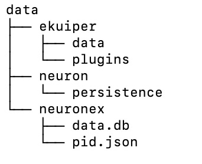

# Data Persistence

EMQX Neuron put all persistence data into its `data` directory, users can easily upgrade EMQX Neuron without losing configuration with the help of this directory.

## Data Organization

There are three directories inside `data` directory like following. 


* ekuiper: Data Processing related configuration 
* neuron: Data Collecting related configuration
* neuronex: EMQX Neuron related configuration

## Deployed by Docker

When deployed by docker, user can mount a directory of host into EMQX Neuron data directory, and all configurations made by EMQX Neuron will be
saved into host directory, when upgrade EMQX Neuron, just need mount the same host directory into EMQX Neuron data directory, the new EMQX Neuron instances will use the configurations made before. And when the first time deployed, the host directory can be empty.

Like the following example, we create an empty directory in host, then we mount it into EMQX Neuron `/opt/neuronex/data`, then local empty directory
will be overwritten by EMQX Neuron. When we upgrade EMQX Neuron, we can mount the host directory into `/opt/neuronex/data` and all configurations in host directory
can be used by EMQX Neuron instance.

```shell
admin@Jianxiangs-MacBook-Pro /tmp % mkdir data
admin@Jianxiangs-MacBook-Pro /tmp % cd data 
admin@Jianxiangs-MacBook-Pro data % ls 
admin@Jianxiangs-MacBook-Pro data % pwd
/tmp/data
admin@Jianxiangs-MacBook-Pro data % docker run -d --name neuronex -p 8085:8085 -v /tmp/data:/opt/neuronex/data  emqx/neuronex:latest

5e256e21b0e5c7ca770fdcae64446d749d841148614bcacfcd064d3911004421
admin@Jianxiangs-MacBook-Pro data % 
admin@Jianxiangs-MacBook-Pro data % ls
ekuiper		neuron		neuronex
admin@Jianxiangs-MacBook-Pro data % 

```

## Deployed by binary

When deployed by binary, all configurations are saved locally into data directory for EMQX Neuron.
Users need copy the data directory from old EMQX Neuron into newer EMQX Neuron for upgrade.