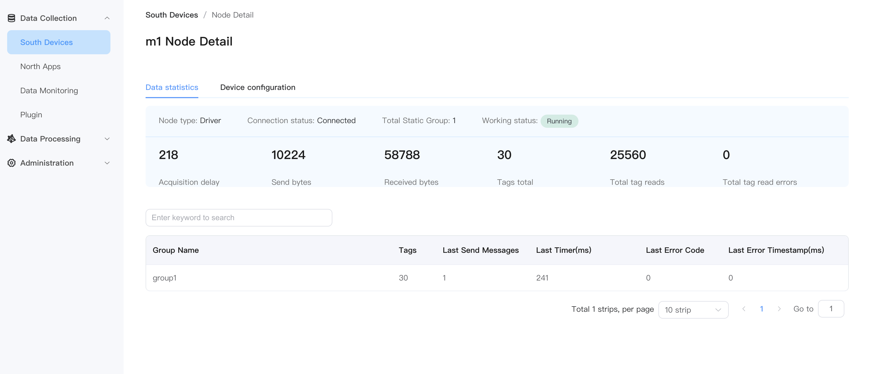
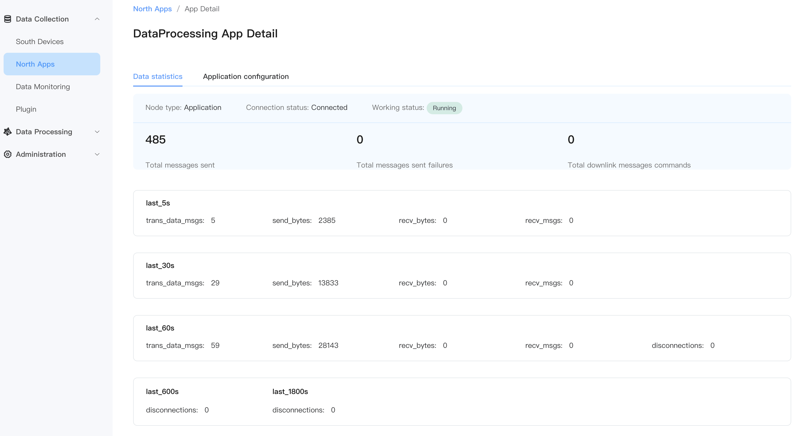

# Statistics

## Driver status statistics

Each driver node card has a `data statistics` operation button, which is used to display the statistical information of the node.

### Southbound drive node statistics

The statistical fields of the southbound driving node are as follows:

::: tip note
Depending on the driver or the number of configured collection groups, the statistical fields of the southbound driver node will be slightly different.
:::

### Northbound application node statistics

The statistical fields of the northbound application node are as follows:

::: tip note
The statistical fields of different northbound application nodes will be slightly different.
:::

## metrics statistics

NeuronEX supports the metrics statistics function based on the Prometheus data model, which is used to monitor the running status of **drivers** and **rules**. The basic principle of Prometheus is to periodically capture the status of monitored components through the HTTP protocol. Any component can be accessed for monitoring as long as it provides the corresponding HTTP interface. NeuronEX provides the corresponding interface and can smoothly access Prometheus for monitoring.

-metrics statistics of data collection module

http://x.x.x.x:8085/api/neuron/metrics

- metrics statistics of data processing module

http://x.x.x.x:8085/api/ekuiper/metrics