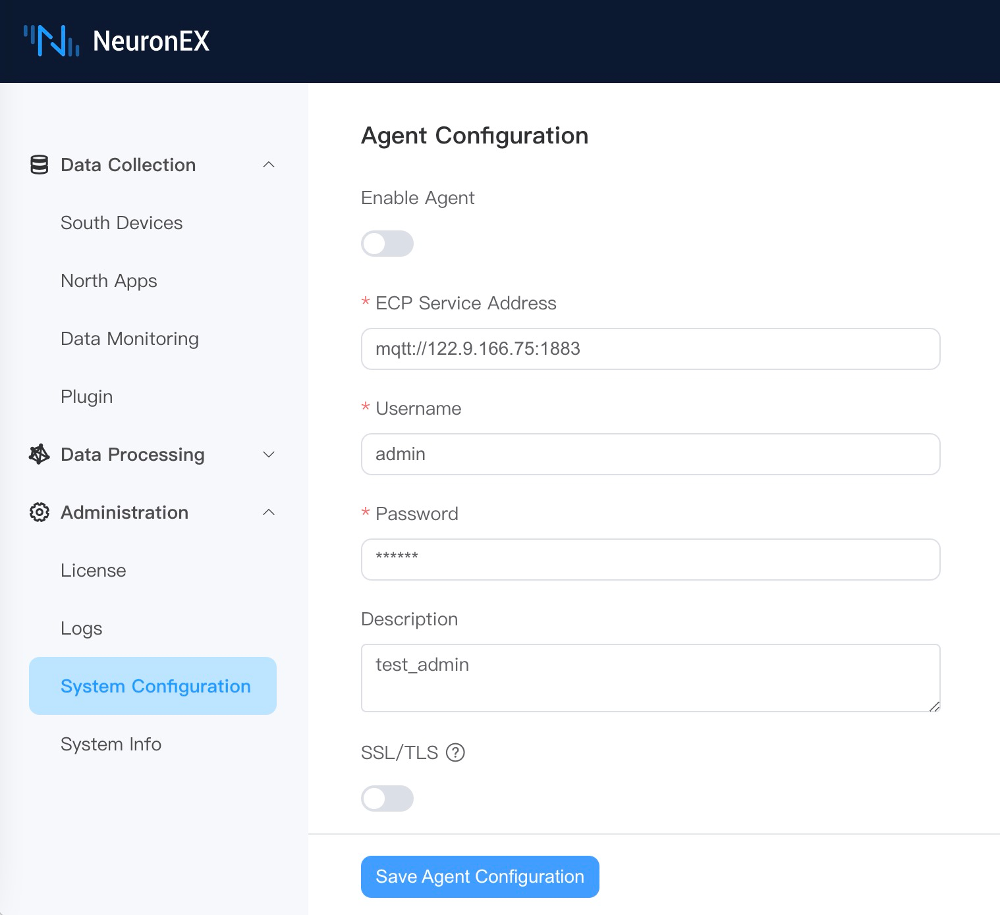
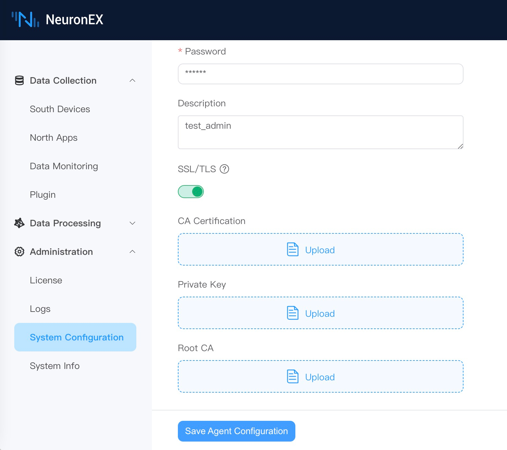

# ECP Integration

When NeuronEX works in a private network and ECP cannot directly access the NeuronEX REST service through IP address, ECP can manage NeuronEX through MQTT to achieve remote batch management of NeuronEX.

## ECP Integration Enable

In order to be managed by ECP, the agent function needs to be enabled on NeuronEX. Click `Administration` -> `System Configuration` -> `Agent Configuration`, click the `Enable Agent` and edit the MQTT information connected to ECP, as shown in the figure below.

* ECP Service Address: NeuronEX communicates with ECP through the MQTT protocol. Fill in the MQTT Broker connection address deployed by ECP here.
* Username: Authentication information filled in through username and password authentication when connecting to MQTT Broker.
* Password: Same as above.
* Description: The registration description information of the NeuronEX to facilitate the ECP side to identify the NeuronEX.

In addition, if MQTT Broker requires mutual certificate authentication, the SSL/TLS function needs to be enabled. As shown below.

When the above information is confirmed to be correct, click `Save Agent Configuration` and NeuronEX will register with ECP. Users can manage this NeuronEX after activating it on the ECP side.

## ECP Integration Disable

Users can leave ECP management by turning off the agent management function and clicking `Save Agent Configuration`.