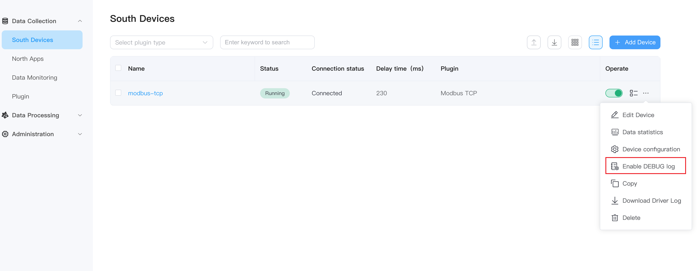
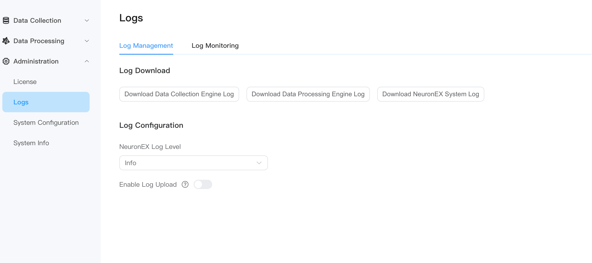

# Log Management


NeuronEX prints logs to the local file system by default and provides a one-click download button in the Web to obtain the packaged logs.
In addition, it also supports sending logs to the user's own SYSLOG server through the SYSLOG protocol to meet the user's long-term log storage needs.
Based on the user scenario, here are examples of how to obtain logs.

## Debug log of node

NeuronEX supports the debug log of a data collection node. There is a `DEBUG log` button of each node, as shown in the figure below. Click to set the log level to debug.


At this time, the node starts to store debug logs. Users can choose to download the logs by the `Download Driver Log` button and view the logs of the corresponding node. 

::: tip
When enabling the node debug log, a lot of redundant log will be printed and it will have a certain impact on performance. When it is not needed, it must be closed in time.
:::

## Log Management

NeuronEX supports the function of one-click download of all log files on the web page. After logging in to NeuronEX, click **Administration** -> **Logs** on the left side of the page to enter the log management page.


In the log download section, click the **Download Data Collection Engine Log** button to download the log of the data collection module (Neuron).
If the existing log information cannot meet the needs, in the log configuration section, you can dynamically set the log level. The Debug level will print a large amount of debugging information, which is helpful for engineers to debug and analyze program failures. As the log level increases, the information printed by the log will The less.
Note that this log level setting will not be persistent and will be restored to the default log level after NeuronEX is restarted. Printing too many logs will have a certain impact on performance, so it needs to be adjusted to a higher level in time.

### Data Collection Engine Log

Let me explain the data collection engine log mentioned earlier. Its function is to package the /opt/neuronex/software/neuron/logs folder into a neuron_debug.tar.gz file and download it to the web page. The file contains all created driver and neuron log files. An example of the file directory level is as shown in the figure below.


* data-stream-processing.log：Data processing configuration
* dlt645.log： Northbound application configuration
* modbus-plus-tcp.log：Southbound device configuration
* neuron.log：Neuron Log

## Syslog upload

NeuronEX supports sending logs to the designated log receiving server through the SYSLOG protocol, and the configuration location is the log upload section.
This configuration is persisted and takes precedence over the [configuration file](./conf-management.md#log) syslogForward section.


The following parameters need to be configured
* Button to turn this function on or off
* SYSLOG service address, IP address or domain name can be used, only one address is supported
* Network protocol type, currently only supports udp
* Upload log level, the lower the level setting, the more information

## View logs in the backend

n addition to downloading logs on the front end, users can also observe log output in real time in the background.

The command to view the data mining engine log is

```shell
 tail -f tail -f /opt/neuronex/software/neuron/logs/neuron.log
```

The command to view the log of a southbound node of the data mining engine is

```shell
 tail -f tail -f modbus-plus-tcp.log
```

The command to view the data processing engine log is

```shell
  tail -f /opt/neuronex/software/ekuiper/log/stream.log
```

The NeuronEX log viewing command is

```shell
  tail -f /opt/neuronex/log/neuronex.log 
```

If deployed through Docker, the command to view the log is ``docker exec <container_name> <command>``

The command to view the data mining engine log is

```shell
 docker exec neuronex tail -f /opt/neuronex/software/neuron/logs/neuron.log
```

## NeuronEX Exception Exit Log

NeuronEX Exception Exit Log, users can view the exception exit log to understand the reason for the exception exit of NeuronEX. Or provide the log information to the EMQ technical support team to quickly locate the problem.

- NeuronEX Docker Deployment Exception Exit Log View

```shell
docker logs <Container Name>
```

```shell
admin@192 ~ % docker logs  neuronex-test
time="2024-12-16T08:57:55Z" level=info msg="trigger eKuiper with command: GOTRACEBACK=crash KUIPER__BASIC__RESTIP=127.0.0.1 KUIPER__BASIC__PROMETHEUS=true KUIPER__BASIC__PROMETHEUSPORT=9081 /opt/neuronex/software/ekuiper/bin/kuiperd -loadFileType absolute -etc /opt/neuronex/software/ekuiper/etc -data /opt/neuronex/data/ekuiper/data -log /opt/neuronex/software/ekuiper/log -plugins /opt/neuronex/data/ekuiper/plugins\n" file="process_control/process.go:87" func=monitor/process_control.get_ekuiper_Process
time="2024-12-16T08:57:55Z" level=info msg="trigger NeuronEX with command: /opt/neuronex/bin/neuronex alone\n" file="process_control/process.go:67" func=monitor/process_control.get_neuronex_Process
time="2024-12-16T08:57:55Z" level=info msg="trigger neuron with command: cd /opt/neuronex/software/neuron/ && ./neuron --log --disable_auth\n\n" file="process_control/process.go:98" func=monitor/process_control.get_neuron_Process
time="2024-12-16T08:57:56Z" level=info msg="set server total memory 2082197504 success" file="memory/mem.go:40"
time="2024-12-16T08:57:56Z" level=info msg="Set config 'kuiper.basic.prometheusport' to '9081' by environment variable" file="conf/load.go:141"
time="2024-12-16T08:57:56Z" level=info msg="Set config 'kuiper.basic.prometheus' to 'true' by environment variable" file="conf/load.go:141"
time="2024-12-16T08:57:56Z" level=info msg="Set config 'kuiper.basic.restip' to '127.0.0.1' by environment variable" file="conf/load.go:141"
```

- NeuronEX RPM/DEB Deployment Exception Exit Log View

```shell
journalctl -xeu neuronex
```

```shell
Dec 26 23:02:50 middleware02 bash[14275]: time="2024-12-26T23:02:50+08:00" level=info msg="trigger NeuronEX with command: /opt/neuronex/bin/neuronex alone\n" file="process_control/process.go:67" func=monitor/process_control.get_neuronex_Process
Dec 26 23:02:50 middleware02 bash[14275]: time="2024-12-26T23:02:50+08:00" level=info msg="trigger eKuiper with command: GOTRACEBACK=crash KUIPER__BASIC__RESTIP=127.0.0.1 KUIPER__BASIC__PROMETHEUS=true KUIPER__BASIC__PROMETHEUSPORT=9081 /opt/neuronex/software/ekuiper/bin/kuiperd -loadFileType absolute -etc /opt/neuronex/software/ekuiper/etc -data /opt/neuronex/data/ekuiper/data -log /opt/neuronex/software/ekuiper/log -plugins /opt/neuronex/data/ekuiper/plugins\n" file="process_control/process.go:87" func=monitor/process_control.get_ekuiper_Process
Dec 26 23:02:50 middleware02 bash[14275]: time="2024-12-26T23:02:50+08:00" level=info msg="trigger neuron with command: cd /opt/neuronex/software/neuron/ && ./neuron --log --disable_auth\n\n" file="process_control/process.go:98" func=monitor/process_control.get_neuron_Process
Dec 26 23:02:51 middleware02 bash[14275]: time="2024-12-26T23:02:51+08:00" level=info msg="set server total memory 33739272192 success" file="memory/mem.go:40"
Dec 26 23:02:51 middleware02 bash[14275]: time="2024-12-26T23:02:51+08:00" level=info msg="Set config 'kuiper.basic.prometheus' to 'true' by environment variable" file="conf/load.go:141"
Dec 26 23:02:51 middleware02 bash[14275]: time="2024-12-26T23:02:51+08:00" level=info msg="Set config 'kuiper.basic.prometheusport' to '9081' by environment variable" file="conf/load.go:141"
Dec 26 23:02:51 middleware02 bash[14275]: time="2024-12-26T23:02:51+08:00" level=info msg="Set config 'kuiper.basic.restip' to '127.0.0.1' by environment variable" file="conf/load.go:141"
Dec 27 00:59:38 middleware02 bash[14275]: panic: runtime error: slice bounds out of range [71:63]
Dec 27 00:59:38 middleware02 bash[14275]: goroutine 4770 [running]:
Dec 27 00:59:38 middleware02 bash[14275]: github.com/emqx/neuronex-go/logic/monitor/alert/rule_processor.(*StrQueue).RemoveHalf(...)
```
