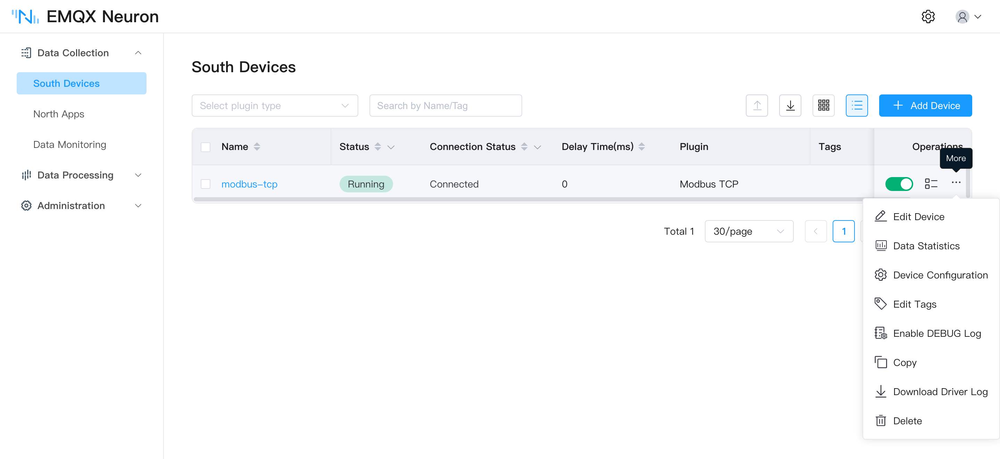

# Log Management

EMQX Neuron prints logs to the local file system and provides log download and level configuration in the console.

## Downloading logs

Click the **Download logs** icon at the top right of the page to export a single archive containing all logs. The entry point is visible on every page, so there is no need to leave the page you are diagnosing.

The archive contains three parts:

| Source | Directory | Contents |
| --- | --- | --- |
| Collection engine | `log/neuron/` | `neuron.log` plus a separate log per configured driver, such as `modbus-plus-tcp.log` and `dlt645.log` |
| Data processing engine | `log/ekuiper/` | `stream.log` and others |
| EMQX Neuron | `log/neuronex/` | `neuronex.log`, `monitor.log` |

## Log level

Set the log level for EMQX Neuron and for the collection engine on **Administration → System Configuration → Log level**. The Debug level prints extensive diagnostic detail; higher levels print less.

::: tip
The log level is **not persisted** and returns to the default after EMQX Neuron restarts. Debug affects performance, so raise the level again once the investigation is finished.
:::

## Debug log of a driver node

Besides the global log level, the debug log of a single driver node can be enabled on its own. On the driver card, click `More` -> `Enable DEBUG log` to set that node's level to debug:



Then click `Download Driver Log` on the same node to download that node's log file alone.

::: tip
Node debug logs print a great deal of redundant detail and affect performance. Click `Disable DEBUG log` once the investigation is finished.
:::

## View logs in the backend

n addition to downloading logs on the front end, users can also observe log output in real time in the background.

The command to view the data mining engine log is

```shell
 tail -f /opt/neuronex/log/neuron/neuron.log
```

The command to view the log of a southbound node of the data mining engine is

```shell
 tail -f /opt/neuronex/log/neuron/modbus-plus-tcp.log
```

The command to view the data processing engine log is

```shell
  tail -f /opt/neuronex/log/ekuiper/stream.log
```

The EMQX Neuron log viewing command is

```shell
  tail -f /opt/neuronex/log/neuronex/neuronex.log
```

If deployed through Docker, the command to view the log is ``docker exec <container_name> <command>``

The command to view the data mining engine log is

```shell
 docker exec neuronex tail -f /opt/neuronex/log/neuron/neuron.log
```

## EMQX Neuron Exception Exit Log

EMQX Neuron Exception Exit Log, users can view the exception exit log to understand the reason for the exception exit of EMQX Neuron. Or provide the log information to the EMQ technical support team to quickly locate the problem.

- EMQX Neuron Docker Deployment Exception Exit Log View

```shell
docker logs <Container Name>
```

```shell
admin@192 ~ % docker logs  neuronex-test
time="2024-12-16T08:57:55Z" level=info msg="trigger eKuiper with command: GOTRACEBACK=crash KUIPER__BASIC__RESTIP=127.0.0.1 KUIPER__BASIC__PROMETHEUS=true KUIPER__BASIC__PROMETHEUSPORT=9081 /opt/neuronex/software/ekuiper/bin/kuiperd -loadFileType absolute -etc /opt/neuronex/software/ekuiper/etc -data /opt/neuronex/data/ekuiper/data -log /opt/neuronex/software/ekuiper/log -plugins /opt/neuronex/data/ekuiper/plugins\n" file="process_control/process.go:87" func=monitor/process_control.get_ekuiper_Process
time="2024-12-16T08:57:55Z" level=info msg="trigger EMQX Neuron with command: /opt/neuronex/bin/neuronex alone\n" file="process_control/process.go:67" func=monitor/process_control.get_neuronex_Process
time="2024-12-16T08:57:55Z" level=info msg="trigger neuron with command: cd /opt/neuronex/software/neuron/ && ./neuron --log --disable_auth\n\n" file="process_control/process.go:98" func=monitor/process_control.get_neuron_Process
time="2024-12-16T08:57:56Z" level=info msg="set server total memory 2082197504 success" file="memory/mem.go:40"
time="2024-12-16T08:57:56Z" level=info msg="Set config 'kuiper.basic.prometheusport' to '9081' by environment variable" file="conf/load.go:141"
time="2024-12-16T08:57:56Z" level=info msg="Set config 'kuiper.basic.prometheus' to 'true' by environment variable" file="conf/load.go:141"
time="2024-12-16T08:57:56Z" level=info msg="Set config 'kuiper.basic.restip' to '127.0.0.1' by environment variable" file="conf/load.go:141"
```

- EMQX Neuron RPM/DEB Deployment Exception Exit Log View

```shell
journalctl -xeu neuronex
```

```shell
Dec 26 23:02:50 middleware02 bash[14275]: time="2024-12-26T23:02:50+08:00" level=info msg="trigger EMQX Neuron with command: /opt/neuronex/bin/neuronex alone\n" file="process_control/process.go:67" func=monitor/process_control.get_neuronex_Process
Dec 26 23:02:50 middleware02 bash[14275]: time="2024-12-26T23:02:50+08:00" level=info msg="trigger eKuiper with command: GOTRACEBACK=crash KUIPER__BASIC__RESTIP=127.0.0.1 KUIPER__BASIC__PROMETHEUS=true KUIPER__BASIC__PROMETHEUSPORT=9081 /opt/neuronex/software/ekuiper/bin/kuiperd -loadFileType absolute -etc /opt/neuronex/software/ekuiper/etc -data /opt/neuronex/data/ekuiper/data -log /opt/neuronex/software/ekuiper/log -plugins /opt/neuronex/data/ekuiper/plugins\n" file="process_control/process.go:87" func=monitor/process_control.get_ekuiper_Process
Dec 26 23:02:50 middleware02 bash[14275]: time="2024-12-26T23:02:50+08:00" level=info msg="trigger neuron with command: cd /opt/neuronex/software/neuron/ && ./neuron --log --disable_auth\n\n" file="process_control/process.go:98" func=monitor/process_control.get_neuron_Process
Dec 26 23:02:51 middleware02 bash[14275]: time="2024-12-26T23:02:51+08:00" level=info msg="set server total memory 33739272192 success" file="memory/mem.go:40"
Dec 26 23:02:51 middleware02 bash[14275]: time="2024-12-26T23:02:51+08:00" level=info msg="Set config 'kuiper.basic.prometheus' to 'true' by environment variable" file="conf/load.go:141"
Dec 26 23:02:51 middleware02 bash[14275]: time="2024-12-26T23:02:51+08:00" level=info msg="Set config 'kuiper.basic.prometheusport' to '9081' by environment variable" file="conf/load.go:141"
Dec 26 23:02:51 middleware02 bash[14275]: time="2024-12-26T23:02:51+08:00" level=info msg="Set config 'kuiper.basic.restip' to '127.0.0.1' by environment variable" file="conf/load.go:141"
Dec 27 00:59:38 middleware02 bash[14275]: panic: runtime error: slice bounds out of range [71:63]
Dec 27 00:59:38 middleware02 bash[14275]: goroutine 4770 [running]:
Dec 27 00:59:38 middleware02 bash[14275]: github.com/emqx/neuronex-go/logic/monitor/alert/rule_processor.(*StrQueue).RemoveHalf(...)
```
