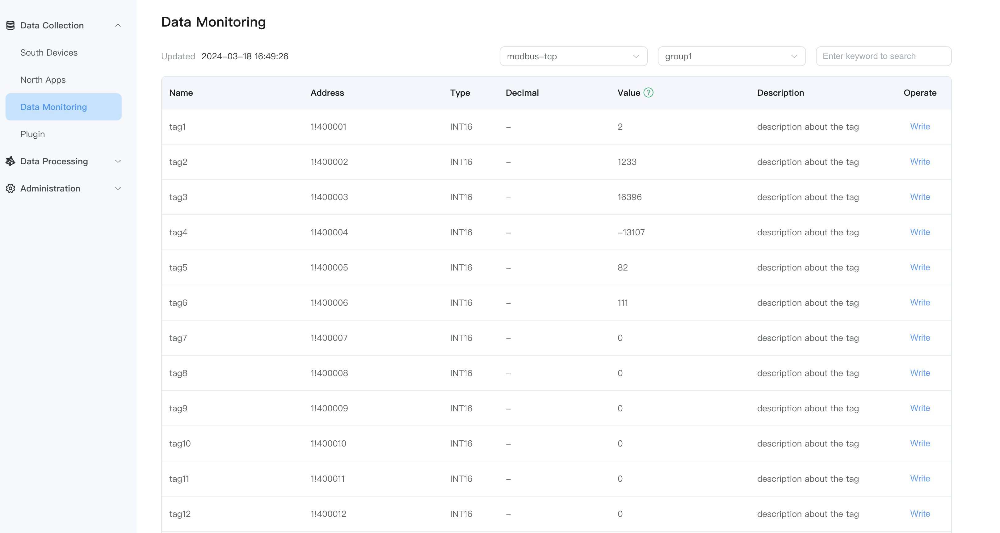
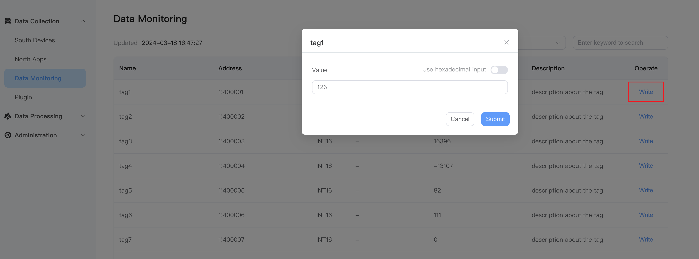

# Data monitoring

## Data monitoring dashboard

Click `Data Monitoring` on the left, select the southbound device and group name, and view the tag values.

* Southbound device: Select the southbound device you want to view, for example, select the created device modbus-tcp;
* Group name: Select the group under the southbound device you want to view, for example, select the created group group1;
* Data monitoring displays values in groups, and the page will display the value of each tag in the group.

## Control device

NeuronEX provides the ability to control device through southbound driver through the following ways:

- [Data processing module](../streaming-processing/sink/neuron.md) of NeuronEX
- Other third-party applications
- IIoT platform
- Cloud platform

There are three ways to send commands to the device:
- Users can write data to device on [Data Monitoring](#data-monitoring-dashboard) page.
- Users can write data to device via [RESTful APIs](https://docs.emqx.com/zh/neuronex/latest/api/api-docs.html#tag/rw).
- [MQTT Topic](../configuration/north-apps/mqtt/api.md) . Any external system, such as a cloud-based platform, can publish command data to a specific MQTT topic, and NeuronEX receives the command data from topic and sends it to the device.

### Monitoring dashboard data writing

When the tag has a write attribute, the Tag on the data monitoring page will have a write operation. Click `Write` to realize control of the device. For example, modify the value of `tag1` with write attribute, as shown in the figure below.

* Click the `Write` button at the end of the tag whose value you want to change;
* Select whether to input in hexadecimal mode, or not;
* Enter the new value of the tag, for example, 123;
* Click the `Submit` button to submit the new value.

::: tip
This tag in the device must also have a writable attribute, otherwise the writing cannot be successful.
:::

### Check whether the value of tag is modified successfully

Open the Modbus simulator and check whether the value changes, as shown in the figure below.

