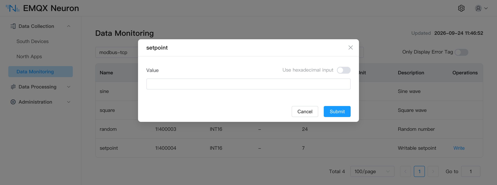
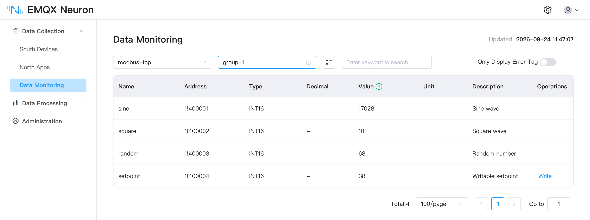

# Data Monitoring and Device Control

The data monitoring page shows live values collected by southbound drivers and provides the entry point for writing back to devices. After groups and tags are configured, this is the first place to confirm that the collection path works.

## View collected data

On **Data Collection → Data Monitoring**, select a southbound device and a group:

| Option | Description |
| --- | --- |
| **South device** | The southbound driver node to inspect, for example `modbus-tcp` |
| **Group** | A collection group under that node, for example `group-1` |
| **Keyword search** | Filters by tag name, for locating a single tag among many |
| **Show error tags only** | Shows only tags that failed to collect. With many tags, this is the quickest way to find a wrong address or one the device does not support |

Values refreshing as the device changes means the collection path works. If they do not refresh, or show an error code, see [Diagnosing a connection](../configuration/south-devices/south-devices.md#diagnosing-a-connection).

## Device control

The EMQX Neuron data path is bidirectional: besides collecting from devices, it can write commands back to change device parameters or drive device behavior.

The target tag must carry the **write** attribute — see [Groups and Tags · Tag attributes](../configuration/groups-tags/groups-tags.md#tag-attributes). The address must also be writable on the device, or the write fails.

There are four control paths:

| Path | Suits |
| --- | --- |
| **Data monitoring page** | Manual testing and verification — see [Writing from the monitoring page](#writing-from-the-monitoring-page) below |
| **Northbound applications** | Commands issued by a cloud platform or an upper-level system. MQTT and AWS IoT use a write request topic, Azure IoT uses cloud-to-device messages, Sparkplug B uses DCMD commands, and with OPC UA Server the client writes the variable node directly. See [Northbound Applications](../configuration/north-apps/catalog.md) |
| **Data processing** | Rule results written straight back to the device, closing a collect → decide → control loop at the edge. See [Neuron Sink](../streaming-processing/sink/neuron.md) |
| **HTTP API** | Integration from third-party software — see the [API reference](https://docs.emqx.com/en/neuronex/latest/api/api-docs.html#tag/rw) |

For worked examples of all four, see [Device Control](../best-practise/device-control.md).

### Writing from the monitoring page

When a tag carries the write attribute, a `Write` button appears at the end of its row:

1. Click `Write` at the end of the target tag.
2. Choose whether to enter the value in hexadecimal.
3. Enter the new value, for example `123`.
4. Click `Submit`.

The tag's live value should update to the new value. You can also confirm it on the device or in the simulator:

::: tip
If a write fails, check two things first: the tag carries the `write` attribute in EMQX Neuron, and the address is writable on the device. Bit-level writes to holding registers on some protocols also require the corresponding function code to be enabled on the driver — see the relevant driver page.
:::
