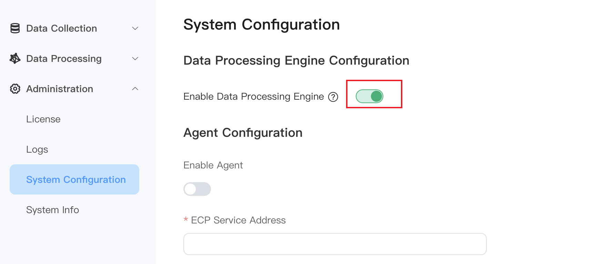
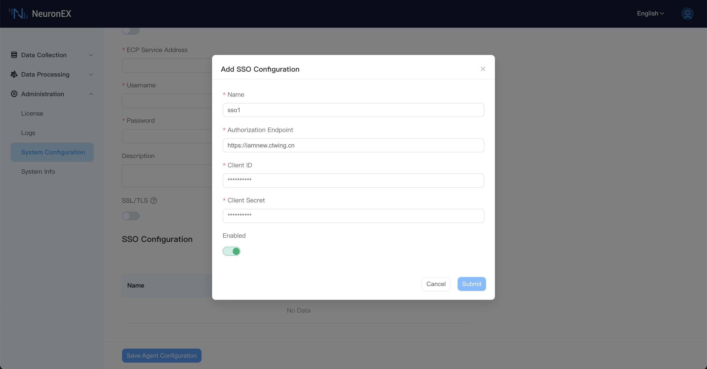

# System Configuration

NeuronEX supports customization of relevant functions on the Dashboard.

## Data Processing Engine Configuration
After logging into NeuronEX, click on **Administration** -> **System Configuration** on the left side to enter the system configuration page. You can manually enable or disable the data processing engine.

:::tip 

Closing the data processing engine will render the data processing function unavailable, so please operation with caution!

:::

## Agent Configuration

When there is an IP change or network address translation after NeuronEX is deployed, and the ECP cannot directly access the NeuronEX service through the IP address, by configuring the agent function, the NeuronEX side configures the connection information on the ECP side, actively initiates the connection, and the ECP realizes Subsequent remote management function.

### Enable Agent Function

In the above situation in order to be managed by ECP, the agent function needs to be enabled on NeuronEX. Click `Administration` -> `System Configuration` -> `Agent Configuration`, click the `Enable Agent` and edit the MQTT information connected to ECP, as shown in the figure below.

* **ECP Service Address**: NeuronEX communicates with ECP through the MQTT protocol. Fill in the MQTT Broker connection address deployed by ECP here.
* **Username**: Authentication information filled in through username and password authentication when connecting to MQTT Broker.
* **Password**: Same as above.
* **Description**: The registration description information of the NeuronEX to facilitate the ECP side to identify the NeuronEX.

In addition, if MQTT Broker requires mutual certificate authentication, the SSL/TLS function needs to be enabled. As shown below.

When the above information is confirmed to be correct, click `Save Agent Configuration` and NeuronEX will register with ECP. Users can manage this NeuronEX after activating it on the ECP side.

### Disable Agent Function

Users can disable agent function by turning off the `Enable Agent` button and clicking `Save Agent Configuration`.

## SSO Configuration

NeuronEX utilizes the OAuth 2.0 protocol to implement single sign-on functionality. Users need to configure NeuronEX's single sign-on URL address on the SSO service first. For example, http://127.0.0.1:8085/web/common.

On the NeuronEX dashboard, the access address and relevant parameters of the SSO service need to be configured.

:::tip

The Client ID and Client Secret are to be retrieved from the SSO service and must be filled in correctly.
:::
