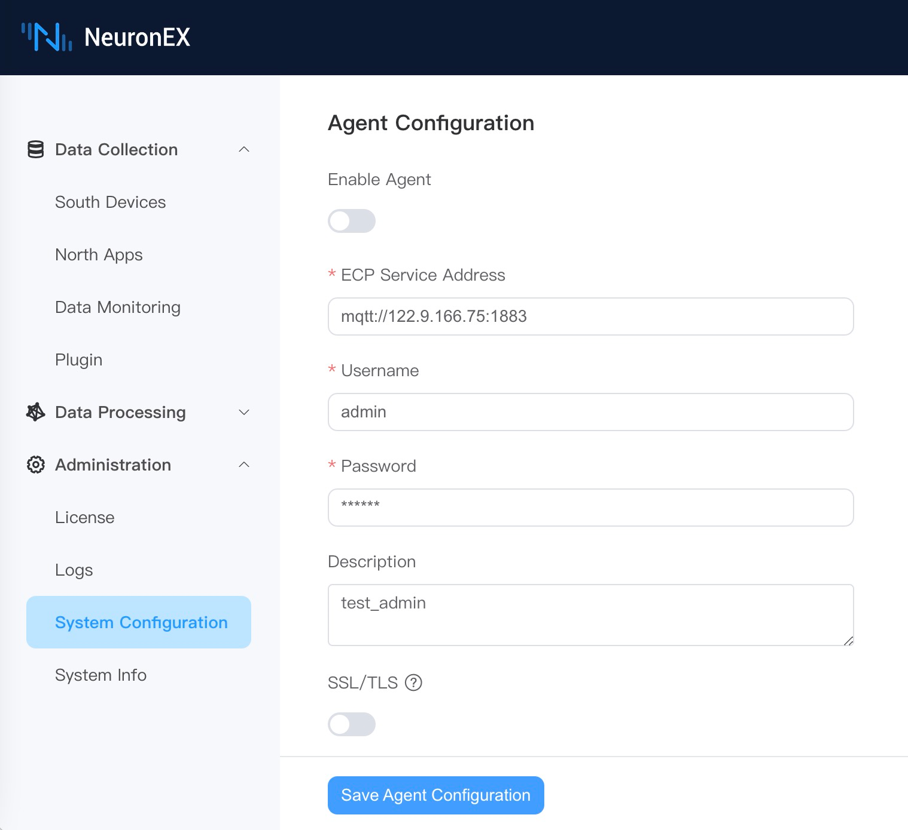
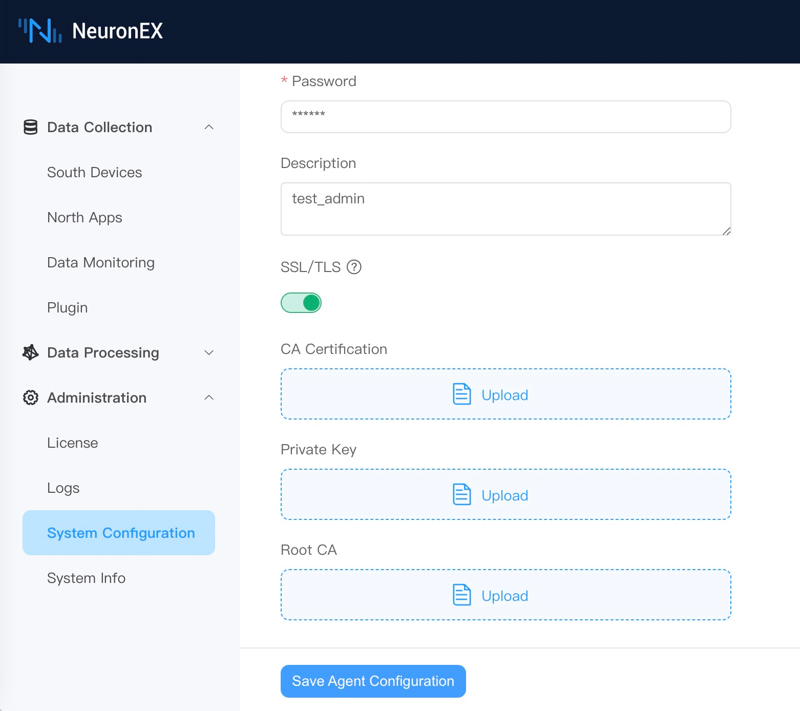

# System Configuration

NeuronEX supports customization of relevant functions on the Dashboard.

## Data Processing Engine Configuration

### Enable Data Processing Engine
After logging into NeuronEX, click on **Administration** -> **System Configuration** on the left side to enter the system configuration page. You can manually enable or disable the data processing engine.

:::tip 

Closing the data processing engine will render the data processing function unavailable, so please operation with caution!

:::

### Enable Metrics Collection

When the metrics collection is enabled, the metrics of the data processing engine will be collected and stored in the local file directory.

When the metrics collection is enabled, on the **Logs** -> **Log Management** page, click the **Download Data Processing Engine Logs** button to download the complete logs and metrics files. Click the **Download Custom Log Metrics File** button to select the logs or metrics files to download.

## SSO Configuration

NeuronEX utilizes the OAuth 2.0 protocol to implement single sign-on functionality.

### AIoT

Configure the Single Sign-On (SSO) URL address for NeuronEX on the AIoT platform in the format: [NeuronEX Access Address]/web/common. e.g, http://127.0.0.1:8085/web/common.

The AIoT platform provides the client identifier (App Key) and client secret (App Secret) for the NeuronEX configuration page.

On the NeuronEX page, you need to configure the access address of the SSO service and the related parameters.

:::tip

The fields for Scope, Grant Type, Request Method, and Content Type need to be filled out according to the platform requirements.

:::

### Azure

On the Azure platform, navigate to Microsoft Entra ID -> App registrations page, find the corresponding App, and fill in the Single Sign-On (SSO) URL address for NeuronEX in the same format as before.

On the Overview page, obtain the client identifier (client id) and provide it to the NeuronEX configuration page.

On the Certificates & secrets page, obtain the client secret and provide it to the NeuronEX configuration page.

On the Overview -> Endpoints page, obtain the authorization endpoint URL and token endpoint URL.

On the NeuronEX page, you need to configure the SSO service access address and the related parameters.

:::tip

The fields for Scope, Grant Type, Request Method, and Content Type need to be filled out according to the platform requirements.

:::

## Network Connection Test

Enter the device IP to confirm whether NeuronEX can access the device IP address:

## Backup and Restore

Backup refers to the complete export of all configurations of NeuronEX; restore refers to re-importing the exported backup, which will overwrite the original configuration.

All configurations include nodes, tags, rules, files, certificates, and all other configuration information.

:::tip 
During the restore process, NeuronEX will automatically restart.
:::

## Agent Configuration

When there is an IP change or network address translation after NeuronEX is deployed, and the ECP cannot directly access the NeuronEX service through the IP address, by configuring the agent function, the NeuronEX side configures the connection information on the ECP side, actively initiates the connection, and the ECP realizes Subsequent remote management function.

### Enable Agent Function

In the above situation in order to be managed by ECP, the agent function needs to be enabled on NeuronEX. Click `Administration` -> `System Configuration` -> `Agent Configuration`, click the `Enable Agent` and edit the MQTT information connected to ECP, as shown in the figure below.

* **ECP Service Address**: NeuronEX communicates with ECP through the MQTT protocol. Fill in the MQTT Broker connection address deployed by ECP here.
* **Username**: Authentication information filled in through username and password authentication when connecting to MQTT Broker.
* **Password**: Same as above.
* **Description**: The registration description information of the NeuronEX to facilitate the ECP side to identify the NeuronEX.

In addition, if MQTT Broker requires mutual certificate authentication, the SSL/TLS function needs to be enabled. As shown below.

When the above information is confirmed to be correct, click `Save Agent Configuration` and NeuronEX will register with ECP. Users can manage this NeuronEX after activating it on the ECP side.

### Disable Agent Function

Users can disable agent function by turning off the `Enable Agent` button and clicking `Save Agent Configuration`.

## Traces

The traces function is used to trace the detailed processing of data collection, processing analysis, and forwarding in NeuronEX. It can be applied to the following scenarios:

- Downstream MQTT Control Command Tracing

    NeuronEX can combine with EMQX V5 to perform full link tracing of MQTT control commands issued to the application side, monitoring the delay of the entire link control and analyzing the delay information of each node, applicable to scenarios with high requirements for control delay, for fault analysis.

- NeuronEX API Control Command Tracing

    It can record the detailed process of control commands issued by NeuronEX API, analyzing the complete link and delay from NeuronEX sending commands to the device to receiving the device's response, applicable to scenarios with high reliability requirements for control command issuance, for fault analysis.

- Data Collection Tracing

    It can record data collection, data calculation, and data tracing combined with EMQX, applicable to scenarios such as collection delay detection and data loss detection.

- Edge Computing Data Tracing

    It can record the detailed process of each operator's computation during edge computing, as well as the data results after processing by each operator.

### Configuration Instructions
- **Enable OpenTelemetry Tracing**: Enable the tracing function.
- **OpenTelemetry Service Address**: Fill in the OpenTelemetry service address, and NeuronEX will send tracing data to this address. EMQX ECP integrates the OpenTelemetry service, and users can directly use the OpenTelemetry service address of EMQX ECP.
- **Service Name**: Fill in the service name. When NeuronEX reports tracing data, it will use this service name to distinguish the tracing data reported by different NeuronEX.
- **Tracing API and Downstream MQTT Control Commands**: Enable tracing for API and downlink MQTT control commands. If using downlink MQTT control commands, the MQTT plugin's MQTT version must be set to 5.0 on the northbound application page.
- **Tracing Data Collection Messages**: Enable tracing for data collection messages. Once enabled, NeuronEX will report all tracing data of southbound driver collection messages to the OpenTelemetry service. (Currently only supports FINS TCP and FINS UDP drivers)
- **Tracing Data Sampling Rate**: Fill in the tracking data sampling rate. Range: `0-1`.  1 indicates a 100% sampling rate for full tracing, while 0.1 indicates a 10% sampling rate for tracing. This parameter is only valid when `Tracing Data Collection Messages` is enabled.

:::tip 
Enabling traces function will incur certain performance overhead for NeuronEX, please enable it according to actual needs.
:::

### Enable Rule Tracing Separately
On the rules page, click the `Enable Tracing` button in the rule operation column to directly enable tracing for that rule.

### NeuronEX API Control Command Tracing

When sending API requests to NeuronEX, the `tracestate: tracer=start` parameter must be added to the Header for NeuronEX to record the tracing data of that API request. For example, in Postman, as shown in the figure below.

After enabling the traces function, on the NeuronEX data monitoring page, click `write` to send data to the device, which will automatically record the tracing data for that API request.

:::tip Note

Other API operations performed on the NeuronEX Dashboard will not record tracing data.

:::

### Downstream MQTT Control Command Tracing

To implement downstream MQTT control command tracing, the following conditions must be met:

- The northbound application page must set the MQTT plugin's MQTT version to 5.0, as shown in the figure:

- Use EMQX V5 and enable OpenTelemetry Traces function, configured as shown in the figure:

- The third-party MQTT client must support the MQTT V5.0 protocol and, when sending MQTT messages, add the following attribute in the user properties:
`traceparent: 00-cce3a024ca134a7cb4b41e048e8d98de-cef47eaa4ebc3fae-01`

    For example, using MQTTX, as shown in the figure below:

## AI Model Configuration

NeuronEX supports configuring AI models in the system configuration page, and using AI models to generate Python plugins.

In the NeuronEX **System Configuration** -> **AI Model Configuration** page, add a LLM model, including the LLM model type, API Key, Endpoint address, and model name. Currently, NeuronEX supports the following models:

| 
Model Vendor
 | 
Endpoint Address
 | 
Model Name
 |
| ------------------------------------------- | --------------------------------------------- | ---------------------------------------- |
| DeepSeek | `https://api.deepseek.com` | `deepseek-chat`   `deepseek-reasoner` |
| SiliconFlow | - | `Pro/deepseek-ai/DeepSeek-V3`   `Pro/deepseek-ai/DeepSeek-R1` |
| OpenAI | `https://api.openai.com/v1` | `gpt-4o` |
| Azure OpenAI | Obtain from Azure official website | `gpt-4o` |

You can obtain API Keys from the official websites of these model vendors, add model configurations on the NeuronEX page, and enable them. Multiple large models can be configured on the page simultaneously, but only one model can be enabled for use.

::: tip
1. Please ensure that NeuronEX can connect to the internet normally and access the model's API.
2. Small models or excessively outdated models will affect the quality of generated Python plugins. The models in the above table are recommended, and new models released by various vendors can also be used in the future.
:::