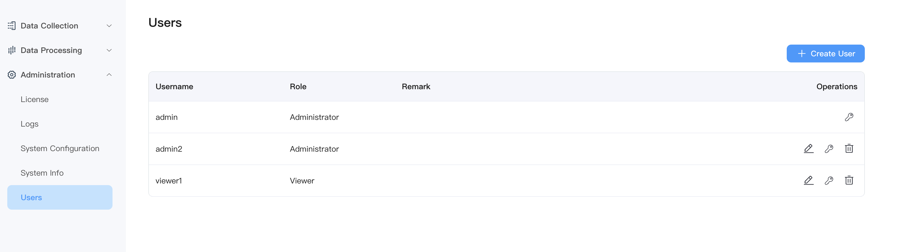

# User Management

Starting with NeuronEX 3.3, the Dashboard user has introduced the Role-Based Access Control (RBAC) feature. RBAC allows assigning permissions to users based on their role in the organization. This feature simplifies authorization management and improves security by limiting access rights.

The **User Management** page provides an overview of all active Dashboard users.

## Create User

To add a new user, simply click the **Create User** button. A pop-up dialog box will prompt you to enter the necessary user details. Once you have entered them, click the **Create** button to generate the user account. For further user management, such as editing user information, updating passwords, or deleting users, you can easily access these options through the **Action** column.

## Role Introduction

Currently, one of the following two predefined roles can be set for a user. You can select the role from the **Role** drop-down menu when creating a user.
- **Administrator**

Administrator has full management access to all NeuronEX functions and resources, including data acquisition, data processing, and system configuration management.

- **Viewer**

Viewer can access all data and configuration information of NeuronEX, corresponding to all `GET` requests in the REST API, but has no right to create, modify, or delete operations.

:::tip
NeuronEX comes with a login username and password of `admin/0000` after installation. The `admin` user defaults to the Administrator role, which cannot be deleted or modified, but can modify the password.
In addition, you can use environment variables to modify the default password of the admin user and add a viewer user when starting for the first time.
- NEURONEX__SERVER__ADMIN__PASSWORD='xxxxxx', xxxxxx is the new password for the admin user
- NEURONEX__SERVER__VIEWER__USERNAME='user1', user1 is the viewer username
- NEURONEX__SERVER__VIEWER__PASSWORD='xxxxxx', xxxxxx is the password of the viewer user

After the admin user logs in to the system through the above settings, he can continue to modify the password of the above user.
:::

:::warning

NeuronEX user management functionality is related to authentication functionality. If you need to use multi-user functionality, please ensure that the authentication function is not manually disabled (the authentication function is enabled by default):

1. When deploying via installation package, ensure `NEURONEX_DISABLE_AUTH=1` environment variable is not set.
2. When deploying via Docker, ensure `NEURONEX_DISABLE_AUTH=1` environment variable is not set.
3. The `disableAuth` configuration item in the `/opt/neuronex/etc/neuronex.yaml` configuration file is not true.

:::

## ECP User Management

When users use ECP to remotely manage NeuronEX.

The project administrator on the ECP side is equivalent to the Administrator role of NeuronEX and will have full management access to all NeuronEX functions and resources. 

The project member on the ECP side is equivalent to the Viewer role of NeuronEX and can only access the data and configuration information of NeuronEX.