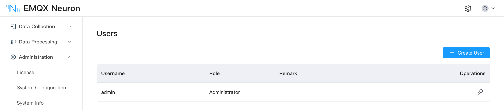

# User Management

Starting with EMQX Neuron 3.3, the Dashboard user has introduced the Role-Based Access Control (RBAC) feature. RBAC allows assigning permissions to users based on their role in the organization. This feature simplifies authorization management and improves security by limiting access rights.

The **User Management** page provides an overview of all active Dashboard users.

## Create User

Click the **Create User** button at the top right of the page, fill in the user details in the dialog box, and click **Create**. Editing user information, updating passwords, and deleting users are all done from the **Action** column of the list.

## Role Introduction

Currently, one of the following two predefined roles can be set for a user. You can select the role from the **Role** drop-down menu when creating a user.
- **Administrator**

Administrator has full management access to all EMQX Neuron functions and resources, including data acquisition, data processing, and system configuration management.

- **Viewer**

Viewer can access all data and configuration information of EMQX Neuron, corresponding to all `GET` requests in the REST API, but has no right to create, modify, or delete operations.

:::tip
EMQX Neuron comes with a login username and password of `admin/0000` after installation. The `admin` user defaults to the Administrator role, which cannot be deleted or modified, but can modify the password.
In addition, you can use environment variables to modify the default password of the admin user and add a viewer user when starting for the first time.
- NEURONEX__SERVER__ADMIN__PASSWORD='xxxxxx', xxxxxx is the new password for the admin user
- NEURONEX__SERVER__VIEWER__USERNAME='user1', user1 is the viewer username
- NEURONEX__SERVER__VIEWER__PASSWORD='xxxxxx', xxxxxx is the password of the viewer user

After the admin user logs in to the system through the above settings, he can continue to modify the password of the above user.
:::

:::warning

User management depends on authentication, which is enabled by default.

**With authentication disabled, neither the web console nor the HTTP API verifies identity — the console opens straight up with no login, and users, roles, and permissions stop taking effect.**

Any of the following disables authentication:

1. `NEURONEX_DISABLE_AUTH=1` is set when deploying from an installation package
2. `NEURONEX_DISABLE_AUTH=1` is set when deploying with Docker
3. `server.disableAuth` is set to `true` in `/opt/neuronex/etc/neuronex.yaml`

To use multi-user functionality, make sure none of the above applies.

:::

## ECP User Management

When users use ECP to remotely manage EMQX Neuron.

The project administrator on the ECP side is equivalent to the Administrator role of EMQX Neuron and will have full management access to all EMQX Neuron functions and resources. 

The project member on the ECP side is equivalent to the Viewer role of EMQX Neuron and can only access the data and configuration information of EMQX Neuron.