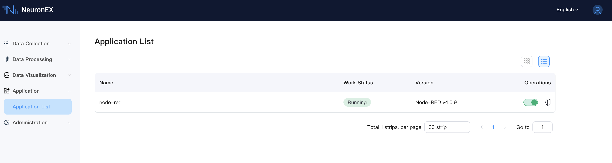

# Node-RED Integration

NeuronEX integrates Node-RED, a popular open-source visual programming tool that uses a flow-based development approach. This integration allows users to leverage Node-RED's rich node library to perform complex data processing on data collected and managed by NeuronEX, and build custom workflows.

## Availability

Starting from NeuronEX version 3.6.0, **Node-RED v4.0.9** is integrated by default in the following Docker images:

*   `emqx/neuronex:3.6.0-ai`
*   `emqx/neuronex:3.6.0-ai-arm64`

For other installation packages (such as deb, rpm, zip) or other Docker images, Node-RED is not integrated.

## Enabling and Accessing Node-RED

By default, the Node-RED service is **disabled**. You can enable and access it through NeuronEX's **Application List**.

1.  Navigate to **Application** -> **Application List** from the left menu.
2.  You will see the `node-red` application in the list, along with its **Version** (Node-RED v4.0.9) and current **Work Status**.

 

*   **Enable/Disable Service:**
    *   In the **Operations** column of the `node-red` entry, use the toggle switch to start or stop the Node-RED service.
    *   When the service is running, its **Work Status** will display as "Running".
*   **Access Node-RED UI:**
    *   Once the Node-RED service is running, click the "Enter" icon in the **Operations** column, which will open the Node-RED interface in a new browser tab, allowing you to create and manage your flows.

## Sending Data to Node-RED

NeuronEX supports pushing data to your Node-RED flows for further processing through the following methods:

*   **Northbound Websocket Application:**
    You can configure a Websocket application in NeuronEX to send data. Then in Node-RED, you can use the `websocket in` node to connect to this Websocket endpoint from NeuronEX to receive data.
*   **Data Processing Module REST Sink:**
    Utilize the REST Sink in NeuronEX's data processing module. Configure the REST Sink to POST data to HTTP endpoints you create in Node-RED using the `http in` node.

This integration enhances NeuronEX's capabilities by allowing users to intuitively design data manipulation, transformation, or integration logic in the familiar Node-RED environment.