# NeuronEX Device Control Best Practices

## Overview

NeuronEX, as a powerful industrial edge datahub software, not only efficiently collects device data but also provides multiple flexible methods for device control capabilities to meet the requirements of different industrial scenarios.

This article will detail the various device control functions supported by NeuronEX, helping you better utilize these features to optimize industrial production processes and enhance automation levels.

## What is Device Control

Device control refers to the process of sending commands to downstream automation devices to control device behavior or modify device parameters. NeuronEX provides multiple control methods to meet the needs of different application scenarios:

- **Dashboard Control**: Human control through an intuitive user interface
- **MQTT Control**: Sending control commands to devices via MQTT protocol
- **Data Processing Module Control**: Implementing intelligent control using NeuronEX's data processing engine
- **API Control**: Programmatic control through RESTful API interfaces

::: tip
During device control, device tags must have writable attributes, otherwise writing will fail. Writable attributes include tags configured in NeuronEX that must have the write property, and the tags must also support writing on the device side.
:::

## Dashboard Control

Dashboard control is the most intuitive human-machine interaction method, suitable for operations personnel performing daily operations and temporary debugging. Access the NeuronEX Web interface, go to **Data Collection** -> **Data Monitoring** page, select the appropriate southbound device and group name, find tags with write attributes, click the Write button at the end, enter a new value in the popup dialog, and click "Submit" to complete device control.

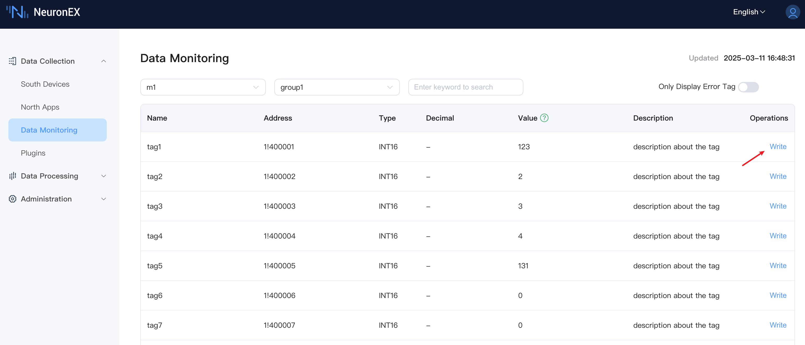

## MQTT Control

### Feature Introduction

MQTT control allows any client program supporting the MQTT protocol to send command data to the corresponding topic on an MQTT Broker. The NeuronEX northbound MQTT plugin subscribes to this topic to receive data and sends control commands to the southbound driver node to implement device control. 

This method is particularly suitable when using EMQX to build a UNS(Unifed Name Space) in industrial scenarios.


To use this method, you need to configure the northbound MQTT plugin in NeuronEX and set the **Write Request Topic** and **Write Response Topic**. At the same time, you need to configure the southbound driver node and set the tags to readable and writable status. The following example provides detailed instructions using EMQX and MQTTX (as an MQTT client).

### Complete MQTT Example

**1) Configure southbound driver**

Configure the ModbusTCP southbound driver **modbus1** in NeuronEX, with group name **group1**, and add three data points **tag1**, **tag2**, **tag3** (supporting read and write). The modbus1 driver reads data from a Modbus simulator. For detailed information about this step, please refer to [Connecting Southbound Drivers](../quick-start/quick-start.md).

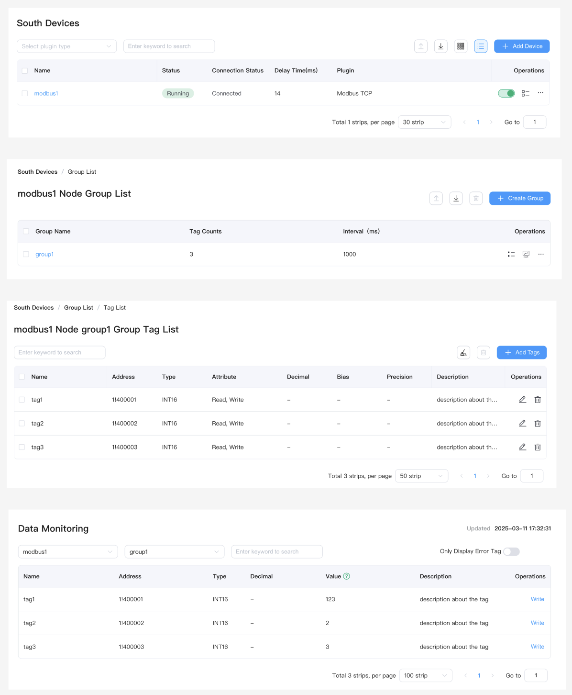

**2) Configure northbound MQTT plugin**

Create a new northbound MQTT plugin in NeuronEX. In the plugin configuration, you can use the default **Write Request Topic** `/neuron/HgihrB/write/req` and **Write Response Topic** `/neuron/HgihrB/write/resp` to receive MQTT control commands, as shown below. In this example, we use EMQ's public MQTT server `broker.emqx.io` as the MQTT Broker.

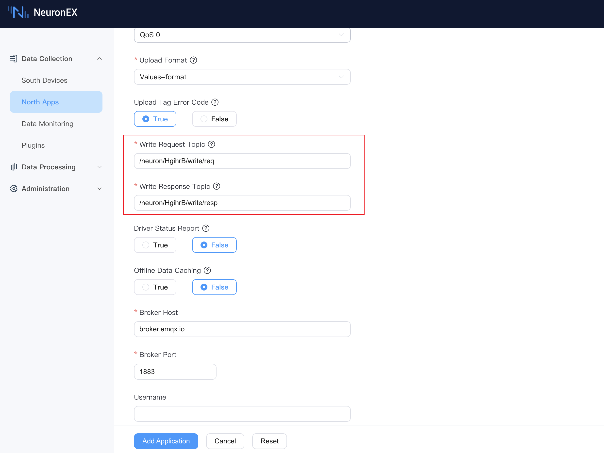

**3) EMQX Configuration**

Since we are using EMQ's public MQTT server `broker.emqx.io` as the MQTT Broker, there is no need to deploy or configure EMQX separately.

**4) MQTTX Configuration**

Add a new connection in MQTTX to connect to the public MQTT server `broker.emqx.io`.

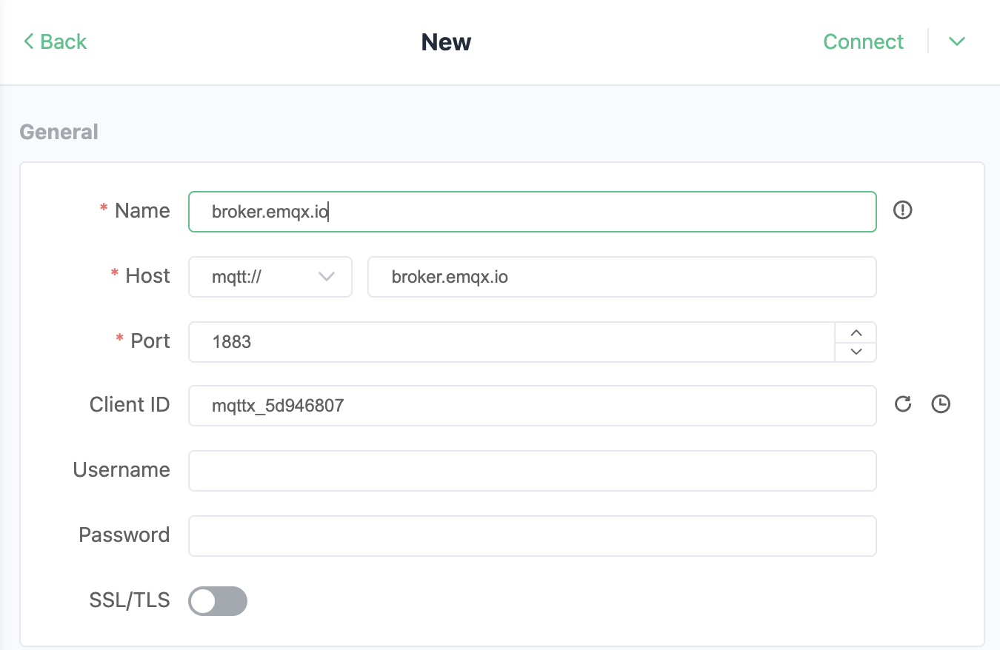

Referring to the NeuronEX MQTT data control format, we understand that the JSON message format for controlling a single data tag is as follows, where:
- **uuid** is a unique identifier generated by NeuronEX, used to match response data when receiving control responses
- **node** is the southbound driver node name, in this example it's `modbus1`
- **group** is the southbound driver group name, in this example it's `group1`
- **tag** is the southbound driver tag name, in this example it's `tag1`
- **value** is the value to be written, in this example it's `1234`

```json
{
    "uuid": "cd32be1b-c8b1-3257-94af-77f847b1ed3e",
    "node": "modbus1",
    "group": "group1",
    "tag": "tag1",
    "value": 1234
}
```

For information about the NeuronEX MQTT data control format, multi-tag writing, or to understand the control response format, please refer to [MQTT Upstream and Downstream Data Format](https://docs.emqx.com/en/neuronex/latest/configuration/north-apps/mqtt/api.html#write-tag).

In MQTTX, enter the above JSON message and configure the send topic as `/neuron/HgihrB/write/req`. Click the send button to send the control command to the MQTT Broker.

To check if the control was executed successfully, you can use MQTTX's **+ New Subscription** button to subscribe to the `/neuron/HgihrB/write/resp` topic and view the response data.

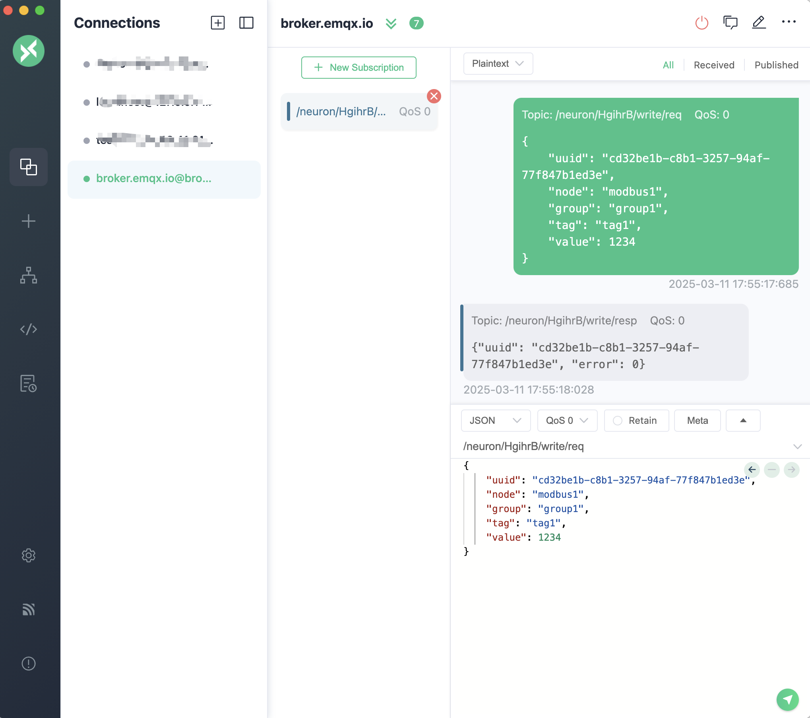

**5) View Control Results**

On the **Data Collection** -> **Data Monitoring** page in NeuronEX, you can see that the value of tag1 has been updated to 1234, indicating that the control of tag1 in the southbound driver modbus1 through the MQTT client MQTTX was successful.

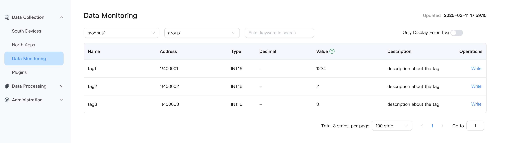

::: tip
If you only need to control devices through the MQTT driver, there is no need to configure the southbound driver to the MQTT driver's subscription list.

If you also need to report southbound driver data to the MQTT Broker through the MQTT driver, you need to configure the southbound driver to the MQTT driver's subscription list.
:::

## Data Processing Module Control

### Feature Introduction

NeuronEX's data processing module provides powerful data analysis and processing capabilities that can automatically trigger device control based on business logic, implementing automated control and closed-loop feedback.

In this example, we will use the value of tag1 collected by the NeuronEX southbound driver node modbus1 to automatically control and write to tag2 of the southbound driver node modbus1.

### Example

**1) Send modbus1 driver data to the data processing module**

Continue using the modbus1 driver from the [Complete MQTT Example](#complete-mqtt-example). As shown in the figure below, configure the driver collection group to the data processing module's subscription group. After configuration, the neuronStream in the data processing module will receive all collection data from the modbus1 driver every second.

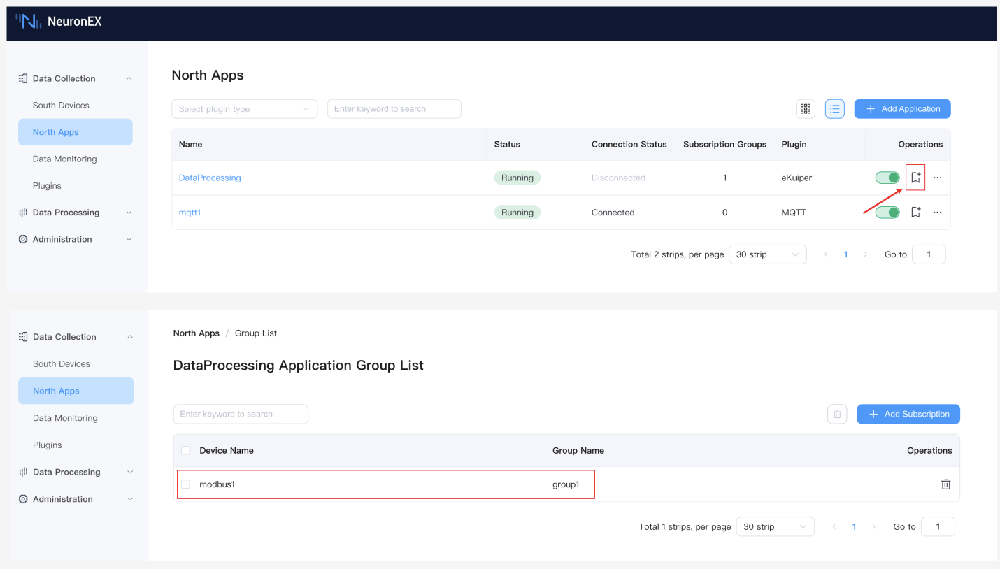

**2) Create a rule and test data inflow**

On the **Data Processing** -> **Rules** page, click **Create Rule** to enter the page. Click the run test button to see that the data processing module receives collection data from the modbus1 driver every second, indicating that the previous configuration steps were successful. You can then stop the rule test.

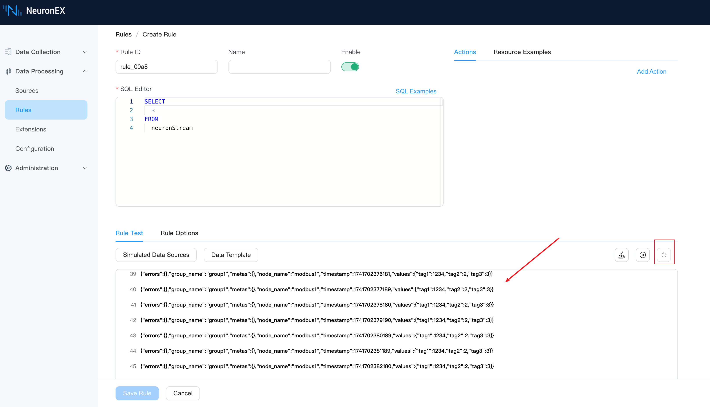

**3) Configure control**

Edit the SQL editor on the current page and enter the following SQL statement. This SQL statement renames the value of tag1 to tag2, and the SQL data result is `{tag2: 1234}`. You can also enable rule debugging here to test and view the rule SQL output.

```sql
SELECT
  values.tag1 as tag2
FROM
  neuronStream
```

Select the rule action as `Neuron` type and configure as follows, indicating that the SQL output data result will be written to **tag2** of the southbound driver **modbus1** collection group **group1**.

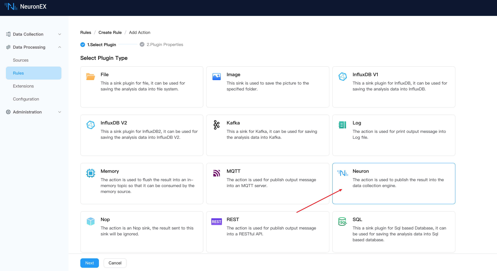

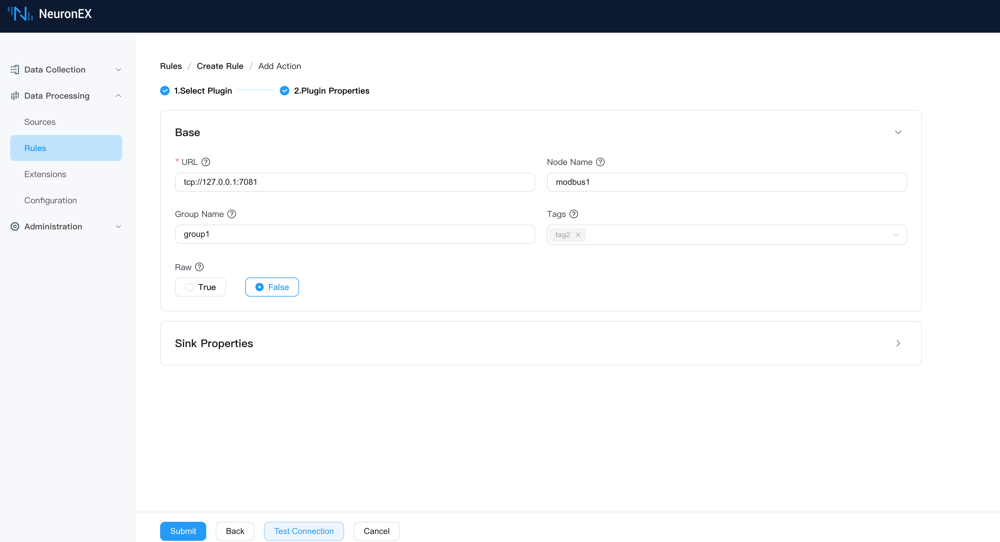

After saving the rule, it automatically enters the running state.

**4) View control results**

Return to the **Data Collection** -> **Data Monitoring** page to see that the value of **tag2** has been updated to `1234`, indicating that the control of **tag2** in the southbound driver **modbus1** through the data processing module was successful.

At this point, we can click the Write button for **tag1** to write a new value of `5678`, and we can see that the value of **tag2** is also updated to `5678`, indicating that the control of **tag2** in the southbound driver **modbus1** through the data processing module was successful.

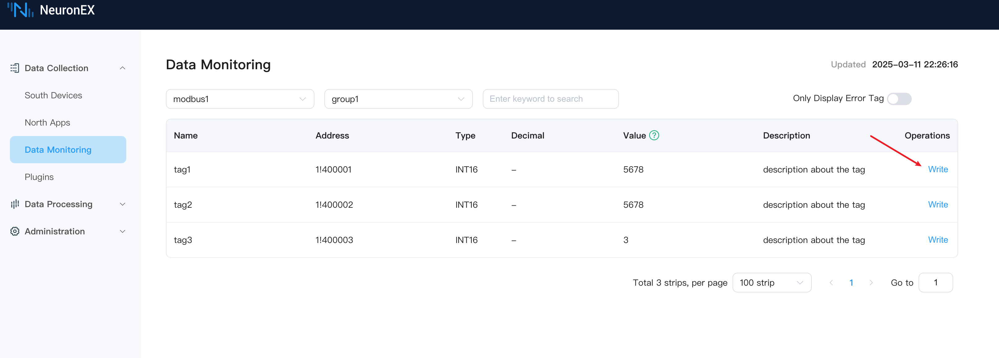

Through data processing module control, more complex control logic can be implemented, such as triggering different control operations based on different conditions, or triggering control operations based on combinations of multiple conditions, quickly building intelligent applications in industrial scenarios.

## API Control

### Feature Introduction

NeuronEX provides comprehensive RESTful API interfaces that allow third-party applications to implement device control through the HTTP protocol. This method offers high flexibility and is suitable for integration with other systems.

By calling NeuronEX's RESTful API, you can read and write device tags data. For detailed API documentation, please refer to the [NeuronEX API Documentation](https://docs.emqx.com/en/neuronex/latest/api/api-docs.html).

### POSTMAN Control Example

POSTMAN is a commonly used API testing tool that can implement device control by calling NeuronEX's RESTful API.

**1) Obtain NeuronEX Token**

In POSTMAN, select the POST method, call the `localhost:8085/api/login` interface, set the request body to JSON format, enter the username and password, and click the send button to obtain the NeuronEX Token.

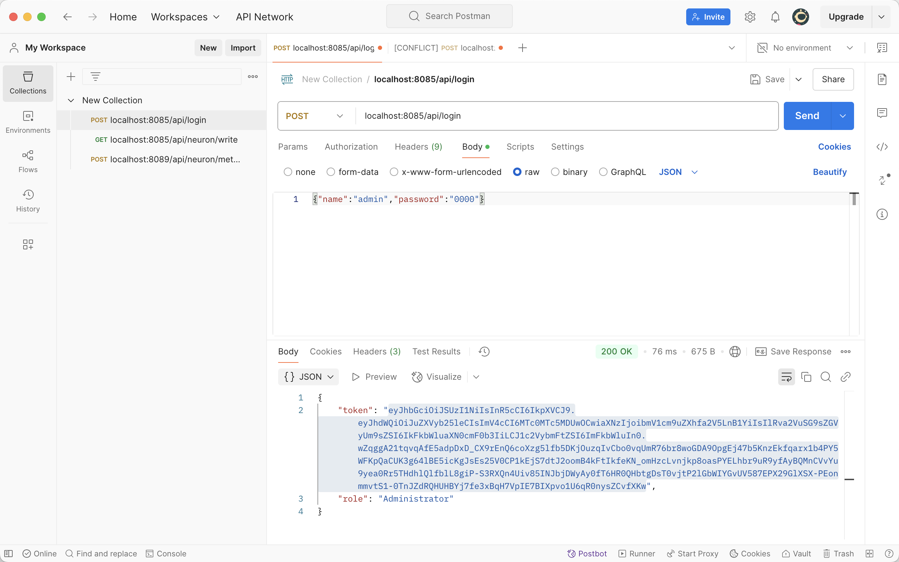

**2) Call the control interface to write data**

In POSTMAN, select the POST method, call the `localhost:8085/api/neuron/write` interface, set the request header to `Authorization` with the value `Bearer ${Token}`, set the request body to JSON format, enter the control JSON message body, and click the send button to implement device control. For detailed information about the `/api/neuron/write` interface, please refer to the [NeuronEX API Documentation](https://docs.emqx.com/en/neuronex/latest/api/api-docs.html#tag/rw/paths/~1api~1neuron~1write/post).

```json
{
  "node": "modbus1",
  "group": "group1",
  "tag": "tag1",
  "value": 12
}
```

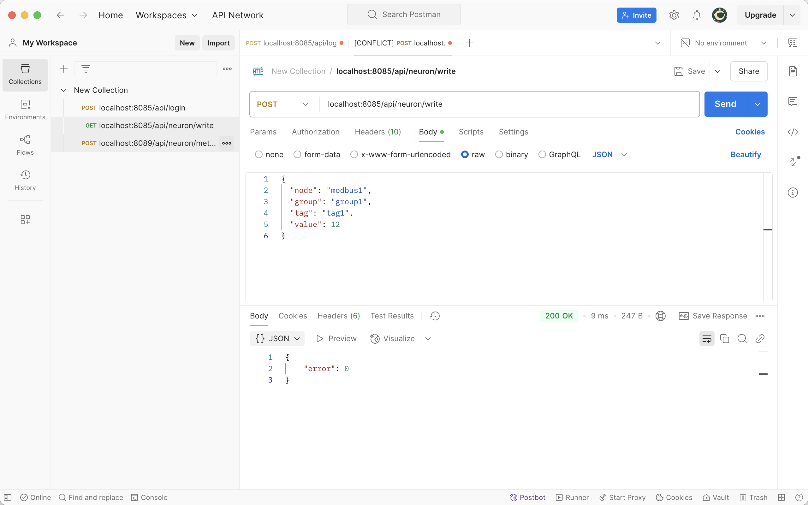

**3) View control results**

On the **Data Collection** -> **Data Monitoring** page in NeuronEX, you can see that the value of **tag2** has been updated to `12`, indicating that the control of **tag2** in the southbound driver **modbus1** through the API was successful.

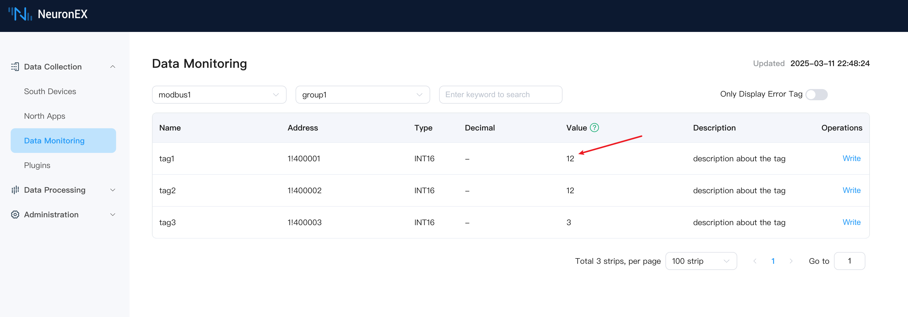

## Summary

The multiple control functions provided by NeuronEX offer powerful support for intelligent control of industrial devices. Whether it's manual operation, remote control, or automated control, all can be implemented through NeuronEX. The flexible combination of these functions can greatly enhance the intelligence level and operational efficiency of industrial production.

Through the four control methods introduced in this article, users can choose the most suitable control solution based on their actual needs and implement comprehensive device management and control from edge to cloud through NeuronEX.