# EMQX Neuron + LLM: real-time industrial fire monitoring

Fire is a major safety risk on the factory floor. This article shows how to combine EMQX Neuron and a large language model (LLM) to build a real-time fire monitoring pipeline.

EMQX Neuron collects industrial data and runs edge analytics, including custom AI functions. An LLM can interpret images as well as text. Together they can watch a site camera feed and raise an alarm when fire risk appears.

## Architecture

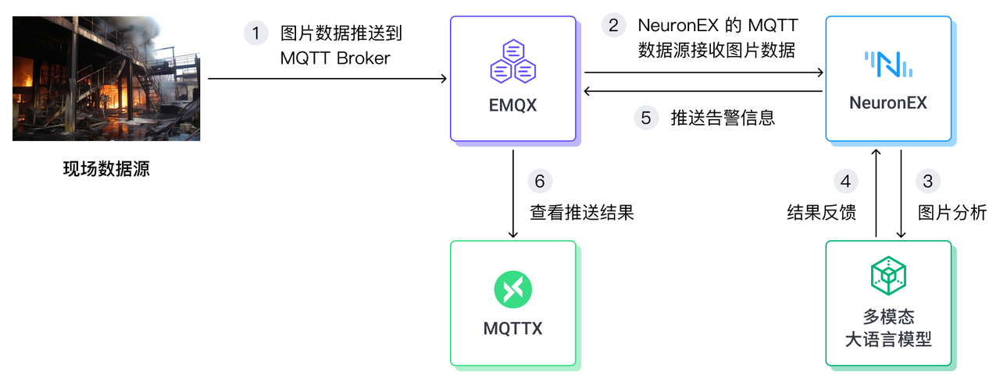

- **Site data**: This example sends Base64-encoded images into an EMQX Neuron MQTT source. Production deployments can ingest RTSP video; MQTT keeps the demo simple.
- **Python function**: A portable Python plugin calls an external multimodal LLM, sends the image, and returns a structured result.
- **LLM**: The demo uses the 01.AI `yi-vision` model, which can analyze images.
- **Alarm output**: EMQX Neuron publishes abnormal results to EMQX. You can inspect them in MQTTX.

## Configuration

### Prepare the environment

- Start EMQX Neuron (Dashboard at `localhost:8085`):

```shell
docker run -d --name neuronex -p 8085:8085 emqx/neuronex:3.8.0
```

- Start EMQX (Dashboard at `localhost:18083`):

```shell
docker run -d --name emqx-enterprise -p 1883:1883 -p 18083:18083 emqx/emqx-enterprise:5.8.0
```

EMQX Neuron and EMQX run in different containers. In this write-up, EMQX Neuron reaches EMQX through the host IP `192.168.71.62`. Replace it with your host address.

- Register at [01.AI](https://platform.lingyiwanwu.com/) and create an API key. At the time of writing, trial usage was available.

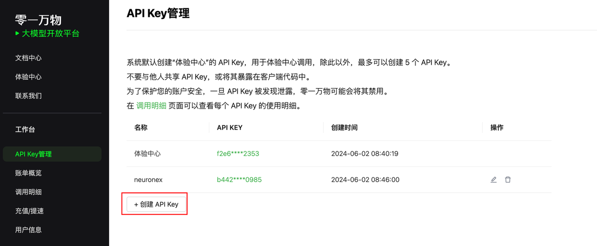

- Install [MQTTX](https://mqttx.app/downloads) to inspect the output.

### Receive simulated image data in EMQX Neuron

On the EMQX Neuron Dashboard, add an MQTT source named `mqtt_source`. Set the broker to `tcp://192.168.71.62:1883` and the topic to `input`.

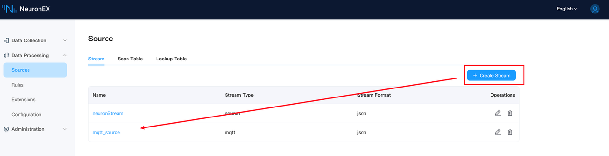
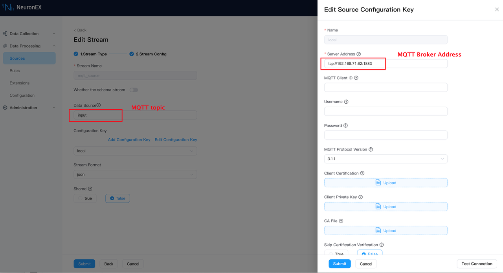

### Integrate a Python algorithm function

EMQX Neuron provides an SDK and [portable Python plugin examples](../streaming-processing/portable_python.md).

In that framework you call the LLM, write a prompt, and parse the response. Example:

```python
class FireDetectFunc(Function):
    def exec(self, args: List[Any], ctx: Context):
        completion = client.chat.completions.create(
            model="yi-vision",
            messages=[
            {
                "role": "user",
                "content": [
                {
                    "type": "text",
                    "text": SYSTEM_PROMPT
                },
                {
                    "type": "image_url",
                    "image_url": {
                    "url": args[0]
                    }
                }
                ]
            },
            ]
        )
        # Parse the model response
        result = json.loads(completion.choices[0].message.content.strip())
        return result
```

Prompt (the demo used a Chinese prompt; an English equivalent):

```text
SYSTEM_PROMPT = '''
I will send you a Base64-encoded photo from a factory camera. From the image, decide whether there is a fire, an ongoing fire, or a clear fire risk. Reply with JSON only.

If there is fire or fire risk:
{
 "is_fire":true,
 "message":"Fire detected. Please handle it immediately!"
}

If there is no fire risk:
{
 "is_fire":false,
 "message":"The factory environment looks normal."
}

Return only the JSON object, nothing else.
'''
```

Add the OpenAI client to `requirements.txt`. It is not in the default EMQX Neuron image:

```text
openai>=1.30.5
```

Import the packaged plugin `myfunc.zip` into EMQX Neuron:

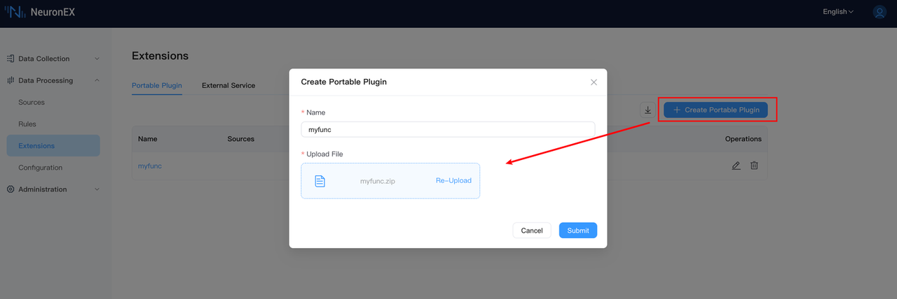

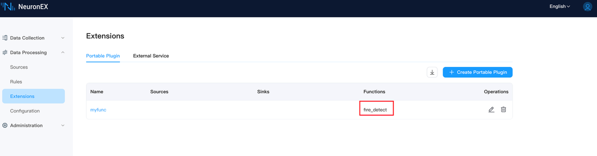

If the OpenAI package fails to install (for example because of network restrictions), enter the EMQX Neuron container and install it from a mirror:

```shell
pip install openai -i https://pypi.tuna.tsinghua.edu.cn/simple
```

### Write a processing rule

Create a rule with this SQL:

```sql
SELECT
  fire_detect(pic) as result
FROM
  mqtt_source
WHERE
  result.is_fire = True
```

`fire_detect` is the Python function imported above. The rule reads each `mqtt_source` event, runs `fire_detect` on the `pic` field, and forwards only results where `is_fire` is `True`. The source payload format is shown in [Send simulated images](#send-simulated-images).

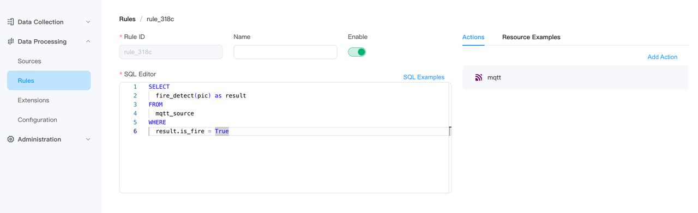

Configure an MQTT action so results go to the EMQX topic `output`:

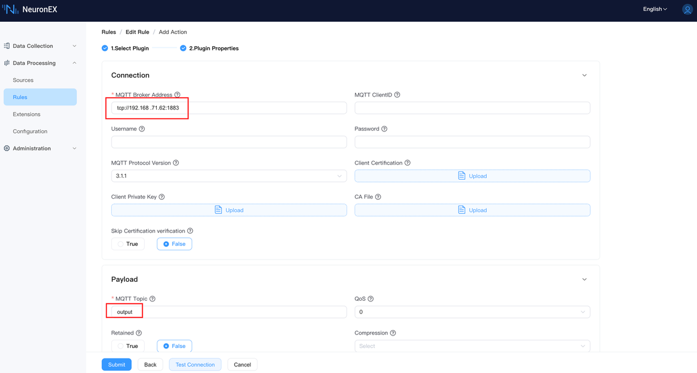

Create the rule:

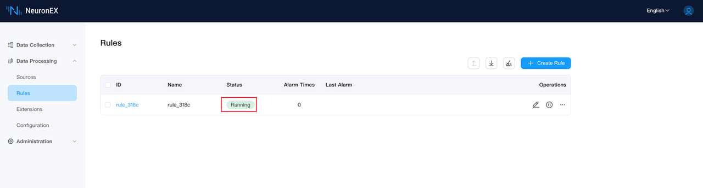

## Demo

### Send simulated images

Prepare one image with fire (`fire.png`) and one without (`no_fire.png`):


Encode `fire.png` as Base64, wrap it in JSON, and publish to the EMQX topic `input`:

```python
import paho.mqtt.client as mqtt
import base64
import json

broker_address = "192.168.71.62"
broker_port = 1883
client = mqtt.Client("MQTT_Client_u34jb34q")
client.connect(broker_address, broker_port)

with open('./_assets/fire.png', 'rb') as image_file:
        image = 'data:image/png;base64,' + base64.b64encode(image_file.read()).decode('utf-8')
payload = {
        "pic": image
}
json_data = json.dumps(payload)
topic = "input"
client.publish(topic, json_data)
client.disconnect()
```

### Inspect the output

MQTTX:

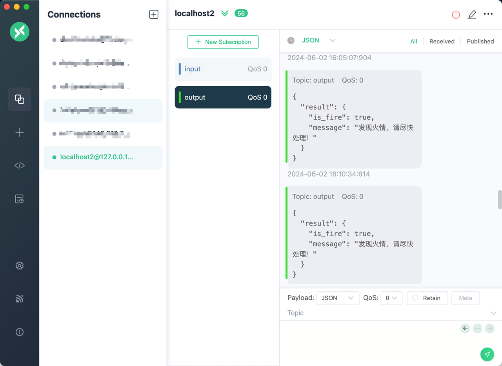

Rule status:

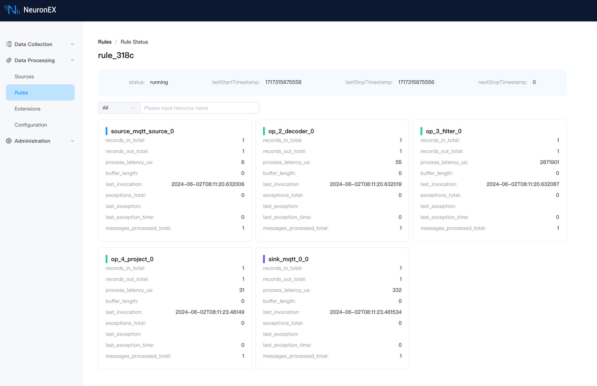

## Summary

This walkthrough combines EMQX Neuron with a multimodal LLM to watch a factory camera and raise fire alarms. The same pattern—ingest at the edge, call a model from a portable function, filter with a rule, and publish to MQTT—applies to other visual inspection tasks.
