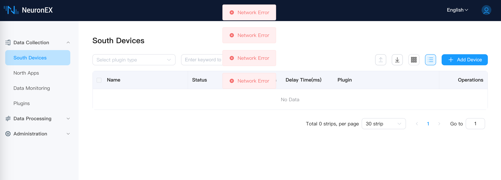
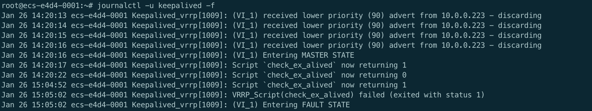

# NeuronEX Master-Backup Mode

## Overview

NeuronEX is an industrial edge data hub that provides industrial data collection and edge intelligent analysis services. In some scenarios, it is necessary to ensure the continuity and stability of the NeuronEX service. By deploying two NeuronEX services in master-backup mode, the high availability of the service can be achieved.

This solution achieves high availability by deploying two NeuronEX services on two servers and using Keepalived to automatically switch between the master and backup nodes. It supports scenarios where the master NeuronEX fails to work or the master server fails, and the backup node automatically takes over the service to ensure that the NeuronEX service is not interrupted. When the master node recovers, it automatically switches to the master node NeuronEX.

## Environment Preparation

- Hardware Requirements
  - 2 servers for master and backup nodes
  - At least 1 CPU core and 1GB memory per server

- Software Requirements
  - Operating System: Ubuntu >=18.04 or CentOS >=7
  - NeuronEX Installation Package (supports deb, rpm, Docker)
  - Keepalived Software

- Network Requirements
  - Internal network communication between master and backup nodes
  - Ensure that the security group or firewall allows VRRP protocol and NeuronEX service port traffic

This example uses two Ubuntu 22.04 x86_64 architecture virtual machines on Cloud, with the internal network IP address of the host as `10.0.0.127` and the internal network IP address of the backup as `10.0.0.223`. The host and backup IP addresses are bound to the `eth0` network card.


## NeuronEX Installation and Configuration

### NeuronEX Installation
Install NeuronEX on both the master and backup nodes. This example uses the NeuronEX 3.4.3 x86_64 architecture deb package. For other installation packages, please visit [NeuronEX Download Page](https://www.emqx.com/en/downloads-and-install/neuronex).

```shell
# Download NeuronEX installation package
wget https://www.emqx.com/zh/downloads/neuronex/3.4.3/neuronex-3.4.3-linux-amd64.deb

# Install NeuronEX
sudo dpkg -i neuronex-3.4.3-linux-amd64.deb

# Start NeuronEX
sudo systemctl start neuronex

# Set to start automatically on boot
sudo systemctl enable neuronex
```

### NeuronEX Configuration

Access the NeuronEX Dashboard of the master node, and configure one Modbus TCP southbound driver to collect data, which will be used to verify the master-backup switch function.

Access the NeuronEX Dashboard page of the backup node, you can manually configure the same data collection service as the master node to verify the master-backup switch function. Alternatively, you can copy the master node's configuration `/opt/neuronex/data/` to the same directory on the backup node to overwrite the existing configuration.

Through the above configuration, both the master and backup NeuronEX can run normally. At this point, you can stop the NeuronEX service of the backup node by the following command to represent the initial state where the master node is running and the backup node is stopped.  

```shell
sudo systemctl stop neuronex
```

## Keepalived Installation and Configuration

### Keepalived Installation
Install Keepalived on both the master and backup nodes:

```bash
# Install Keepalived
sudo apt-get install keepalived
```


### Keepalived Configuration on Master Node

Create `keepalived.conf`, `master.sh`, `fault.sh`, `check_alive.sh` files in the `/etc/keepalived/` directory of the master node.

1. Configure Keepalived on the master node, the configuration file is `/etc/keepalived/keepalived.conf`, the content is as follows:

```shell
! Configuration File for keepalived
global_defs {
   vrrp_skip_check_adv_addr
   #vrrp_strict
   vrrp_garp_interval 0
   vrrp_gna_interval 0
}

# Define the script content for the instance execution
vrrp_script check_ex_alived {
        script "/etc/keepalived/check_alive.sh"
        interval 5
        fall 3 # require 3 failures for KO
}


# Define a virtual router instance
vrrp_instance VI_1 {
    # Define the initial state, which can be MASTER or BACKUP
    state MASTER
    # nopreempt
    # Define the working interface
    interface eth0

    virtual_router_id 51
	# Define the weight
    priority 100
	# Define the advert frequency, unit is second
    advert_int 1
	# Define the communication authentication mechanism
    authentication {
        auth_type PASS
        auth_pass abcdefgh
    }

    # Define the virtual VIP address, which is not used
    virtual_ipaddress {
        192.160.127.254/17
    }
    unicast_peer {
        10.0.0.223  # Backup node IP address
    }
    # Track script, usually used to execute the script content defined in the vrrp_script
    track_script {
        check_ex_alived
    }

    # Notify script, which will be executed after the host state becomes Master|Backup|Fault
    notify_fault "/etc/keepalived/fault.sh"
    notify_master "/etc/keepalived/master.sh"
}

```

::: tip

Since the IP address of the backup node in this example is `10.0.0.223`, `unicast_peer` in the keepalived.conf file is `10.0.0.223`, please modify it according to actual conditions.

Since the network card bound to the host IP address `10.0.0.127` is `eth0`, `interface` in the keepalived.conf file is `eth0`. Please modify it according to the actual situation.

:::


2. Configure `master.sh` script on the master node, the configuration file directory is `/etc/keepalived/master.sh`, the content is as follows:

```shell
#!/bin/bash

systemctl start neuronex
```

3. Configure `fault.sh` script on the master node, the configuration file directory is `/etc/keepalived/fault.sh`, the content is as follows:

```shell
#!/bin/bash

systemctl stop neuronex
```

4. Configure `check_alive.sh` script on the master node, the configuration file directory is `/etc/keepalived/check_alive.sh`, the content is as follows:

```shell
#!/bin/bash

if ! curl 127.0.0.1:8085  >/dev/null 2>&1; then echo "neuronex start failed"; exit 1; fi
```

5. Start Keepalived on the master node

```shell
sudo systemctl start keepalived

# Set to start automatically on boot
sudo systemctl enable keepalived
```


### Configure Keepalived on the Backup Node

Create `keepalived.conf`、 `master.sh`、 `backup.sh` files in the `/etc/keepalived/` directory of the backup node.

1. Configure Keepalived on the backup node, the configuration file directory is `/etc/keepalived/keepalived.conf`, the content is as follows:

```shell
! Configuration File for keepalived
global_defs {
   vrrp_skip_check_adv_addr
   #vrrp_strict
   vrrp_garp_interval 0
   vrrp_gna_interval 0
}

# Define a virtual router instance
vrrp_instance VI_1 {
    # Define the initial state, which can be MASTER or BACKUP
    state BACKUP
	# Non-preemptive mode
    nopreempt
    # Define the working interface
    interface eth0

    virtual_router_id 51
	# Define the weight
    priority 90
	# Announcement frequency, unit is second
    advert_int 1
	# Define the communication authentication mechanism
    authentication {
        auth_type PASS
        auth_pass abcdefgh
    }

    # Define the virtual VIP address, which is not used
    virtual_ipaddress {
        192.160.127.254/17
    }

    unicast_peer {
        10.0.0.127  # Master node IP address
    }

    # Notify script, which will be executed after the host state becomes Master|Backup|Fault
    notify_master "/etc/keepalived/master.sh"
    notify_backup "/etc/keepalived/backup.sh"
}
```

::: tip

Since the IP address of the master node in this example is `10.0.0.127`, the unicast_peer content in the keepalived.conf file is `10.0.0.127`, please modify it according to actual conditions.

Since the network card bound to the host IP address `10.0.0.223` is `eth0`,  `interface` in the keepalived.conf file is `eth0`. Please modify it according to actual conditions.

:::

2. Configure `master.sh` script on the backup node, the configuration file directory is `/etc/keepalived/master.sh`, the content is as follows:

```shell
#!/bin/bash

systemctl start neuronex
```

3. Configure `backup.sh` script on the backup node, the configuration file directory is `/etc/keepalived/backup.sh`, the content is as follows:

```shell
#!/bin/bash

systemctl stop neuronex
```

4. Start Keepalived on the backup node

```shell
sudo systemctl start keepalived

# Set to start automatically on boot
sudo systemctl enable keepalived
```


## Master-Backup Switch Logic

After the above configuration steps, both the master and backup nodes have started the Keepalived service, and the master node is in the `MASTER` state, and the backup node is in the `BACKUP` state. The master node NeuronEX service is running normally, and the backup node NeuronEX service is stopped. When the following situations occur:

1. **Master Node NeuronEX Service Failure**

  - Fault detection:

    Keepalived periodically executes the `check_alive.sh` script through vrrp_script to detect the status of the NeuronEX service.

    If the `check_alive.sh` script detects that the NeuronEX service fails, it returns a failure status.

    Keepalived confirms the service failure within the specified time (15 seconds in this example) based on the interval and fall parameters.

  - Priority adjustment:

    Keepalived lowers the priority of the master node.

    Keepalived executes the `fault.sh` script to stop the master node NeuronEX service.

    The master node sends a VRRP announcement, announcing its new priority.

  - Backup node switch:

    The backup node receives the VRRP announcement from the master node and finds that the priority of the master node is lower than its own priority (for example, 0 < 90).

    The backup node switches to the `MASTER` state.

    The backup node executes the `master.sh` script to start the NeuronEX service and take over the workload of the master node.


2. **Master Node Server Failure**

  - Fault detection:

    The master node server completely crashes, and both Keepalived and NeuronEX stop running.

    The master node cannot send a VRRP announcement, and the backup node cannot receive the status information from the master node.

  - Backup node switch:

    The backup node does not receive the VRRP announcement from the master node within the advert_int * 3 time (3 seconds in this example), and considers the master node to be faulty.

    The backup node automatically switches to the `MASTER` state.

    The backup node executes the `master.sh` script to start the NeuronEX service and take over the workload of the master node.


3. **Master Node Recovery**

  - Service recovery:

    The NeuronEX service of the master node recovers, and the `check_alive.sh` script detects that the NeuronEX is running normally, returning a successful status.

    Keepalived restores the priority of the master node.

    The master node sends a VRRP announcement, announcing its priority.

  - Master node becomes `MASTER`:

    The backup node receives the VRRP announcement from the master node and finds that the priority of the master node is higher than its own priority.

    The backup node is not configured with nopreempt, so the backup node actively downgrades to the `BACKUP` state.

    The backup node executes the `backup.sh` script to stop the NeuronEX service.

    The master node becomes `MASTER`, taking over the workload.

::: tip 

Since the master node Keepalived is configured with the preemptive mode, the master node will automatically switch to the `MASTER` state and start the NeuronEX service after recovery, taking over the workload of the master node.

:::


## Test and Verification

### Simulate Master Node NeuronEX Service Failure

1. Stop the master node NeuronEX service through the following command:

    ```shell
    sudo systemctl stop neuronex
    ```

2. Check the NeuronEX status of the master node and the backup node through the following command:

    ```shell
    sudo systemctl status neuronex
    ```

3. Access the backup node NeuronEX Dashboard page, the backup node NeuronEX service runs normally, and the southbound driver collects data normally. Access the master node NeuronEX Dashboard page, the master node NeuronEX service stops.

    - Backup node NeuronEX service runs normally


    - Master node NeuronEX service stops


### Simulate Master Node Server Failure

1. Turn off the master node server, and check the NeuronEX status of the backup node through the following command:

    ```shell
    sudo systemctl status neuronex
    ```

2. Access the backup node NeuronEX Dashboard page, the backup node NeuronEX service runs normally, and the southbound driver collects data normally. Access the master node NeuronEX Dashboard page, the master node NeuronEX service stops.


### Master Node Recovery

1. Turn on the master node server, since we have set Keepalived and NeuronEX to start automatically in the previous steps, the master node will automatically start the Keepalived and NeuronEX service. Check the NeuronEX status of the master node through the following command:

    ```shell
    sudo systemctl status neuronex
    ```

2. Access the master node NeuronEX Dashboard page, the master node NeuronEX service runs normally.

3. Access the backup node NeuronEX Dashboard page, the backup node NeuronEX service has stopped.


## Other Notes

### Deployment Mode

The master-backup mode also supports the NeuronEX Docker deployment mode.

In this example, NeuronEX is deployed through the `systemd` method, so the corresponding script starts and stops NeuronEX in the systemctl command form. 

If the NeuronEX deployment method is `Docker`, then the startup and stop NeuronEX method in the script is in the docker command form. You need to replace the systemctl command in the `master.sh`, `backup.sh`, `fault.sh` scripts with the docker command. For example, `docker start neuronex`, `docker stop neuronex`.

### Configuration File Synchronization

The master-backup mode does not support automatic synchronization of configuration files between the master and backup NeuronEX. If you need the configuration files of the master and backup NeuronEX to be consistent, you need to manually synchronize the configuration files.

If the configuration file of the master node NeuronEX has changed after running for a period of time, and you do not want to start both the master and backup NeuronEX services at the same time (this will cause duplicate data collection), then you can manually synchronize the configuration file while keeping the backup node NeuronEX service stopped:

- Package installation Mode:  

    Copy the configuration file `/opt/neuronex/data/` of the master node NeuronEX to the same directory of the backup node.

- Docker deployment Mode:

    Copy the configuration file `/opt/neuronex/data/` of the master node NeuronEX to the directory mounted to the host by the docker container.


### Data Loss and Duplication Issues

To build a complete high-availability function for NeuronEX, the complete high-availability means that any single NeuronEX node failure will not lose or duplicate data. This requires configuring three NeuronEX services, implementing data high availability through distributed databases and cluster modes. This method requires a high cost and requires the factory equipment and network to support high availability to be fully effective. In actual factory scenarios, it is often difficult to meet this condition, that is, the PLC does not support master-backup or the factory network does not support master-backup, and there is still a single point of failure, which cannot achieve full data link high availability.

The high-availability solution in the current example still has some data loss or duplication issues.

About the data loss issue, when the NeuronEX on the master node fails, keepalived needs some time to detect it, where the detection interval and failure count can be configured, as follows:

```shell

vrrp_script check_ex_alived {
        script "/etc/keepalived/check_alive.sh"
        interval 5
        fall 3 # require 3 failures for KO
}
```

The current configuration is to detect every 5 seconds and trigger the master-backup switch after 3 failures. Therefore, during this period, the NeuronEX on both the `MASTER` and `BACKUP` nodes is not running, resulting in short-term data loss.

In addition, about the data duplication issue, after the master node recovers, the backup node detects the master node recovery and stops its own NeuronEX, so there will be a short period of time when both nodes' NeuronEX are running, causing short-term duplicate data collection.

## Common Issues


- You can use the `ping` command to check if the master and backup nodes are communicating normally.

- You can check the status of the master and backup nodes and whether they are switching normally by viewing the keepalived log.

    ```shell
    journalctl -u keepalived -f
    ``` 

- Master node log example:



- Backup node log example:

