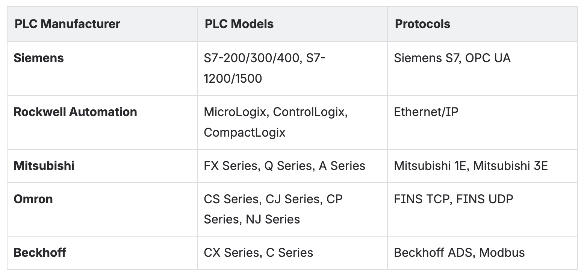
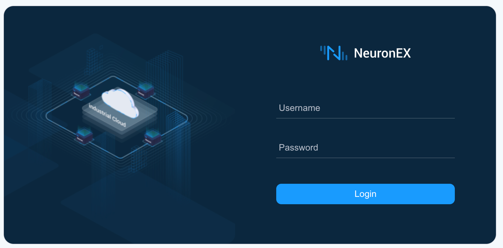
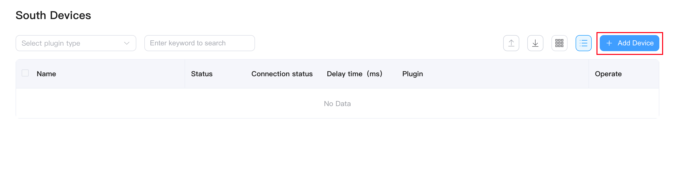
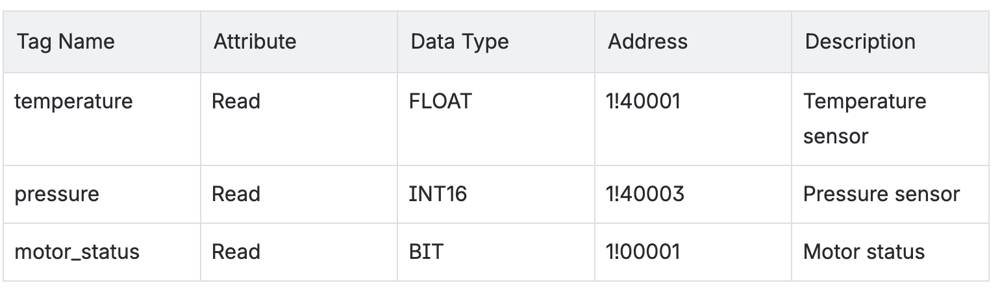
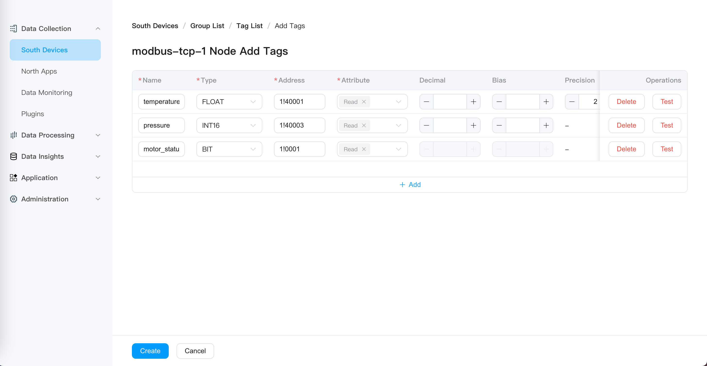
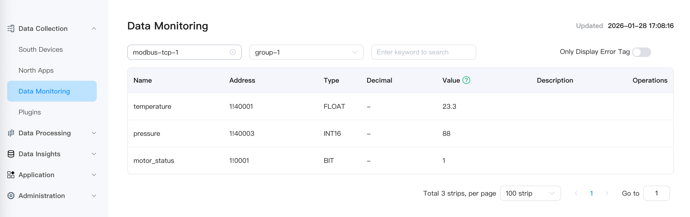
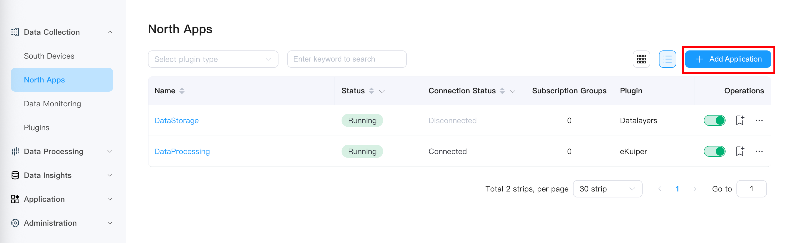
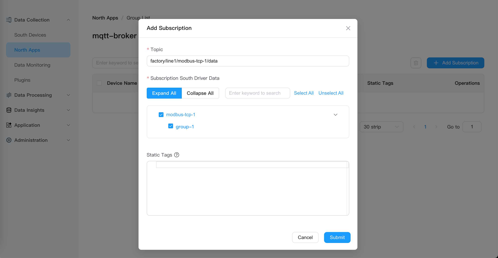

# How to Connect Any PLC to MQTT in 10 Minutes

Connecting **PLC** data to **MQTT** is the first step in modern industrial digitalization. As a lightweight messaging protocol, **MQTT** has become the de facto standard for Industrial IoT—it handles unstable network environments well, supports real-time data streaming, and is natively supported by almost all cloud platforms, data analytics tools, and MES systems.

However, in real factory environments, connecting **PLC** data to **MQTT** is far more complex than imagined. **PLCs** from different manufacturers use different communication protocols (**Modbus**, **OPC UA**, **Siemens S7**, **Ethernet/IP**...), and traditional solutions require writing driver code for each protocol, resulting in high deployment and maintenance costs.

This article demonstrates how to connect any **PLC** to **MQTT** in 10 minutes using **EMQX Neuron**, without writing any code.

## Why is PLC to MQTT So Difficult?

### Protocol Fragmentation
Equipment in factory workshops comes from different eras and manufacturers:



Each protocol has its own data format, addressing method, and communication mechanism. Traditional solutions require developing and maintaining independent drivers for each protocol.

### Inconsistent Data Formats

Even after successfully collecting data, different **PLCs** have vastly different data formats:

- Register addresses: `40001` (**Modbus**) vs `DB1.DBD0` (**Siemens**) vs `N7:0` (**Allen-Bradley**)

- Data types: `INT16`, `FLOAT`, `BOOL`, `STRING`...

- Byte order: Big-endian vs Little-endian

These data need to be standardized before being sent to **MQTT**.

### Deployment and Maintenance Costs
Traditional access solutions often rely on dedicated hardware gateways, which not only have high initial procurement costs but also incur a series of hidden expenses: deployment and debugging of hardware gateways require professional engineers to operate on-site, which is time-consuming and labor-intensive; driver adaptation for different PLC protocols, firmware upgrades, and troubleshooting all require additional technical service fees.

## EMQX Neuron: Industrial Edge Gateway Software

EMQX Neuron is an industrial edge gateway software designed specifically for industrial scenarios. It integrates protocol conversion, data processing, and MQTT publishing into a lightweight software solution.

### Core Advantages

1. **100+ Industrial Protocols Out of the Box**

   - Modbus TCP/RTU, OPC UA, Siemens S7, Ethernet/IP, BACnet, IEC 60870-5-104, DNP3...

   - Complete protocol list: [Data Collection Plugin List](../introduction/plugin-list/plugin-list.md)

2. **Flexible & Lightweight Deployment**

   - **Docker** container: One-click deployment, cross-platform operation (runs with `256MB` memory)

   - **Kubernetes**: Cloud-native deployment

   - Bare-metal installation: Supports **Ubuntu**, **CentOS**, **Debian**

   - Edge hardware: Raspberry Pi, Industrial **PC**, **ARM** gateways

3. **Zero-Code Configuration**

   - Visual configuration via **Web** interface

   - Complete **PLC** to **MQTT** pipeline in 10 minutes

4. **Powerful Edge Computing Capabilities**

   - **SQL** stream processing: `160+` built-in functions, supports filtering, transformation, aggregation

   - **AI** algorithm integration: Supports **Python**, **ONNX**, external **HTTP** services

   - Real-time alerts: Millisecond-level response, supports complex rules

5. **Enterprise-Grade Features**

   - High performance: Single node supports `100,000+` data points

   - Security: **TLS/SSL** encryption, user permission management

   - Observability: Complete logs, metrics, and monitoring

## 10-Minute Hands-On: Modbus PLC to MQTT

Let's demonstrate the entire process through a complete hands-on case.

### Architecture Overview


### Prerequisites

- **PLC** or simulator: This example uses a **Modbus TCP** simulator (**PeakHMI Slave Simulators**)

- **EMQX Neuron**: Quick deployment via **Docker**

- **MQTT Broker**: Use public broker `broker.emqx.io`

- **MQTT** client: Use **MQTTX** to verify data

### Step 1: Start EMQX Neuron

```shell
docker pull emqx/neuronex:latest
docker run -d --name neuronex -p 8085:8085 --log-opt max-size=100m --privileged=true emqx/neuronex:latest
```

Access <http://localhost:8085> and log in with default credentials: Username: `admin`, Password: `0000`



### Step 2: Add Southbound Device (Data Source)

**Southbound devices** are connections between **NeuronEX** and **PLCs**.

1. Go to "**Data Collection**" → "**Southbound Devices**"

2. Click "**Add Device**"

3. Configure device parameters:

   - Name: `modbus-tcp-1`

   - Plugin: Select "**Modbus TCP**"

   - **IP Address**: Enter the simulator's **IP** (e.g., `192.168.1.100`)

   - Port: `502` (**Modbus TCP** default port)

   - Keep other parameters as default

4. Click "**Add Device**"



### Step 3: Create Collection Group and Tags

**Collection groups** are used to group data points, and each group can have an independent collection frequency.

#### 3.1 Create Collection Group

1. Click on the `modbus-tcp-1` device card you just created

2. Click "**Create Group**"

3. Configure group parameters:

   - Group Name: `group-1`

   - Collection Interval: `1000` (milliseconds, i.e., collect once per second)

#### 3.2 Add Data Tags

1. Click "**Tag List**" for the `group-1` group

2. Click "**Add Tag**"

3. Configure tag parameters:



Address format explanation:

- `1!40001`, where `1` is the station number and `40001` is the holding register address

- `1!00001:1`, where `1` is the station number and `00001` is the coil address

4. Click "**Create**"



After completing tag creation, the device status will automatically change to "**Connected**".

### Step 4: Verify Data Collection

1. Go to "**Data Collection**" → "**Data Monitoring**"

2. Select southbound device: `modbus-tcp-1`

3. Select group: `group-1`

4. View real-time data



You will see the real-time values of each tag.

### Step 5: Configure Northbound Application (MQTT Publishing)

**Northbound applications** are used to send collected data to external systems.

#### 5.1 Create MQTT Application

1. Go to "**Data Collection**" → "**Northbound Applications**"

2. Click "**Add Application**"

3. Configure application parameters:

   - Name: `mqtt-broker`

   - Plugin: Select "**MQTT**"



#### 5.2 Configure MQTT Connection

1. Fill in the application configuration page:

   - Server Address: `broker.emqx.io` (public **MQTT Broker**)

   - Server Port: `1883`

   - Client **ID**: `neuron-client-001` (optional)

   - Username/Password: Leave blank (public broker requires no authentication)

2. Click "**Submit**", and the application status will change to "**Running**".

#### 5.3 Subscribe to Southbound Data Group

1. Click "**Add Subscription**" for the `mqtt-broker` application

2. Configure subscription parameters:

   - Topic: `factory/line1/modbus-tcp-1/data` (custom topic)

   - Subscribe to Southbound Driver Data: Select `modbus-tcp-1` → `group-1`



3. Click "**Submit**"

### Step 6: Verify MQTT Data

Use the **MQTTX** client to verify that data is successfully published to the **MQTT Broker**.

1. Open **MQTTX** and create a new connection:

   - Name: `TestConnection`

   - **Host**: `broker.emqx.io`

   - **Port**: `1883`

2. Add subscription:

   - **Topic**: `factory/line1/modbus-tcp-1/data`

3. View received data:

```json
{
  "timestamp": 1706745600000,
  "node_name": "modbus-tcp-1",
  "group_name": "group-1",
  "values": {
    "temperature": 23.3,
    "pressure": 88,
    "motor_status": 1
  }
}
```


Congratulations! You have completed the complete data pipeline from **Modbus PLC** to **MQTT** in 10 minutes.

## Advanced: Support for More PLC Protocols

The example above uses a **Modbus** simulator for data collection. **EMQX Neuron** supports `100+` industrial protocols. For a complete tutorial on collecting data from **Siemens S7-1200 PLC** using **EMQX Neuron** and sending it to **MQTT**, please refer to: [Connecting Siemens S7-1200 PLC to MQTT in 10 Minutes](https://www.emqx.com/en/blog/connecting-siemens-s7-1200-plc-to-mqtt)

## Advanced: Edge Data Processing

**EMQX Neuron** can not only collect and forward data but also perform real-time data processing at the edge.

### Use Cases

- **Data filtering**: Only upload data exceeding thresholds (e.g., temperature > `80°C`)

- **Data transformation**: Unit conversion (`PSI` → `Bar`), value calculation (`+1`, `×0.9`)

- **Data aggregation**: Calculate average, maximum, minimum values

- **Alert triggering**: Real-time anomaly detection and alert sending

### Quick Example: Temperature Over-Limit Alert

Scenario: When temperature exceeds `80°C`, send an alert to a separate **MQTT** topic.

1. **Subscribe data to the data processing module**

   In "**Data Collection**" → "**Northbound Applications**", find the default **DataProcessing** application and add a subscription: the `group-1` collection group of the `modbus-tcp-1` driver.

   Data will automatically flow into the `neuronStream` data stream of the data processing module.

2. **Create processing rule**

   Go to "**Data Processing**" → "**Rules**", click "**New Rule**":

```sql
SELECT
  timestamp,
  node_name,
  values.temperature as temp
FROM neuronStream
WHERE values.temperature > 80
```

3. **Configure action (Sink)**

   Click "**Add**" in the "**Actions**" module, select "**MQTT**":

   - Server Address: `broker.emqx.io:1883`

   - Topic: `factory/alerts/high-temperature`

   - Data Template:

```json
{
  "alert_type": "high_temperature",
  "device": "{{.node_name}}",
  "temperature": {{.temp}},
  "timestamp": {{int64 .timestamp}}
}
```

4. **Verify alert**

   Subscribe to `factory/alerts/high-temperature` in **MQTTX**. When the temperature exceeds `80°C`, you will receive an alert message.

## Summary

Connecting **PLCs** to **MQTT** should not be a complex, expensive, and time-consuming project. **EMQX Neuron** simplifies the entire process in the following ways:

✅ **100+ protocols out of the box**: No need to write drivers for each **PLC**

✅ **Zero-code configuration**: Visual **Web** interface operations, complete configuration in 10 minutes

✅ **Lightweight deployment**: **Docker** container, `200MB+` image, `256MB` memory

✅ **Edge computing capabilities**: **SQL** stream processing + **AI** algorithm integration

Start your industrial digitalization journey today and let data flow.
