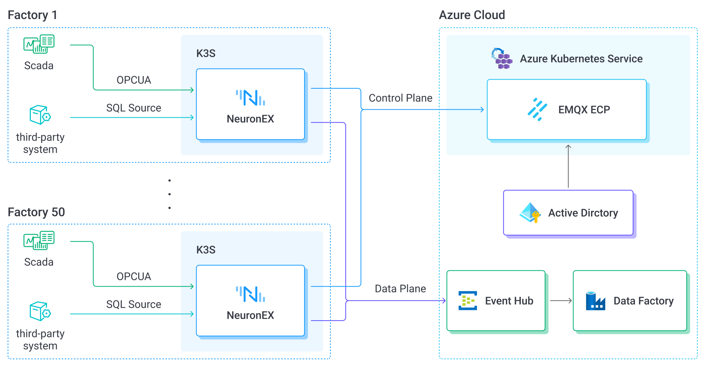

# Build a beverage production digital platform with EMQX Neuron and ECP

Facing faster competition and changing demand, a beverage manufacturer wanted a more automated production and management system. They combined EMQ’s manufacturing stack with Azure to improve efficiency, quality, and time-to-market.

## Challenges

- **Data silos**

  Lines used equipment and systems from many vendors, each with its own data format and protocol. Heterogeneous data blocked unified management and analysis.

- **Slow response**

  Traditional collection and analysis lagged behind the need for real-time monitoring and decisions, which limited how quickly the plant could adjust production.

- **Integration**

  Connecting many production systems and devices was difficult. Compatibility and interoperability became a bottleneck.

- **Weak analytics**

  Without better tools, it was hard to extract value from large volumes of production data, which limited intelligent production and predictive maintenance.

- **Edge computing**

  To improve latency and reduce load on central servers, the plant needed to process data close to the source so critical tasks could run with low delay.

## Solution

The manufacturer chose EMQ’s manufacturing solution on Azure. Core pieces:

- **EMQX Neuron**: industrial edge gateway for multi-protocol collection and edge computing—collect, process, analyze, and forward data from devices and production systems.
- **EMQX ECP**: industrial data platform for cloud–edge management of Neuron instances, including SSO.
- **Azure Event Hubs**: cloud message queue for high-throughput streams from the edge.
- **Azure Data Factory**: managed service for persistence and enterprise analytics.
- **Azure Active Directory (AD)**: identity and access management, integrated with ECP SSO.
- **Azure Kubernetes Service (AKS)**: container platform that simplifies ECP deployment and improves reliability.

## Highlights

- **Lightweight edge rollout**

  Neuron on K3s was deployed to about 50 plants. The model fits limited shop-floor compute while keeping the system observable.

- **Broad data collection**

  OPC UA pulls data from SCADA. Incremental reads from SQL Server integrate third-party production systems (see [SQL source templates](../streaming-processing/sql.md#sql-statement-template-examples)).

- **Edge compute and real-time analysis**

  Preprocessing and analysis at the line standardizes data and reduces load on central systems.

- **Reliable transport**

  Neuron publishes to Azure Event Hubs with checkpointing so streams stay complete across interruptions.

- **Cloud–edge operations**

  ECP provides centralized lifecycle management for Neuron at 50 sites: remote configuration, monitoring, and anomaly detection.

- **Stronger security**

  ECP SSO plus Azure identity improves both security and day-to-day access.

## Results

The plant built a data-driven manufacturing platform:

- **Connected data**: Unified collection, management, and sharing across the factory.
- **Live production insight**: Key metrics available in time for operators and management to act.
- **Lower cost and less downtime**: Remote monitoring reduced maintenance cost and unexpected stops.
- **Faster response**: Digital workflows shortened the path from market change to production change.

## Summary

With EMQ, this beverage manufacturer improved efficiency and quality, and gained a live data foundation for further manufacturing platforms. Flexible Neuron deployment plus ECP cloud–edge management supports continued product and process innovation.
