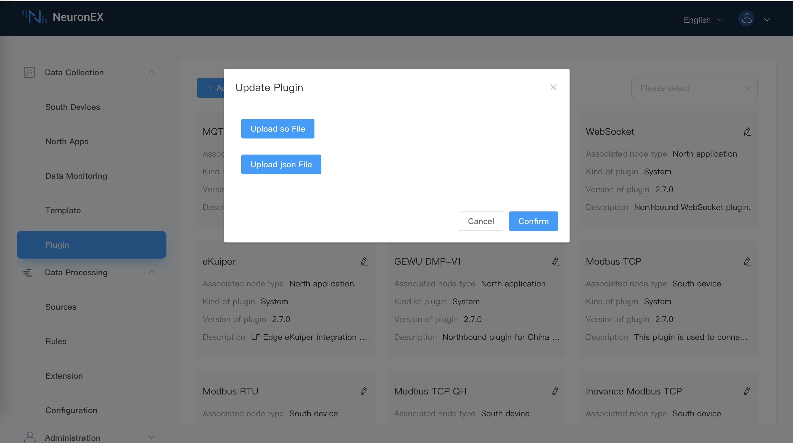

# Manage plug-in modules

Plug-ins can be divided into northbound applications and southbound drivers. Northbound plug-ins are typically used to connect to cloud platforms or external applications like processing engines. Southbound plugins are communication drivers that implement specific protocols to access external devices. In order to implement protocol format conversion, at least one northbound plugin and one southbound plug-in are required for data transmission and data collection respectively.

After logging in to NeuronEX, you can click **Data Collection** -> **Plugin** to view the system's plugin list. You can also click the **Add Plugin** button in the upper left corner to install a custom plugin.

You can visit the [plugin list page](../introduction/plugin-list/plugin-list.md) to get the complete list of plug-ins supported by NeuronEX.

## View available plugin modules

The plugin management page displays all available pluggable modules and detailed information, including plug-in name, associated node type, and description information, as shown in the figure below. You can select plugins for northbound applications or southbound devices from the drop-down box.

Plugin types include the following three modes:

* System: cannot be deleted, comes with the software
* Custom: can be deleted, developed by the user or customized

## Add new pluggable module

On the plugin page, click the **Add plugin** button in the upper left corner to upload the local plugin .so file and .json file.

For specific plug-in development tutorials, please refer to [SKD Tutorial](https://neugates.io/docs/zh/latest/dev-guide/sdk-tutorial/sdk-tutorial.html).

## Replace existing plug-in modules

On the plugin page, click the **Replace** button on each plugin card to upload the local plugin .so file and .json file.

For specific plugin replacement and updates, please contact the EMQ business team.