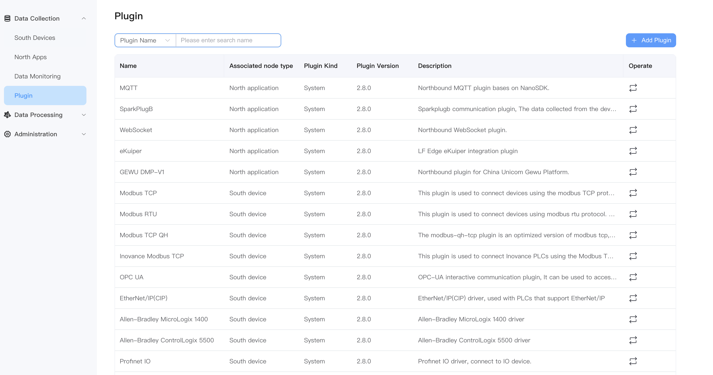
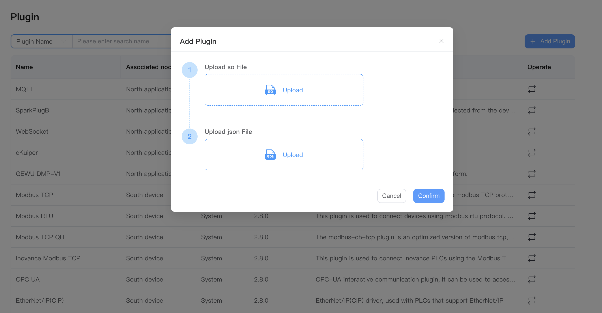

# Managing plugins

Plugins can be divided into northbound applications and southbound drivers. Northbound plugins are typically used to connect to cloud platforms or external applications like processing engines. Southbound plugins are communication drivers that implement specific protocols to access external devices. In order to implement protocol format conversion, at least one northbound plugin and one southbound plugin are required for data transmission and data collection respectively.

After logging in to NeuronEX, you can click **Data Collection** -> **Plugin** to view the system's plugin list. You can also click the **Add Plugin** button in the upper left corner to install a custom plugin.

You can visit the [plugin list page](../introduction/plugin-list/plugin-list.md) to get the complete list of plugins supported by NeuronEX.

## View available plugins

The plugin management page displays all available plugins and detailed information, including plugin name, associated node type, and description information, as shown in the figure below. You can select plugins for northbound applications or southbound devices from the drop-down box.

Plugin types include the following three modes:

* System: cannot be deleted, comes with the software
* Custom: can be deleted, developed by the user or customized

## Add new plugin

On the plugin page, click the **Add plugin** button to upload the .so file and .json file of the plugin.

For specific plugin development tutorials, please refer to [SDK Tutorial](../dev-guide/sdk-tutorial/sdk-tutorial.md).

## Update existing plugin

On the plugin page, click the **Update plugin** button on each plugin to upload the .so file and .json file of the plugin.

For specific plugin replacement and updates, please contact the EMQ business team.