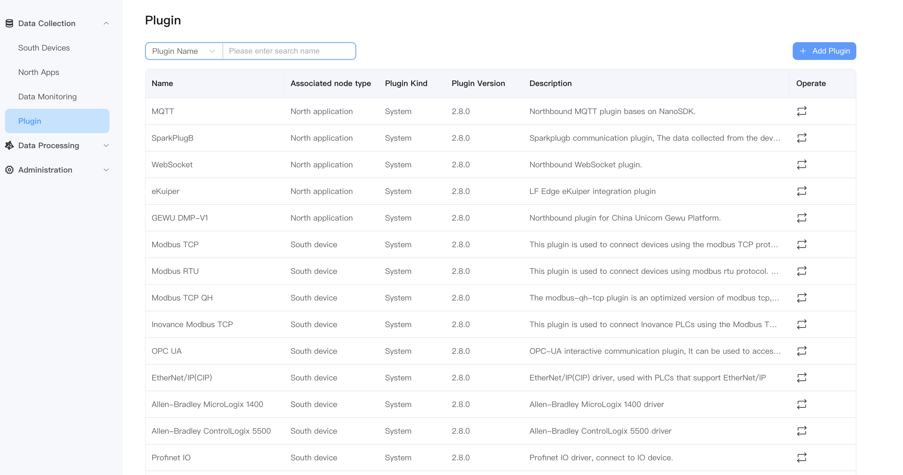
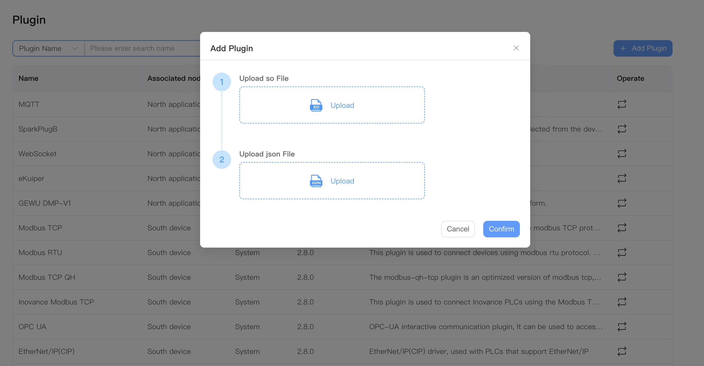

# Driver and Application Management

After logging in to EMQX Neuron, open the driver and application management page under **Data Collection** to view installed southbound drivers and northbound applications. For custom development, see the [SDK Tutorial](../dev-guide/sdk-tutorial/sdk-tutorial.md).

## View Available Drivers and Applications

The management page lists the name, type, category, version, and description. Use the drop-down to filter northbound applications or southbound drivers.

Drivers and applications have the following types:

* **System**: Built into the product. These cannot be deleted, but can be replaced for upgrades.
* **Custom**: Developed by users or for custom requirements. These can be deleted or replaced for upgrades.

## Add a Driver or Application

Use the add action in the upper left and upload the local `.so` and `.json` files.

## Replace a Driver or Application

Use the replace action on the corresponding driver or application card and upload the new `.so` and `.json` files. To replace an official driver or application, contact the EMQ business team.

## CNC File Upload

Southbound CNC drivers support sending files to devices.

