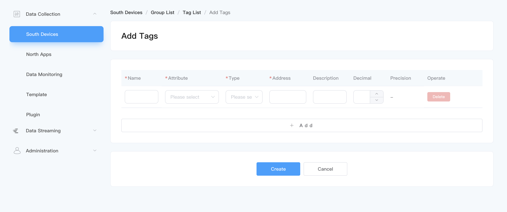
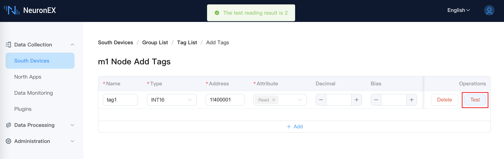

# Connecting Southbound Device

 Data tags will be assigned to groups. Each group has an independent polling frequency to read data from the device. To establish communication between the device and NeuronEX, first add the group and data tags for the southbound driver. Once the group and data tags are created, the real-time value of the tags can be obtained from data monitoring.

## Create a group in the device node

Create collection groups, and data in the same group will be collected and reported at the same frequency.

Click the newly added device node to enter the group list page, and click `Create` to create the group.

* Name: Fill in the name of the group, such as group-1.
* Interval: The collection and reporting frequency of this group of tags, in milliseconds, 100 means collecting once every 100ms, and the value of the entire group of tags is reported once.


## Add data tags to the group

Add the data tags that need to be collected, including tags addresses, tags attributes, data types, etc.

Click the `Tag List` icon in the group to enter the Tag List page .

Click the `Create` button to enter the add tag page, as shown in the figure below.



* **Name**: fill in the Tag name, for example, tag1;
* **Attribute**: Pull down to select Tag attributes, such as read, write, subscribe, static, and support the configuration of multiple tag types. For an introduction to different types of tags, see [Tag Attributes](#tag-attributes);
* **Type**: drop-down to select data type, for example, int16, uint16, int32, uint32, float, bit;
* **Address**: Fill in the tag address. Different driver protocols have different address definition specifications. For details, please refer to [Create Southbound Driver](../south-devices/south-devices.md). Taking the Modbus protocol as an example, 1!40001. `1` represents the tag site number set in the Modbus simulator, and `40001` represents the tag register address.
* **Decimal**: not filled in by default; when the tag attribute is read, it supports setting Decimal. At this time, `device value` * Decimal = `display value`.
* **Bias**: not filled in by default; when the tag attribute is read, it supports setting Bias. At this time, `device value` * Bias = `display value`.
* **Precision**: Configure the precision when the tag type is `float` or `double`, the accuracy range is 0 ~ 17
* **Description**: Leave blank by default.

### Tag attributes

There are three types of tags: `Read`, `Write` and `Subscribe`.

- Read and Write type tags are used to read data and write data respectively.

- Subscribing to a tag will only send messages to north apps when the data changes, and will not send messages when there are no changes. For example, the default data is 0, when the data is changed to 2, a message will be sent. 

### Tag Precision

The tag precision is configured when the tag type is `float` or `double`. The accuracy range is 0 ~ 17.The collection specifications of tag precision are as follows:

- If the precision is not set, the float or double tag retains 5 decimal places by default.

- Starting from the second decimal place, if two consecutive `00` or `99` appear, rounding will be performed, for example, `1.02990` will display `1.03`, and `1.80012` will display `1.8`.

- If the precision is set for the point, NeuronEX will not perform rounding.

## Test the connection

After the tag creation is completed, the status of the device is **Running**, and the connection status should be **Connected**. If the connection status is still **Not Connected** at this time, please first execute the following command on the NeuronEX running environment to confirm whether the NeuronEX running environment can access the corresponding IP and port:

```bash
$ telnet <IP of the PC running the Modbus simulator> 502
```

:::tip
Please confirm that the IP and Port are set correctly during device configuration and the firewall is turned off.
:::

### Tag Reading Test

In the **Add tag** page, support tag reading test. Currently only support Modbus TCP driver.

