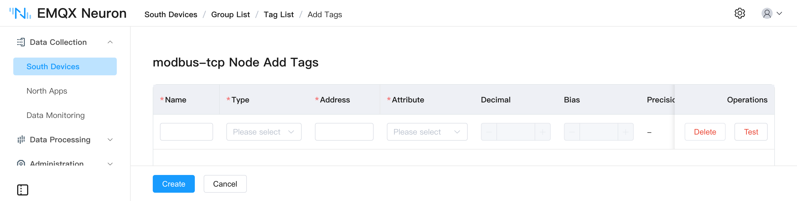
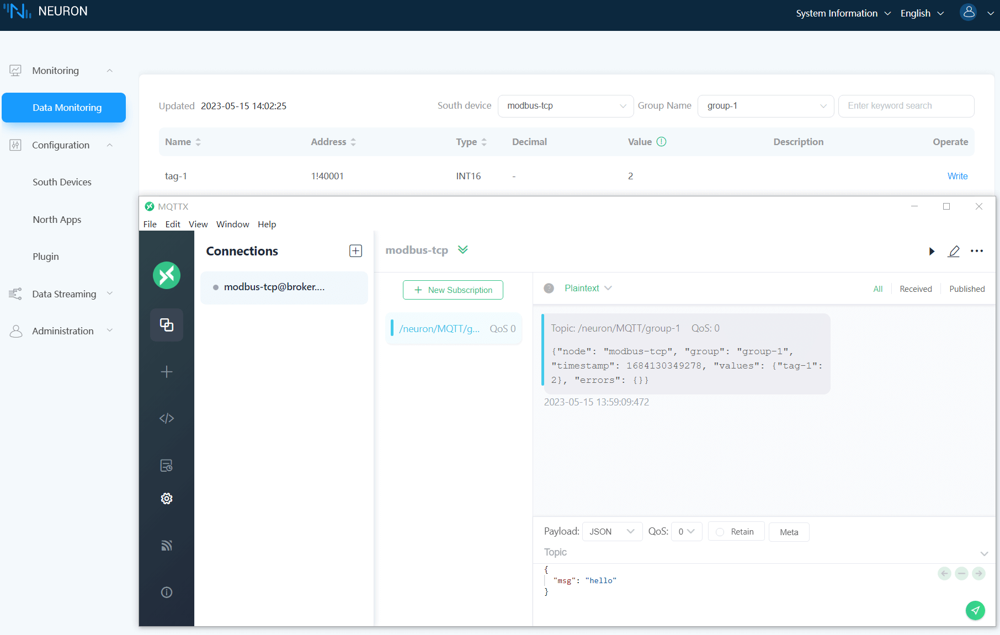
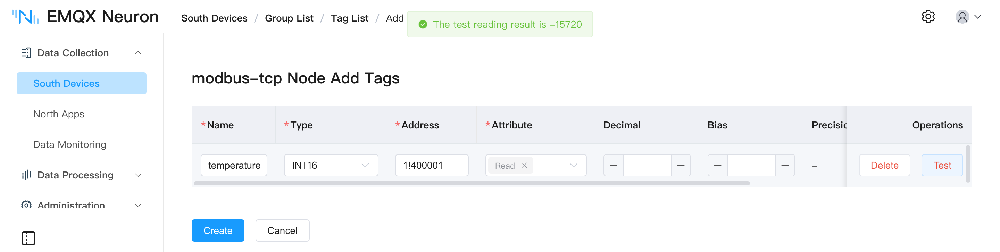

# Groups and Tags

A **tag** is one address inside a device, with read/write attributes, a data type, and a precision. A **group** is a set of tags with its own polling interval.

The group is the unit of collection, reporting, and subscription: every tag in a group is polled at the same interval, packed into a single message, and published together; northbound applications also subscribe per group. **How you divide tags into groups therefore determines the shape of the published payload, its size, and the bandwidth it consumes** — decide on grouping before configuring tags.

## Grouping strategy

**Group by polling interval.** This matters most. Temperature and level readings change slowly and a five-second interval is plenty, while vibration or current may need 100 ms. Putting them in one group polls the slow values at the fast rate — loading the device unnecessarily and filling every payload with values that have not changed.

**Group by destination.** Northbound applications subscribe per group. If some tags go to the cloud while others are only read by on-site SCADA, put them in separate groups so each can be subscribed independently.

**Group by device or process section.** Runtime statistics (`group_last_timer_ms`, `group_tags_total`) are reported per group, so grouping that mirrors the plant structure makes problems easier to locate.

**Keep groups a reasonable size.** All tags in a group are published in one message, so a larger group means a larger payload. After the driver runs, check `group_last_timer_ms`: if it approaches or exceeds the group's interval, the poll cannot finish within one cycle and the group should be split or the interval widened.

Limits: at most **512** groups per southbound driver, and a minimum polling interval of **100 ms**. For the full list, see [Configuration specification](../introduction.md#configuration-specification).

## Create a group

Click the driver node to open its group list, then click **Create Group**:

| 
Field
 | Description |
| --- | --- |
| **Name** | Group name, up to 128 characters. It appears in the default upload topic and in OPC UA NodeIds |
| **Interval** | Polling and reporting interval for the group, in milliseconds, minimum 100 |

## Add tags

Open **Tag List** on the group, then click **Add Tag**:

| 
Field
 | Description |
| --- | --- |
| **Name** | Tag name, up to 128 characters |
| **Attribute** | `read`, `write`, `subscribe`; multiple may be selected — see [Tag attributes](#tag-attributes) |
| **Type** | Data type. Supported types differ per driver; see the relevant driver page |
| **Address** | The format differs per driver. In Modbus, `1!40001` means slave `1`, holding register `40001` |
| **Decimal** | Optional — see [Shaping the data](#shaping-the-data) |
| **Bias** | Optional — see [Shaping the data](#shaping-the-data) |
| **Precision** | Configurable for `float` and `double`, range 0–17 |
| **Unit** | Optional engineering unit for the tag, such as `℃` or `kPa`. A label only — it takes no part in the conversion |
| **Description** | Optional, up to 256 characters |

## Tag attributes

| Attribute | Behavior |
| --- | --- |
| **read** | Polled at the group's interval |
| **write** | Allows writes from a northbound application, the data monitoring page, or the HTTP API. Without it, a write returns an error |
| **subscribe** | Sends a message to northbound applications only when the value changes |

Attributes can be combined. A tag that is both collected and controlled needs `read` and `write` together.

`subscribe` suits discrete and status tags that rarely change: the device is still polled at the group's interval, but a message is produced only when the value moves, which cuts uplink traffic significantly. For example, a tag that defaults to 0 publishes only when it changes to 2:

## Shaping the data

The raw value in a device is often not the value the business needs — a register may hold an integer scaled by ten, or a baseline may have to be subtracted. This conversion can happen at collection time so downstream systems receive usable values directly.

| Parameter | Formula | Constraints |
| --- | --- | --- |
| **Decimal** | device value × decimal = reported value | Applies only when the tag attribute is `read` |
| **Bias** | device value + bias = reported value | Applies only when the tag attribute is `read`; unavailable when the tag also has `write`; numeric and float types only |

### Precision

Precision is configurable for `float` and `double` types, range 0–17:

- With no precision set, five decimal places are kept by default.
- From the second decimal place on, two consecutive `00` or `99` digits trigger rounding — `1.02990` displays as `1.03`, and `1.80012` as `1.8`.
- Once a precision is set, EMQX Neuron no longer applies that rounding.

::: tip
For more involved conversion, filtering, or aggregation — a formula across several tags, or an average over a time window — use SQL in [Data Processing](../../streaming-processing/overview.md).
:::

## Verify

Once tags exist, the driver node should move to **Running** and **Connected**. If it stays **Disconnected**, see [Diagnosing a connection](../south-devices/south-devices.md#diagnosing-a-connection).

The **Add Tag** page can read a tag directly to confirm the address is correct (Modbus TCP driver only):

With the configuration in place, open [Data Monitoring and Device Control](../../admin/monitoring.md) to see live values. For large tag counts, use [Excel import](../import-export/import-export.md) instead of entering them one by one.
