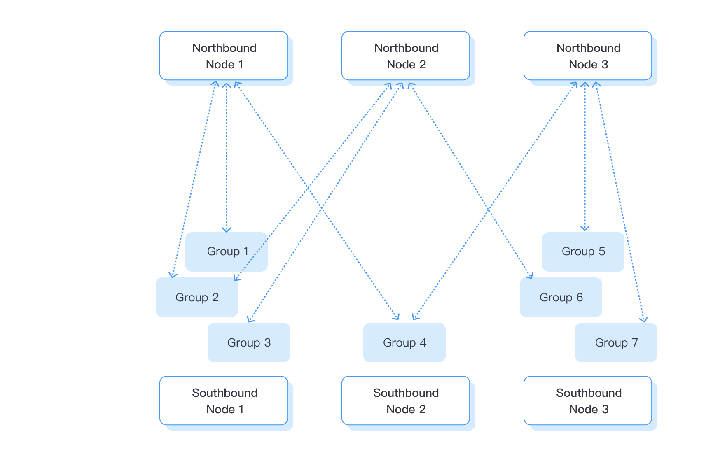

# Data Collection and Forwarding

Install or confirm the required drivers first, then add a southbound driver, configure tags, and monitor values. This section covers the complete workflow from device collection, tag configuration, and monitoring to northbound forwarding. Per-protocol parameters and examples are in [Southbound Drivers](../introduction/driver-list/driver-list.md).

Read this section in sidebar order:

1. [Create a Southbound Driver](./south-devices/south-devices.md): create the node, groups, and tags
2. [Data Monitoring](../admin/monitoring.md): confirm tags are collecting
3. [Modbus TCP Server Simulator](./modbus-simulator.md): test collection without hardware
4. [Data Forwarding](../application/overview.md): create a northbound application and subscribe to southbound data

## Key concepts

### Drivers and Applications

Southbound drivers collect device data; northbound applications send data to a cloud platform or processing engine. You need at least one of each for protocol conversion. For custom development, see the [SDK Tutorial](../dev-guide/sdk-tutorial/sdk-tutorial.md).

### [Node](./south-devices/south-devices.md#add-a-southbound-device)

A node is an instance of a driver or application. One EMQX Neuron process can run many nodes; the core framework routes messages between them.

### [Group](./groups-tags/groups-tags.md) and [Tag](./groups-tags/groups-tags.md)

A tag describes a device address, read/write attributes, and metadata such as precision. Tags belong to groups; each group has its own polling interval. Northbound nodes subscribe to southbound groups.

## Configuration process

1. [Create a southbound driver](./south-devices/south-devices.md): pick the driver for the device protocol, create a node, and set connection parameters.
2. [Configure groups and tags](./groups-tags/groups-tags.md). You can also [import tags in batch](./import-export/import-export.md) from Excel.

    :::tip
    Repeat steps 1 and 2 until all required drivers, groups, and tags are created.
    :::

3. To send data to MQTT, the cloud, or a processing engine, go to [Data Forwarding](./north-apps/north-apps.md): create a northbound application and subscribe to southbound groups.

The overall process is shown below:

## Configuration specification

| Object | Limit |
| --- | --- |
| Node name length | 128 characters |
| Tag name length | 128 characters |
| Tag address length | 128 characters |
| Tag description length | 256 characters |
| Group name length | 128 characters |
| Maximum groups per southbound driver | 512 |
| Maximum subscribed groups per northbound application | unlimited |
| Driver or application module name length | 32 characters |
| Driver or application file name length | 64 characters |
| Driver or application description length | 512 characters |
| Southbound driver collection interval | minimum 100 milliseconds |
