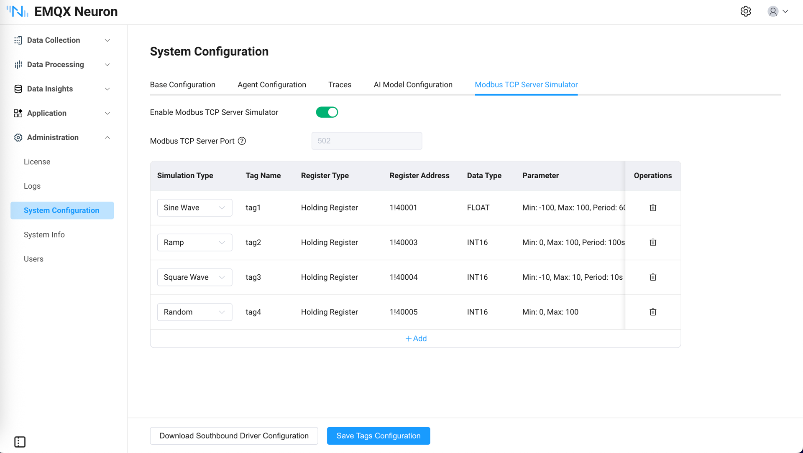

# Built-in Modbus TCP Server Simulator

## Introduction

To facilitate users' development and testing in environments without hardware, version 3.8.0 includes a built-in Modbus TCP simulator. It has the following features:

- One-click start of Modbus TCP simulator without installing third-party software

- Configurable dynamic simulation data for various tags

- One-click export of simulator configuration, which can be imported into southbound devices to automatically complete data collection functionality

Typical application scenarios:

- Development and testing: Quickly verify data collection logic without real PLC hardware

- Training and demonstrations: Demonstrate complete EMQX Neuron functionality without hardware devices

- CI/CD integration: Use the simulator for regression testing in automated testing workflows



## Usage

### Starting the Simulator

In the NeuronEX Management -> System Configuration page, select the `Built-in Modbus TCP Server Simulator` tab, and click the `Start Simulator` button to start the simulator. After the simulator starts, you still need to configure tags information. Please refer to [Adding Tags in the Simulator](#adding-tags-in-the-simulator).

::: tip

After NeuronEX is installed and started by default, the built-in Modbus TCP Server simulator is in a stopped state and does not consume any system resources. It needs to be started manually.

:::


### Adding Tags in the Simulator

The simulator supports configuring up to 10 tags. Simulation types include `sine wave`, `ramp wave`, `square wave`, and `random numbers`. Each simulation type has fixed register type, data type, and parameters (which cannot be modified). Register addresses are dynamically allocated and cannot be manually modified.

### Saving Tags Configuration

Click `Save Tags Configuration`, and the simulator will generate corresponding dynamic simulation data based on the currently configured information. At this point, the simulator is ready to run normally.

### Downloading Corresponding Southbound Driver Configuration

After the simulator is running normally, you can download the corresponding southbound driver configuration by clicking the `Download Southbound Driver Configuration` button.

The downloaded configuration file already contains the driver and tags information configured in the simulator. It can be directly imported in the Data Collection -> South Devices page to implement data collection functionality. You can then view the data from the simulator in the Data Collection -> Data Monitoring page.


### Configuring Simulator Port (Optional)

The simulator's default port is `502`, which generally does not need to be modified. Port modification is not currently supported in the interface. Port adjustment is done through the system configuration file.

Modify the simulator's running port by changing the `port` parameter of `modbus_simulator` in the `/opt/neuronex/software/neuron/config/neuron.json` file. After modification, NeuronEX needs to be restarted for the changes to take effect.

```json
{
    "ip": "127.0.0.1",
    "port": 7000,
    "disable_auth": 0,
    "syslog_host": "",
    "syslog_port": 541,
    "sub_filter_error": 0,
    "modbus_simulator": {
        "port": 502
    }
}
```
