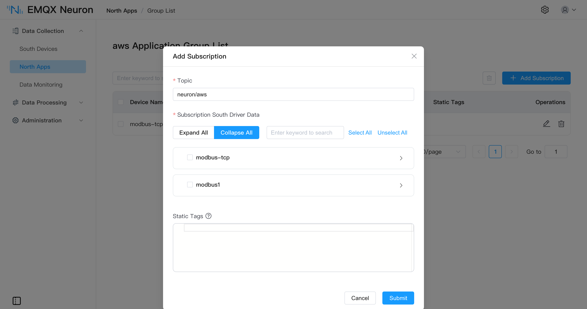

# AWS IoT

[AWS IoT Core] provides secure, bi-directional communication for Internet-connected devices to connect to the AWS Cloud over MQTT.

The EMQX Neuron AWS IoT application is built on the [MQTT application] and comes preconfigured for AWS IoT Core: supply the device data endpoint plus the certificate and private key generated when you create a thing in the AWS IoT console. Upload formats, offline caching, and write-back all work the same as in the MQTT application.

[MQTT application]: ../mqtt/overview.md
[AWS IoT Core]: https://docs.aws.amazon.com/iot/

## Add Application

To create a northbound node and connect it to AWS IoT Core to upload data, navigate to **North Apps** and click **Add Application**.

- Name: The name of this application node, for example, "aws-iot".
- Application: Select the AWS IoT application.

## Configure Application

See the table below for the configuration parameters.

| Parameter                       | Description                                                  |
| ------------------------------- | ------------------------------------------------------------ |
| **Client ID**                   | MQTT client id for communication, a required field.          |
| **QoS Level**                   | MQTT QoS level for message delivery, optional, default QoS 0. |
| **Upload Format**               | JSON format of reported data, a required field:    - *values-format*, data are split into `values` and `errors` sub-objects.  - *tags-format*, tag data are put in a single array.   Same as the MQTT application, see [MQTT Upstream/Downstream Data Format](../mqtt/api.md#write-tag) |
| **Write Request Topic**         | MQTT topic to which the application subscribes for write requests. Same as the MQTT application, see [MQTT Upstream/Downstream Data Format](../mqtt/api.md#write-tag) (since 2.4.5) |
| **Write Response Topic**        | MQTT topic to which the application sends write responses.        |
| **Offline Data Caching**    | Cache messages while the connection is down and sync them once it is restored. See [Offline Data Caching](../mqtt/overview.md#offline-data-caching) |
| **Cache Memory Size**       | In-memory cache limit in MB when publishing fails, required; range [0, 1024]. Must not exceed the disk cache size. |
| **Cache Disk Size**         | On-disk cache limit in MB when publishing fails, required; range [0, 10240]. If nonzero, the memory cache size must also be nonzero. |
| **Cache Sync Interval**     | Interval in ms between messages when replaying the cache after the connection is restored, required; range [10, 120000] |
| **Device Data Endpoint**        | AWS IoT device data endpont.                                 |
| **Root CA Certificate**         | AWS IoT data endpoint root CA certificate.                   |
| **Device Certificate**          | Device Certificate corresponding to a `thing` object in the AWS IoT console. |
| **Private Key**                 | Private Key corresponding to a `thing` object in the AWS IoT console. |

## Add Subscription

After application configuration, data delivery can be enabled via southbound device subscriptions.

Click the device card or row on the **North Apps** page, then **Add Subscription** on the **Group List** page:

Fill in **Topic** to set the upload topic (for example `/neuron/mqtt/upload`); leave it blank to use the default. Under **Subscription South Driver Data**, expand a driver node and tick the collection groups to subscribe to. For the fields, see [Subscribe to Southbound Data](../../subscription.md#add-a-subscription).

The exact format of the data reported is controlled by the **Upload Format** parameter, and the behavior is the same as that of the MQTT application. For more detailed information, see [MQTT Upstream/Downstream Data Format](../mqtt/api.md#data-upload)

## Tutorial

[Bridging Data to AWS IoT using EMQX Neuron](./example.md) demonstrates how to use the AWS IoT application to connect to AWS IoT Core.
