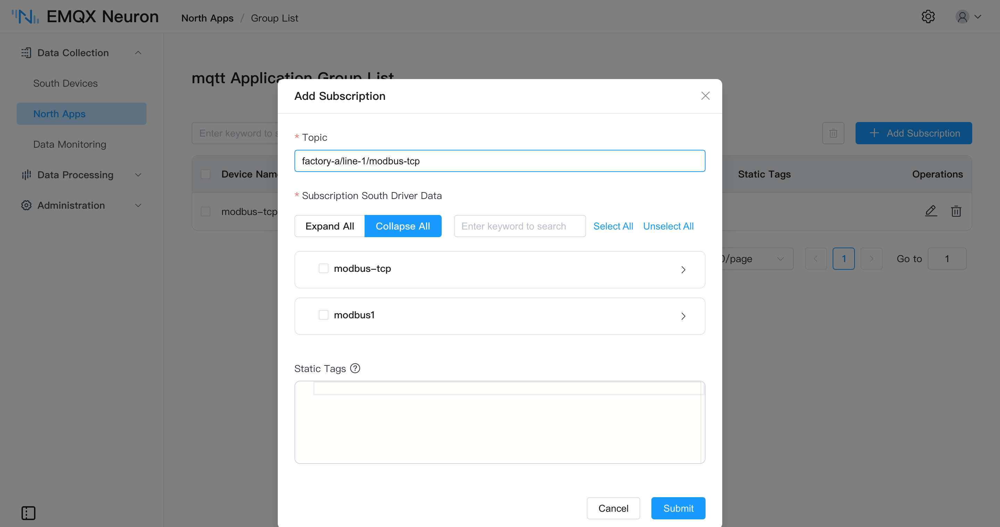

# Send Data to the Cloud

Publish tags collected by southbound drivers to a cloud platform or an MQTT broker. Protocol conversion happens at the edge, so the cloud receives JSON with a uniform structure.

## Selecting an application

| <div style="width:80pt">Application</div> | Target | Authentication |
| --- | --- | --- |
| [MQTT](./mqtt/overview.md) | Any MQTT broker: EMQX, [EMQX Cloud](./mqtt/overview.md#connecting-to-emqx-cloud), or self-hosted | Username and password, TLS with one-way or mutual authentication |
| [AWS IoT](./aws-iot/overview.md) | AWS IoT Core | Device certificate and private key |
| [Azure IoT](./azure-iot/overview.md) | Azure IoT Hub | SAS token or X.509 certificate |

All three are built on MQTT and share most configuration parameters. AWS IoT and Azure IoT embed the topic rules and certificate scheme of their platform, so only the platform credentials have to be supplied.

::: tip
Running several MQTT application nodes in one EMQX Neuron instance is not recommended, as it may cause reduced throughput and resource contention. To publish to several destinations, add multiple subscriptions under one node, or use different northbound application types.
:::

## Upload topic

The upload topic is set per subscription. When it is left blank, the default topic applies:

```
/neuron/{application name}/{driver name}/{group name}
```

For an application named `mqtt`, a southbound driver `modbus-tcp-1`, and a group `group-1`, the default topic is `/neuron/mqtt/modbus-tcp-1/group-1`.

Across multiple plants or production lines, define topics that carry the hierarchy — `factory-a/line-1/modbus-tcp-1`, for example — so the cloud can subscribe with topic wildcards.



## Upload format

The JSON structure of the published payload is controlled by the **Upload Format** parameter. Four formats are available:

| <div style="width:90pt">Format</div> | Structure |
| --- | --- |
| `values-format` | Tags collected successfully go into `values`, tags that failed into `errors` |
| `tags-format` | All tags go into a single array, each element carrying a tag name and value |
| `ECP-format` | `tags-format` with an added data type field |
| `Custom` | A user-defined template; fields and nesting are composed with built-in variables |

A `values-format` payload:

```json
{
    "timestamp": 1650006388943,
    "node": "modbus",
    "group": "grp",
    "values": { "tag0": 123 },
    "errors": { "tag1": 2014 },
    "metas": {}
}
```

When a tag fails to collect, an error code is published instead of a value. Setting the **Upload Tag Error Code** parameter to `False` filters failed tags out of the payload entirely.

For the other three formats and full field descriptions, see [Upstream/Downstream Data Format](./mqtt/api.md#data-upload).

### Static tags

Each collection group can carry a set of static tags — JSON key/value pairs published alongside the collected data — for attributes that do not change with collection, such as a line number, device serial, or installation location:

```json
{ "location": "sh", "sn_number": "123456" }
```

Boolean, integer, float, and string types are supported; arrays and structures are published as strings. A static tag must not share a name with a collected tag, or it will override the collected value under `values-format`.

## Offline caching

When communication is interrupted, messages are written to the memory cache first and moved to the disk cache once memory fills. They are replayed in first-in, first-out order after the connection is restored.

| Parameter | Range | Default |
| --- | --- | --- |
| Offline Data Caching | On / Off | Off |
| Cache Memory Size | 1 – 1024 MB | Empty |
| Cache Disk Size | 1 – 10240 MB | Empty |
| Cache Sync Interval | 10 – 120000 ms | 100 |

When the disk cache size is nonzero, the memory cache size must also be nonzero, and the memory cache size must not exceed the disk cache size. For measured disk usage at different tag counts, see [Offline Data Caching](./mqtt/overview.md#offline-data-caching).

MQTT, AWS IoT, Azure IoT, and Sparkplug B all support these parameters; Kafka and WebSocket do not.

## Writing back to devices

The cloud publishes a JSON write request to the **write request topic**. EMQX Neuron writes the value to the device through the southbound driver and publishes the result to the **write response topic**.

| Application | Write request topic |
| --- | --- |
| MQTT, AWS IoT | Configurable, default `neuron/${random_str}/write/req` |
| Azure IoT | Fixed at `devices/{device ID}/messages/devicebound/#`, with the result published to `devices/{device ID}/messages/events/` |

The target tag must have the **write** attribute configured in the southbound driver — see [Groups and Tags · Tag attributes](../groups-tags/groups-tags.md#tag-attributes). For the request body and multi-tag writes, see [Upstream/Downstream Data Format · Write Tag](./mqtt/api.md#write-tag).

## Processing before upload

With a large number of tags or a high polling rate, publishing raw data consumes considerable uplink bandwidth and cloud storage. Southbound data can first be routed into the [data processing](../../streaming-processing/overview.md) engine and filtered, downsampled, or aggregated with SQL before publishing. Both paths can coexist; for selection guidance, see [Feed Analytics and Edge Computing](./analytics.md).

## Next steps

- [Create a northbound application](./north-apps.md) → [Subscribe to southbound data](../subscription.md)
- Southbound driver states can be published to a dedicated topic for monitoring gateway health from the cloud — see [MQTT · Driver status reporting](./mqtt/overview.md#driver-status-report)
