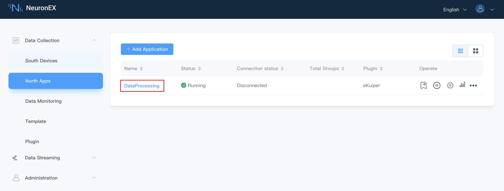
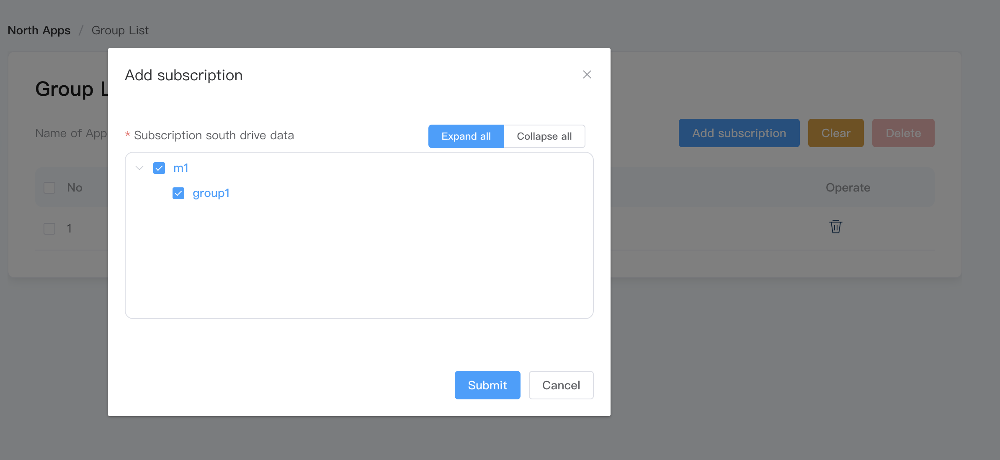

# eKuiper

The eKuiper plugin is used to send data from the NeuronEX data collection module to the data processing module.

The **eKuiper** type node `DataProcessing` has been configured by default on the **North Apps** page of NeuronEX, and the parameters have been configured. Users only need to add and subscribe the southbound driver data to the `DataProcessing` node.



## Add subscription

Click **Add Subscription** in the operate bar and make the following settings:

- **Device Name**: Select the southbound device to subscribe to, for example, `m1`;
- **Group Name**: Select a group under the southbound device, for example, `group1`.



At this point, we will be able to send the data in the `group1` group of the southbound driver `m1` through the DataProcessing node to the `neuronStream` stream of the data processing module for further processing.

For operations in the data processing module, see [neuronStream](../../../streaming-processing/neuron.md).

:::tip Tips
When the `neuronStream` stream in the data processing module is used in the rules and data flows in, the connection status of the `Dataprocessing` node will become **Connected**.
:::

## Data Format

Messages sent to `neuronStream` through DataProcessing node are in fixed json format, as shown below:

```json
{
   "timestamp": 1646125996000,
   "node_name": "node1",
   "group_name": "group1",
   "values": {
     "tag_name1": 11.22,
     "tag_name2": "string"
   },
   "errors": {},
   "metas":{}
}
```

## Device Control

Through `Neuron Sink`, the data processing module can send write commands to the southbound driver through the DataProcessing node to control the device. For detailed operations on this part, see [Neuron Sink](../../../streaming-processing/sink/neuron.md).