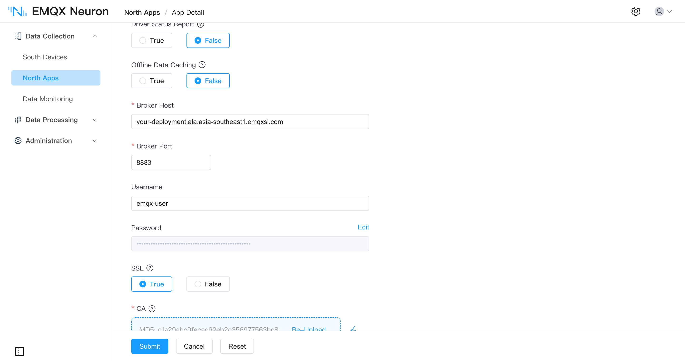
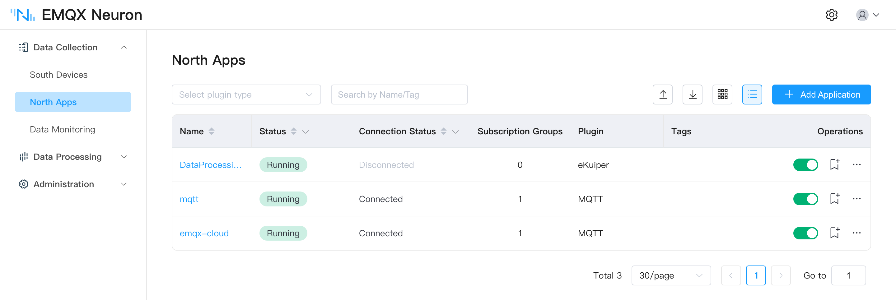
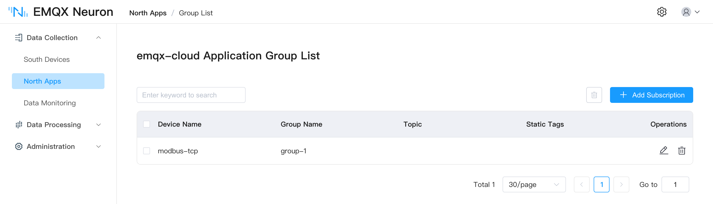
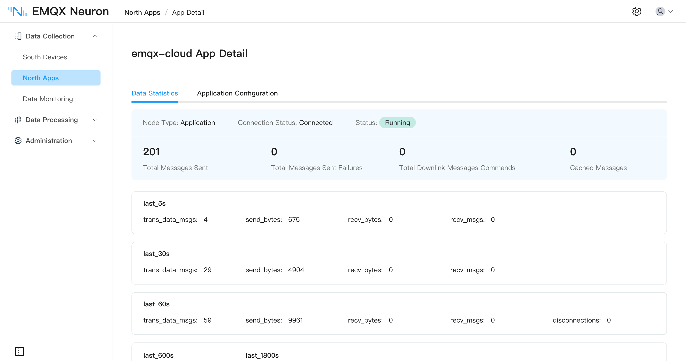

# EMQX Cloud

[EMQX Cloud](https://www.emqx.com/en/cloud) is the fully managed MQTT service from EMQ. EMQX Neuron has no dedicated EMQX Cloud application — connect with the [MQTT application](../mqtt/overview.md), since what EMQX Cloud exposes is a standard MQTT endpoint.

What differs from a self-hosted broker is the port, the authentication, and TLS, and it depends on the deployment type.

## Connection settings

| Setting | Serverless | Dedicated |
| --- | --- | --- |
| Broker address | The deployment's connection address, shown on the **Deployments** page of the EMQX Cloud console | Same |
| Broker port | `8883`; no plaintext port is exposed | `1883` by default; `8883` once TLS is configured |
| SSL | Required | Required when using `8883` |
| CA | One-way TLS — [download the CA](https://assets.emqx.com/data/emqxsl-ca.crt) and upload it | Whatever your certificate setup requires |
| Username, password | Created under **Authentication → Built-in Database** in the console | Same |

Every other parameter — upload format, offline caching, write topics — is the same as for any MQTT application. See [MQTT · Configure Application](../mqtt/overview.md#configure-application).

::: tip
Serverless deployments require SNI, so **Broker address** must be the deployment's full domain name. An IP address is rejected.
:::

## Steps

1. Create a deployment in the EMQX Cloud console and note the connection address and port on the **Deployments** page.
2. Create a username and password under **Authentication → Built-in Database**.
3. Back in EMQX Neuron, add a northbound application of type MQTT — see [Create a Northbound Application](../north-apps.md).
4. Fill in the settings from the table above. For Serverless, also turn on **SSL** and upload the CA certificate.



5. Submit. The application reaches the **running** state and the connection status shows as connected.



6. [Subscribe to southbound data](../../subscription.md) to choose the groups to publish.



To check that publishing is working, look at the sent message count on the application's **Data Statistics** tab:



On the cloud side, use the online message viewer in the EMQX Cloud console, or subscribe to the topic with MQTTX — see [MQTT · Use MQTTX to View Data](../mqtt/overview.md#use-mqttx-to-view-data). The default topic is `/neuron/{application}/{driver}/{group}`, and a message looks like this:

```json
{
  "node": "modbus-tcp",
  "group": "group-1",
  "timestamp": 1790219933821,
  "values": { "sine": -15741, "square": -10, "random": 99, "setpoint": 68 },
  "errors": {},
  "metas": {}
}
```

## Onward to the data warehouse

Once the data is in EMQX, EMQX data integration can write it straight into an analytics platform such as Snowflake or Databricks, with no change at the edge. See [Bridging Data to Snowflake and Databricks](./datalake.md).

## Further reading

For the full port and authentication reference, see the EMQX Cloud documentation: [Serverless connection guide](https://docs.emqx.com/en/cloud/latest/deployments/port_guide_serverless.html) and [Dedicated connection guide](https://docs.emqx.com/en/cloud/latest/deployments/port_guide_dedicated.html).
