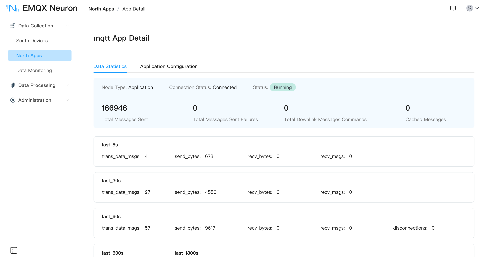

# Create a Northbound Application

After southbound tags are collecting, use a northbound application to send data to MQTT, the cloud, or a processing engine. For the protocol list and parameters, see [Northbound Applications](./catalog.md).

Read in this order:

1. This page: create the northbound node
2. [Subscribe to Southbound Data](../subscription.md): attach southbound groups to the application
3. [Northbound Applications](./catalog.md): MQTT, Sparkplug B, Kafka, and more

This walkthrough uses MQTT.

## Add a northbound application

In **Data Collection** -> **North Apps**, click **Add Application**:

* **Name**: application node name, for example `mqtt`.
* **Application**: select **MQTT**.

After **Create**, you go to the application configuration page. You can also open **Application Configuration** from the card later.

## Application configuration

Fill in the connection parameters. For MQTT fields, see [MQTT](./mqtt/overview.md).

After **Submit**, the card enters **Running**.

## Application card

On **North Apps**, switch between list and card view in the upper right. On the card:

* **Name**: unique name of the northbound application.
* **Application Configuration**: connection parameters.
* **Edit**: change the node name.
* **Data Statistics**: runtime stats.
* **DEBUG Log**: print DEBUG logs for this node; after about ten minutes the default level returns.
* **Delete**: remove the node.
* **Working state**:
  * **Initialize**: just added.
  * **Configure**: configuration in progress.
  * **Ready**: configuration succeeded.
  * **Running**: running.
  * **Stop**: stopped.
* **Working state switch**: on connects and reports; off disconnects.
* **Connection state**: whether the peer is connected.
* **Application**: application used by this application.

## Subscribe to southbound data

Tags are reported by group. After you create the application, subscribe to southbound groups. See [Subscribe to Southbound Data](../subscription.md).

## Operation and maintenance

### Data statistics

On the card or in the list, click **Data Statistics**.

| Parameter | Description |
| --- | --- |
| send_msgs_total | Total messages sent |
| send_msg_errors_total | Total failed sends |
| recv_msgs_total | Total messages received |
| link_state | Connection: DISCONNECTED = 0, CONNECTED = 1 |
| running_state | Node: INIT = 1, READY = 2, RUNNING = 3, STOPPED = 4 |

### Troubleshooting

If the application misbehaves, click **DEBUG Log**. The system prints DEBUG logs for that node and returns to the default level after about ten minutes. Then open **Administration** -> **Logs**. See [Managing Logs](../../admin/log-management.md).
