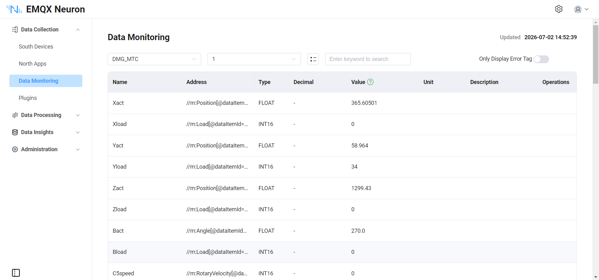

# Connect to DMG MORI via MTConnect

This guide demonstrates how to connect DMG MORI CNC to EMQX Neuron using the MTConnect protocol, with the MTConnect cppagent as the intermediate agent.

## Architecture Overview

```
DMG MORI Machine 1 ──TCP:7878──┐
                               ├── MTConnect Agent (Docker) ──HTTP:5000── EMQX Neuron
DMG MORI Machine 2 ──TCP:7878──┘
```

Each DMG MORI machine runs an adapter that pushes real-time operating data to the MTConnect cppagent via TCP port 7878. The agent aggregates the data and serves it through an HTTP REST API on port 5000, from which EMQX Neuron collects the data using the MTConnect driver.

## Deploy MTConnect Agent

Pull the agent Docker image and run the container. For more details, visit [cppagent](https://github.com/mtconnect/cppagent).

```shell
docker pull mtconnect/agent:2.7
docker run -d --name mtcagent -it -p 5000:5000/tcp -v ./conf:/mtconnect/config mtconnect/agent:2.7
```

The `./conf` directory on the host contains the configuration files: `agent.cfg` and `Devices.xml`.

## Configure agent.cfg

`agent.cfg` specifies the adapters (DMG MORI machines), the HTTP port, and other agent settings:

```ini
Devices = Devices.xml
SchemaVersion = 2.7
WorkerThreads = 3
MonitorConfigFiles = yes
Port = 5000
JsonVersion = 2

MinCompressFileSize = 10k

Files {
  schemas {
    Path = ../data/schemas
    Location = /schemas/
  }
  styles {
    Path = ../data/styles
    Location = /styles/
  }
  Favicon {
      Path = ../data/styles/favicon.ico
      Location = /favicon.ico
  }
}

Directories {
  twin {
    Path = ../twin/
    Location = /twin/
    Default = index.html
  }
}

Sinks {
#  MqttService {
#  }
}

DevicesStyle { Location = /styles/styles.xsl }
StreamsStyle { Location = /styles/styles.xsl }

Adapters {
  DMG_MORI {
    Port = 7878
    Host = 172.16.146.145
  }
  DMG_MORI1 {
    Port = 7878
    Host = 172.16.146.135
  }
}

logger_config {
  output = file /tmp/agent.log
  level = debug
}
```

| Parameter | Description |
| ----------- | ------------------------------------------------------ |
| `Devices` | Path to the device model XML file. |
| `Port` | HTTP port for the agent API (default 5000). |
| `Adapters` | Defines the machines that push data to the agent. Each entry specifies the adapter's TCP host and port. |

## Configure Devices.xml

`Devices.xml` describes the data model for each machine — what data items are available (axes, controller status, spindle, etc.) and their types. This file follows the MTConnect schema and is typically provided by the machine vendor. Two identical DMG MORI machines with MAPPS controllers are defined in this example.

## Configure EMQX Neuron

### Add Device

Go to **Data Collection -> South Devices** and click **Add Device**. Select the **MTConnect** driver and configure the following parameters:

| Parameter | Value |
| ----------- | ----------------------------------------- |
| **host** | MTConnect Agent IP address |
| **port** | 5000 |
| **ns_prefix** | m |
| **ns_uri** | `urn:mtconnect.org:MTConnectStreams:2.7` |

::: tip
The version number in `ns_uri` should match the `SchemaVersion` configured in `agent.cfg`. For example, if `SchemaVersion = 2.7`, use `MTConnectStreams:2.7`.
:::

### Configure Data Groups and Tags

Add a group with the desired collection interval (e.g., 1000 ms). Then add tags using XPath addresses to select the desired data items from the MTConnect stream.

### How to Write an Address

To determine the correct address for a data item, fetch the current snapshot from the Agent and locate the target data element in the XML.

```shell
wget http://$AGENT_IP:5000/current
```

For example, a `current` response for the DMG MORI device may contain the following fragment:

```xml
<Samples>
  <Position dataItemId="DMGXact" name="Xact" timestamp="..." subType="ACTUAL">-40.139</Position>
  <Load dataItemId="DMGXload" name="Xload" timestamp="...">6</Load>
</Samples>
<Events>
  <Execution dataItemId="DMGexecution1" name="execution1" timestamp="...">ACTIVE</Execution>
  <PartCount dataItemId="DMGpart_count1" name="part_count1" timestamp="...">17</PartCount>
</Events>
<Condition>
  <Normal dataItemId="DMGmotion1" name="motion1" timestamp="..." type="MOTION_PROGRAM" />
</Condition>
```

To compose the address:
- Use `//m:` followed by the XML element name (e.g., `Position`, `Load`, `Execution`) and a `[@dataItemId="..."]` filter.
- For items with text content, use the default format: `//m:ElementName[@dataItemId="<id>"]`
- For self-closing tags (often CONDITION items), prepend `node-name:` to extract the element tag name: `node-name://m:*[@dataItemId="<id>"]`

| Data to Collect | Address |
| ----------------------------------- | --------------------------------------------------------------- |
| X-axis position (`DMGXact`) | `//m:Position[@dataItemId="DMGXact"]` |
| Execution status (`DMGexecution1`) | `//m:Execution[@dataItemId="DMGexecution1"]` |
| Alarm/motion status (`DMGmotion1`) | `node-name://m:*[@dataItemId="DMGmotion1"]` |

## Address Format

Tags use XML XPath expressions with the `m:` namespace prefix. The address selects a data item by its `dataItemId` attribute.

| Address | Data Type | Description |
| -------------------------------------------------------------- | --------- | ------------------------------ |
| `//m:PartCount[@dataItemId="DMGpart_count1"]` | INT32 | Part count |
| `//m:LineLabel[@dataItemId="DMGline1"]` | STRING | Cycle time label |
| `//m:Execution[@dataItemId="DMGexecution1"]` | STRING | Execution status |
| `//m:OperationMode[@dataItemId="DMGoperationmode1"]` | STRING | Operation mode |
| `//m:ControllerMode[@dataItemId="DMGmode1"]` | STRING | Controller mode |
| `//m:PathFeedrateOverride[@dataItemId="DMGjogoverride1"]` | STRING | Jog feedrate override |
| `//m:PathFeedrateOverride[@dataItemId="DMGrapidoverride1"]` | STRING | Rapid feedrate override |
| `//m:PathFeedrate[@dataItemId="DMGpath_feedrate1"]` | DOUBLE | Path feedrate (mm/s) |
| `//m:RotaryVelocityOverride[@dataItemId="DMGspindleoverride5"]` | STRING | Spindle override |
| `//m:RotaryVelocityOverride[@dataItemId="DMGspindleoverride8"]` | STRING | Spindle speed override |
| `//m:Load[@dataItemId="DMGXload"]` | INT32 | Servo load 1 (X) |
| `//m:Load[@dataItemId="DMGYload"]` | INT32 | Servo load 2 (Y) |
| `//m:Load[@dataItemId="DMGZload"]` | INT32 | Servo load 3 (Z) |
| `//m:Load[@dataItemId="DMGBload"]` | INT32 | Servo load 4 (B) |
| `//m:ToolNumber[@dataItemId="DMGtoolnumber1"]` | STRING | Tool number |
| `//m:Program[@dataItemId="DMGprogram1"]` | STRING | Current program number |
| `//m:Block[@dataItemId="DMGblock1"]` | STRING | Current program name |
| `node-name://m:*[@dataItemId="DMGmotion1"]` | STRING | Alarm status |

::: tip
The `dataItemId` attribute in the XPath corresponds to the `id` value defined in `Devices.xml`. Refer to your `Devices.xml` file to determine the exact data item IDs available for your machine.
:::

## Data Monitoring

After configuring the tags, you can click **Monitoring -> Data Monitoring** to view the real-time data collected from the DMG MORI machines.



For more details, see [Data Monitoring](../../../admin/monitoring.md).

## Appendix: Devices.xml

```xml
<?xml version="1.0" encoding="utf-8"?>
<MTConnectDevices xmlns:mt="urn:mtconnect.org:MTConnectDevices:2.7"
  xmlns:xsi="http://www.w3.org/2001/XMLSchema-instance"
  xmlns="urn:mtconnect.org:MTConnectDevices:2.7"
  xsi:schemaLocation="urn:mtconnect.org:MTConnectDevices:2.7 ./schemas/MTConnectDevices_2.7.xsd">
  <Header deviceModelChangeTime="2022-06-17T16:33:21.188094Z" creationTime="2013-04-02T03:40:04Z"
    assetBufferSize="1024" sender="localhost" assetCount="0" version="2.0" instanceId="1"
    bufferSize="131072"/>
  <Devices>
		<Device id="d2" uuid="DMG_MORI" name="DMG_MORI">
			<Description manufacturer="DMG MORI" serialNumber="NHC50171001">DMG MORI with MAPPS controller</Description>
			<Configuration>
				<CoordinateSystems>
					<CoordinateSystem id="dm_base" type="BASE">
						<Origin>0 0 0</Origin>
					</CoordinateSystem>
					<CoordinateSystem id="dm_machine" type="MACHINE" parentIdRef="dm_base">
						<Transformation>
							<Translation>0 0 0</Translation>
							<Rotation>0 0 0</Rotation>
						</Transformation>
					</CoordinateSystem>
					<CoordinateSystem id="dm_work" type="OBJECT" parentIdRef="dm_machine">
						<Transformation>
							<Translation>0 0 0</Translation>
							<Rotation>0 0 0</Rotation>
						</Transformation>
					</CoordinateSystem>
				</CoordinateSystems>
			</Configuration>
			<DataItems>
				<DataItem category="EVENT" id="DMGavail" name="avail" type="AVAILABILITY"/>
				<DataItem category="EVENT" id="DMGestop" name="estop" type="EMERGENCY_STOP"/>
				<DataItem category="EVENT" id="DMGcoolant" name="coolant" type="x:COOLANT"/>
				<DataItem category="EVENT" id="DMGcutting1" name="cutting1" type="x:CUTTING_STATUS"/>
			</DataItems>
			<Components>
				<Axes id="dm_axes" name="axes">
					<Components>
						<Linear id="dm_x" name="X">
							<DataItems>
								<DataItem type="POSITION" subType="ACTUAL" category="SAMPLE" id="DMGXact" name="Xact" units="MILLIMETER" coordinateSystemIdRef="dm_machine"/>
								<DataItem type="LOAD" category="SAMPLE" id="DMGXload" name="Xload" units="PERCENT"/>
							</DataItems>
						</Linear>
						<Linear id="dm_y" name="Y">
							<DataItems>
								<DataItem type="POSITION" subType="ACTUAL" category="SAMPLE" id="DMGYact" name="Yact" units="MILLIMETER" coordinateSystemIdRef="dm_machine"/>
								<DataItem type="LOAD" category="SAMPLE" id="DMGYload" name="Yload" units="PERCENT"/>
							</DataItems>
						</Linear>
						<Linear id="dm_z" name="Z">
							<DataItems>
								<DataItem type="POSITION" subType="ACTUAL" category="SAMPLE" id="DMGZact" name="Zact" units="MILLIMETER" coordinateSystemIdRef="dm_machine"/>
								<DataItem type="LOAD" category="SAMPLE" id="DMGZload" name="Zload" units="PERCENT"/>
							</DataItems>
						</Linear>
						<Rotary id="dm_b" name="B">
							<DataItems>
								<DataItem type="ANGLE" subType="ACTUAL" category="SAMPLE" id="DMGBact" name="Bact" units="DEGREE" coordinateSystemIdRef="dm_machine"/>
								<DataItem type="LOAD" category="SAMPLE" id="DMGBload" name="Bload" units="PERCENT"/>
							</DataItems>
						</Rotary>
						<Rotary id="dm_c5" name="C5">
							<DataItems>
								<DataItem type="ROTARY_VELOCITY" subType="ACTUAL" category="SAMPLE" id="DMGC5speed" name="C5speed" units="REVOLUTION/MINUTE"/>
								<DataItem type="LOAD" category="SAMPLE" id="DMGC5load" name="C5load" units="PERCENT"/>
								<DataItem type="ROTARY_MODE" category="EVENT" id="DMGC5mode" name="C5mode"/>
								<DataItem type="ROTARY_VELOCITY_OVERRIDE" category="EVENT" id="DMGspindleoverride5" name="spindleoverride5" units="PERCENT"/>
								<DataItem type="x:SPINDLE_ROTATING" category="EVENT" id="DMGspindlerotating5" name="spindlerotating5"/>
							</DataItems>
						</Rotary>
						<Rotary id="dm_c6" name="C6">
							<DataItems>
								<DataItem type="ROTARY_VELOCITY" subType="ACTUAL" category="SAMPLE" id="DMGC6speed" name="C6speed" units="REVOLUTION/MINUTE"/>
								<DataItem type="LOAD" category="SAMPLE" id="DMGC6load" name="C6load" units="PERCENT"/>
								<DataItem type="ROTARY_MODE" category="EVENT" id="DMGC6mode" name="C6mode"/>
								<DataItem type="x:SPINDLE_ROTATING" category="EVENT" id="DMGspindlerotating6" name="spindlerotating6"/>
							</DataItems>
						</Rotary>
						<Rotary id="dm_c7" name="C7">
							<DataItems>
								<DataItem type="LOAD" category="SAMPLE" id="DMGC7load" name="C7load" units="PERCENT"/>
							</DataItems>
						</Rotary>
						<Rotary id="dm_c8" name="C8">
							<DataItems>
								<DataItem type="ROTARY_VELOCITY" subType="ACTUAL" category="SAMPLE" id="DMGC8speed" name="C8speed" units="REVOLUTION/MINUTE"/>
								<DataItem type="ROTARY_MODE" category="EVENT" id="DMGC8mode" name="C8mode"/>
								<DataItem type="ROTARY_VELOCITY_OVERRIDE" category="EVENT" id="DMGspindleoverride8" name="spindleoverride8" units="PERCENT"/>
								<DataItem type="x:SPINDLE_ROTATING" category="EVENT" id="DMGspindlerotating8" name="spindlerotating8"/>
							</DataItems>
						</Rotary>
						<Rotary id="dm_c9" name="C9">
							<DataItems>
								<DataItem type="ROTARY_VELOCITY" subType="ACTUAL" category="SAMPLE" id="DMGC9speed" name="C9speed" units="REVOLUTION/MINUTE"/>
								<DataItem type="ROTARY_MODE" category="EVENT" id="DMGC9mode" name="C9mode"/>
								<DataItem type="x:SPINDLE_ROTATING" category="EVENT" id="DMGspindlerotating9" name="spindlerotating9"/>
							</DataItems>
						</Rotary>
					</Components>
				</Axes>
				<Controller id="dm_ctrl" name="controller">
					<DataItems>
						<DataItem type="CONTROLLER_MODE" category="EVENT" id="DMGmode1" name="mode1"/>
						<DataItem type="x:OPERATION_MODE" category="EVENT" id="DMGoperationmode1" name="operationmode1"/>
						<DataItem type="EXECUTION" category="EVENT" id="DMGexecution1" name="execution1"/>
						<DataItem type="PROGRAM" category="EVENT" id="DMGprogram1" name="program1"/>
						<DataItem type="PROGRAM" subType="MAIN" category="EVENT" id="DMGmainprogram1" name="mainprogram1"/>
						<DataItem type="PART_COUNT" category="EVENT" id="DMGpart_count1" name="part_count1"/>
						<DataItem type="TOOL_NUMBER" category="EVENT" id="DMGtoolnumber1" name="toolnumber1"/>
						<DataItem type="x:RESET" category="EVENT" id="DMGreset1" name="reset1"/>
						<DataItem type="CONTROLLER_MODE_OVERRIDE" subType="OPTIONAL_STOP" category="EVENT" id="DMGoptionalstop1" name="optionalstop1"/>
						<DataItem type="CONTROLLER_MODE_OVERRIDE" subType="DRY_RUN" category="EVENT" id="DMGdryrun1" name="dryrun1"/>
						<DataItem type="x:BLOCK_DELETE" category="EVENT" id="DMGblockdelete1" name="blockdelete1"/>
						<DataItem type="PATH_FEEDRATE_OVERRIDE" subType="JOG" category="EVENT" id="DMGjogoverride1" name="jogoverride1" units="PERCENT"/>
						<DataItem type="PATH_FEEDRATE_OVERRIDE" subType="RAPID" category="EVENT" id="DMGrapidoverride1" name="rapidoverride1" units="PERCENT"/>
						<DataItem type="LOGIC_PROGRAM" category="CONDITION" id="DMGlogic1" name="logic1"/>
						<DataItem type="MOTION_PROGRAM" category="CONDITION" id="DMGmotion1" name="motion1"/>
						<DataItem type="LOGIC_PROGRAM" category="CONDITION" id="DMGlogic2" name="logic2"/>
						<DataItem type="MOTION_PROGRAM" category="CONDITION" id="DMGmotion2" name="motion2"/>
						<DataItem type="LOGIC_PROGRAM" category="CONDITION" id="DMGlogic3" name="logic3"/>
						<DataItem type="MOTION_PROGRAM" category="CONDITION" id="DMGmotion3" name="motion3"/>
						<DataItem type="LOGIC_PROGRAM" category="CONDITION" id="DMGlogic4" name="logic4"/>
						<DataItem type="MOTION_PROGRAM" category="CONDITION" id="DMGmotion4" name="motion4"/>
					</DataItems>
					<Components>
						<Path id="dm_path1" name="path">
							<DataItems>
								<DataItem type="PATH_FEEDRATE" subType="ACTUAL" category="SAMPLE" id="DMGpath_feedrate1" name="path_feedrate1" units="MILLIMETER/SECOND"/>
								<DataItem type="BLOCK" category="EVENT" id="DMGblock1" name="block1"/>
								<DataItem type="LINE_LABEL" category="EVENT" id="DMGline1" name="line1"/>
							</DataItems>
						</Path>
					</Components>
				</Controller>
			</Components>
		</Device>
		<Device id="d3" uuid="DMG_MORI1" name="DMG_MORI1">
			<Description manufacturer="DMG MORI" serialNumber="NHC50171001">DMG MORI with MAPPS controller</Description>
			<Configuration>
				<CoordinateSystems>
					<CoordinateSystem id="dm_base_1" type="BASE">
						<Origin>0 0 0</Origin>
					</CoordinateSystem>
					<CoordinateSystem id="dm_machine_1" type="MACHINE" parentIdRef="dm_base_1">
						<Transformation>
							<Translation>0 0 0</Translation>
							<Rotation>0 0 0</Rotation>
						</Transformation>
					</CoordinateSystem>
					<CoordinateSystem id="dm_work_1" type="OBJECT" parentIdRef="dm_machine_1">
						<Transformation>
							<Translation>0 0 0</Translation>
							<Rotation>0 0 0</Rotation>
						</Transformation>
					</CoordinateSystem>
				</CoordinateSystems>
			</Configuration>
			<DataItems>
				<DataItem category="EVENT" id="DMGavail_1" name="avail" type="AVAILABILITY"/>
				<DataItem category="EVENT" id="DMGestop_1" name="estop" type="EMERGENCY_STOP"/>
				<DataItem category="EVENT" id="DMGcoolant_1" name="coolant" type="x:COOLANT"/>
				<DataItem category="EVENT" id="DMGcutting1_1" name="cutting1" type="x:CUTTING_STATUS"/>
			</DataItems>
			<Components>
				<Axes id="dm_axes_1" name="axes">
					<Components>
						<Linear id="dm_x_1" name="X">
							<DataItems>
								<DataItem type="POSITION" subType="ACTUAL" category="SAMPLE" id="DMGXact_1" name="Xact" units="MILLIMETER" coordinateSystemIdRef="dm_machine_1"/>
								<DataItem type="LOAD" category="SAMPLE" id="DMGXload_1" name="Xload" units="PERCENT"/>
							</DataItems>
						</Linear>
						<Linear id="dm_y_1" name="Y">
							<DataItems>
								<DataItem type="POSITION" subType="ACTUAL" category="SAMPLE" id="DMGYact_1" name="Yact" units="MILLIMETER" coordinateSystemIdRef="dm_machine_1"/>
								<DataItem type="LOAD" category="SAMPLE" id="DMGYload_1" name="Yload" units="PERCENT"/>
							</DataItems>
						</Linear>
						<Linear id="dm_z_1" name="Z">
							<DataItems>
								<DataItem type="POSITION" subType="ACTUAL" category="SAMPLE" id="DMGZact_1" name="Zact" units="MILLIMETER" coordinateSystemIdRef="dm_machine_1"/>
								<DataItem type="LOAD" category="SAMPLE" id="DMGZload_1" name="Zload" units="PERCENT"/>
							</DataItems>
						</Linear>
						<Rotary id="dm_b_1" name="B">
							<DataItems>
								<DataItem type="ANGLE" subType="ACTUAL" category="SAMPLE" id="DMGBact_1" name="Bact" units="DEGREE" coordinateSystemIdRef="dm_machine_1"/>
								<DataItem type="LOAD" category="SAMPLE" id="DMGBload_1" name="Bload" units="PERCENT"/>
							</DataItems>
						</Rotary>
						<Rotary id="dm_c5_1" name="C5">
							<DataItems>
								<DataItem type="ROTARY_VELOCITY" subType="ACTUAL" category="SAMPLE" id="DMGC5speed_1" name="C5speed" units="REVOLUTION/MINUTE"/>
								<DataItem type="LOAD" category="SAMPLE" id="DMGC5load_1" name="C5load" units="PERCENT"/>
								<DataItem type="ROTARY_MODE" category="EVENT" id="DMGC5mode_1" name="C5mode"/>
								<DataItem type="ROTARY_VELOCITY_OVERRIDE" category="EVENT" id="DMGspindleoverride5_1" name="spindleoverride5" units="PERCENT"/>
								<DataItem type="x:SPINDLE_ROTATING" category="EVENT" id="DMGspindlerotating5_1" name="spindlerotating5"/>
							</DataItems>
						</Rotary>
						<Rotary id="dm_c6_1" name="C6">
							<DataItems>
								<DataItem type="ROTARY_VELOCITY" subType="ACTUAL" category="SAMPLE" id="DMGC6speed_1" name="C6speed" units="REVOLUTION/MINUTE"/>
								<DataItem type="LOAD" category="SAMPLE" id="DMGC6load_1" name="C6load" units="PERCENT"/>
								<DataItem type="ROTARY_MODE" category="EVENT" id="DMGC6mode_1" name="C6mode"/>
								<DataItem type="x:SPINDLE_ROTATING" category="EVENT" id="DMGspindlerotating6_1" name="spindlerotating6"/>
							</DataItems>
						</Rotary>
						<Rotary id="dm_c7_1" name="C7">
							<DataItems>
								<DataItem type="LOAD" category="SAMPLE" id="DMGC7load_1" name="C7load" units="PERCENT"/>
							</DataItems>
						</Rotary>
						<Rotary id="dm_c8_1" name="C8">
							<DataItems>
								<DataItem type="ROTARY_VELOCITY" subType="ACTUAL" category="SAMPLE" id="DMGC8speed_1" name="C8speed" units="REVOLUTION/MINUTE"/>
								<DataItem type="ROTARY_MODE" category="EVENT" id="DMGC8mode_1" name="C8mode"/>
								<DataItem type="ROTARY_VELOCITY_OVERRIDE" category="EVENT" id="DMGspindleoverride8_1" name="spindleoverride8" units="PERCENT"/>
								<DataItem type="x:SPINDLE_ROTATING" category="EVENT" id="DMGspindlerotating8_1" name="spindlerotating8"/>
							</DataItems>
						</Rotary>
						<Rotary id="dm_c9_1" name="C9">
							<DataItems>
								<DataItem type="ROTARY_VELOCITY" subType="ACTUAL" category="SAMPLE" id="DMGC9speed_1" name="C9speed" units="REVOLUTION/MINUTE"/>
								<DataItem type="ROTARY_MODE" category="EVENT" id="DMGC9mode_1" name="C9mode"/>
								<DataItem type="x:SPINDLE_ROTATING" category="EVENT" id="DMGspindlerotating9_1" name="spindlerotating9"/>
							</DataItems>
						</Rotary>
					</Components>
				</Axes>
				<Controller id="dm_ctrl_1" name="controller">
					<DataItems>
						<DataItem type="CONTROLLER_MODE" category="EVENT" id="DMGmode1_1" name="mode1"/>
						<DataItem type="x:OPERATION_MODE" category="EVENT" id="DMGoperationmode1_1" name="operationmode1"/>
						<DataItem type="EXECUTION" category="EVENT" id="DMGexecution1_1" name="execution1"/>
						<DataItem type="PROGRAM" category="EVENT" id="DMGprogram1_1" name="program1"/>
						<DataItem type="PROGRAM" subType="MAIN" category="EVENT" id="DMGmainprogram1_1" name="mainprogram1"/>
						<DataItem type="PART_COUNT" category="EVENT" id="DMGpart_count1_1" name="part_count1"/>
						<DataItem type="TOOL_NUMBER" category="EVENT" id="DMGtoolnumber1_1" name="toolnumber1"/>
						<DataItem type="x:RESET" category="EVENT" id="DMGreset1_1" name="reset1"/>
						<DataItem type="CONTROLLER_MODE_OVERRIDE" subType="OPTIONAL_STOP" category="EVENT" id="DMGoptionalstop1_1" name="optionalstop1"/>
						<DataItem type="CONTROLLER_MODE_OVERRIDE" subType="DRY_RUN" category="EVENT" id="DMGdryrun1_1" name="dryrun1"/>
						<DataItem type="x:BLOCK_DELETE" category="EVENT" id="DMGblockdelete1_1" name="blockdelete1"/>
						<DataItem type="PATH_FEEDRATE_OVERRIDE" subType="JOG" category="EVENT" id="DMGjogoverride1_1" name="jogoverride1" units="PERCENT"/>
						<DataItem type="PATH_FEEDRATE_OVERRIDE" subType="RAPID" category="EVENT" id="DMGrapidoverride1_1" name="rapidoverride1" units="PERCENT"/>
						<DataItem type="LOGIC_PROGRAM" category="CONDITION" id="DMGlogic1_1" name="logic1"/>
						<DataItem type="MOTION_PROGRAM" category="CONDITION" id="DMGmotion1_1" name="motion1"/>
						<DataItem type="LOGIC_PROGRAM" category="CONDITION" id="DMGlogic2_1" name="logic2"/>
						<DataItem type="MOTION_PROGRAM" category="CONDITION" id="DMGmotion2_1" name="motion2"/>
						<DataItem type="LOGIC_PROGRAM" category="CONDITION" id="DMGlogic3_1" name="logic3"/>
						<DataItem type="MOTION_PROGRAM" category="CONDITION" id="DMGmotion3_1" name="motion3"/>
						<DataItem type="LOGIC_PROGRAM" category="CONDITION" id="DMGlogic4_1" name="logic4"/>
						<DataItem type="MOTION_PROGRAM" category="CONDITION" id="DMGmotion4_1" name="motion4"/>
					</DataItems>
					<Components>
						<Path id="dm_path1_1" name="path">
							<DataItems>
								<DataItem type="PATH_FEEDRATE" subType="ACTUAL" category="SAMPLE" id="DMGpath_feedrate1_1" name="path_feedrate1" units="MILLIMETER/SECOND"/>
								<DataItem type="BLOCK" category="EVENT" id="DMGblock1_1" name="block1"/>
								<DataItem type="LINE_LABEL" category="EVENT" id="DMGline1_1" name="line1"/>
							</DataItems>
						</Path>
					</Components>
				</Controller>
			</Components>
		</Device>
  </Devices>
</MTConnectDevices>
```
