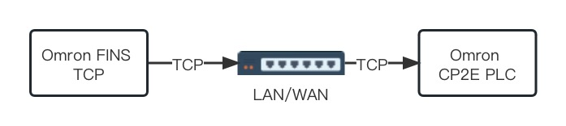
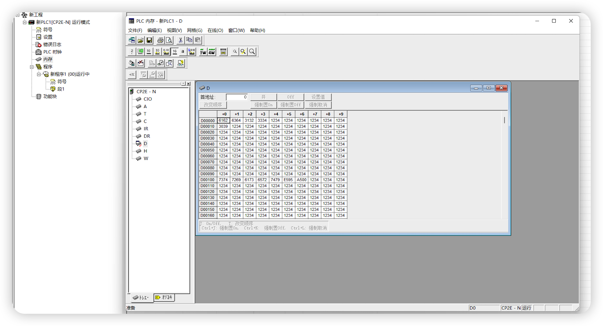

# Connect to CP2E

This article uses the Omron FINS TCP plugin to connect to an Omron CP2E PLC and read/write tag values.

The Omron FINS TCP plugin can reach the PLC over a local LAN or the Internet. If the PLC and the EMQX Neuron server are not on the same LAN, configure port forwarding on the PLC.

## Prerequisites

CX-Programmer is already connected to the CP2E PLC so you can inspect PLC tags.

## Inspect PLC tags

1. In the left menu, open **Settings** to the PLC setup window, then the **Built-in Ethernet** tab, and configure the PLC IP address and subnet mask.
2. In the left menu, open **Memory** to see the data areas and address ranges the PLC supports. As shown below, this PLC has multiple areas including CIO, A, and W.

## Configure EMQX Neuron

* Under Southbound Devices, click **Add Device** and select the **Omron FINS TCP** plugin to create a node for the CP2E PLC.
* After the node is created, click **Device Configuration** and set:
	* **PLC IP Address**: IP address of the PLC
	* **PLC Port**: PLC port, default 9600
* In the southbound node, create a group and add tags under the group.

## Data monitoring

After tags are configured, open **Data Collection** -> **Data Monitoring** to view device data and write tags. See [Data Monitoring](../../../../../admin/monitoring.md).
