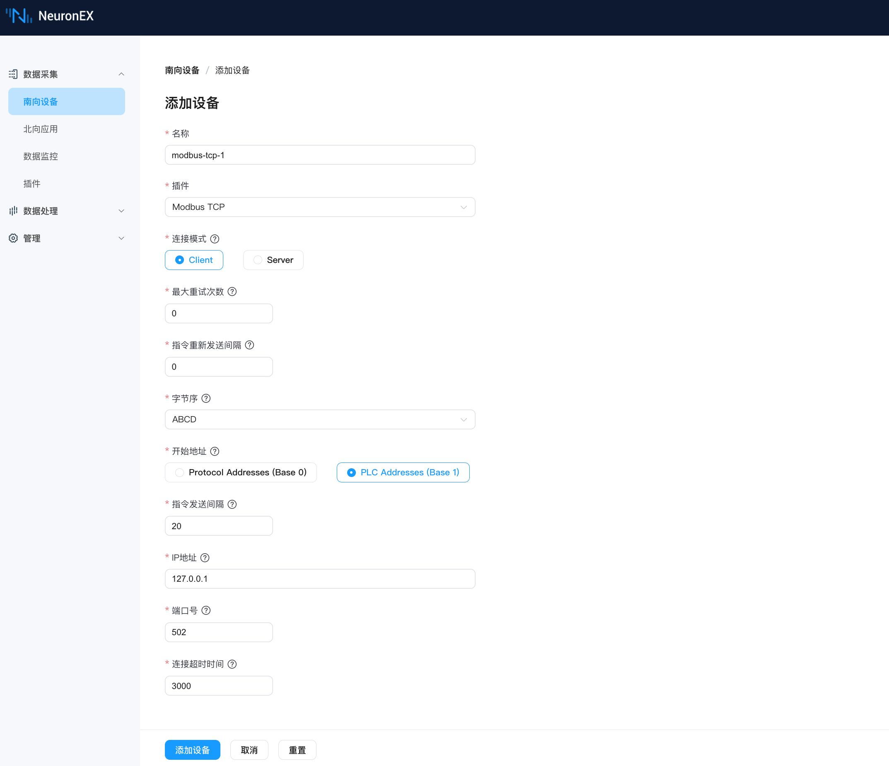
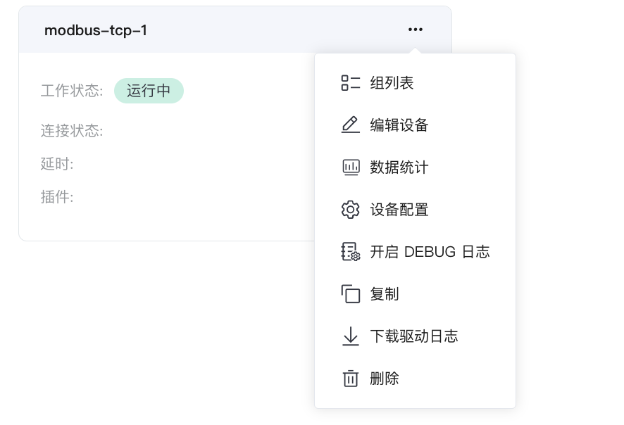
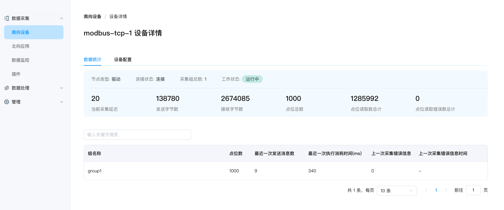

# Create a Southbound Driver

This chapter uses **Modbus TCP** to show how to add a southbound driver node in EMQX Neuron. For groups and tags, see [Groups and Tags](../groups-tags/groups-tags.md).

## Add a southbound device

In **Data Collection** -> **South Devices**, click **Add Device**. This example uses **Modbus TCP**.

* **Name**: Device name, for example `modbus-tcp-1`.
* **Plugin**: Select **Modbus TCP**.
* **Connection mode**: For Ethernet TCP, EMQX Neuron can act as TCP client or server.
* **Max retries**: Maximum retries after a read command fails.
* **Send interval**: Wait time between read/write commands, in milliseconds. If the interval is too short, some serial devices drop commands.
* **Byte order**: Default `1234`.
* **Start address**: Whether Modbus addresses start from 1 or 0.
* **IP address**: Target device IP.
* **Port**: Modbus port, default `502`.
* **Connection timeout**: In ms, default `3000`. If no response arrives within this time, an error is reported.

Click **Add Device** to finish.



After you add the device, the **South Devices** page shows a driver card with working state, connection state, and actions.

## Device card

On **South Devices**, switch between list and card view in the upper right.

* **Name**: Unique name of the southbound device.
* **Group list**: Open the collection groups for this device.
* **Edit device**: Change the unique device name.
* **Data statistics**: Runtime details for this driver.
* **Device configuration**: Parameters required to connect to the device.
* **Enable DEBUG log**: Turn on DEBUG logs for this node. Click again to turn them off.
* **Copy**: Duplicate the node, including configuration and tags.
* **Download driver log**: Download logs for this node.
* **Delete**: Remove the node from the southbound list.
* **Working state**:
    * **Initialize**: Configuration is invalid; the driver cannot run until you fix it.
    * **Running**: The driver is running.
    * **Stopped**: The driver is stopped.
* **Working state switch**: Connect or disconnect from the device.
    * On: EMQX Neuron connects and starts collecting data.
    * Off: Disconnect and stop collecting.
* **Connection state**: After groups and tags are set, EMQX Neuron connects to collect data and the state becomes **Connected**. If it cannot connect, the state is **Disconnected**.
* **Latency**: Time between sending a command and receiving a response.
* **Plugin**: Plugin module used by this device.



## Create groups and tags

After you add the driver, configure groups and tags. See [Groups and Tags](../groups-tags/groups-tags.md). You can also [import tags in batch](../import-export/import-export.md). Then open [Data Monitoring](../../admin/monitoring.md) to view live values.

## Connection test

If the connection state stays **Disconnected**, check network reachability. For Ethernet, run:

```bash
$ telnet <device IP> <port>
```

You can also open **Administration** -> **System Configuration**, enter the device IP, and test whether EMQX Neuron can reach it:


:::tip
Confirm that IP and port are correct in the device configuration and that the firewall is off.
:::

## Import and export southbound devices

Use **Import** and **Export** in the upper right of **South Devices** to back up or restore driver settings and tags.

## Driver statistics

On the device card or list, click **Data statistics**.



| Parameter | Description |
| --- | --- |
| last_rtt_ms | Time between sending and receiving a command, in milliseconds |
| send_bytes | Total bytes of commands sent |
| recv_bytes | Total bytes of commands received |
| tag_reads_total | Total read commands, including failures |
| tag_read_errors_total | Failed read commands |
| group_tags_total | Number of tags in the group |
| group_last_send_msgs | Messages sent in one group timer tick |
| group_last_timer_ms | Duration of one group timer tick, in milliseconds |
| link_state | Connection state: DISCONNECTED = 0, CONNECTED = 1 |
| running_state | Node state: INIT = 1, READY = 2, RUNNING = 3, STOPPED = 4 |
