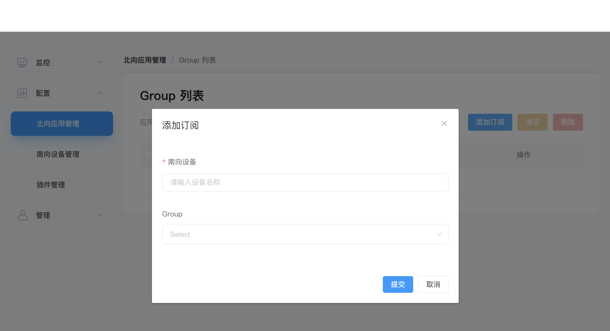

# Subscribe to southbound data

Northbound nodes can subscribe to any group created in southbound nodes. After the subscription is established, the data of the corresponding group will be continuously published to the northbound node according to the frequency of the group. This section explains how to subscribe to a group.

The collection points are uploaded in groups. Subscription selects the point group to be uploaded.

Click the MQTT node card, enter the group list, click `Add Subscription`, select the point group to subscribe, and subscribe to the point group of the southbound device.

* Southbound device: Select the southbound device to subscribe to, for example, modbus-tcp-1;
* Group: Select a group under the southbound device, for example, group-1.
