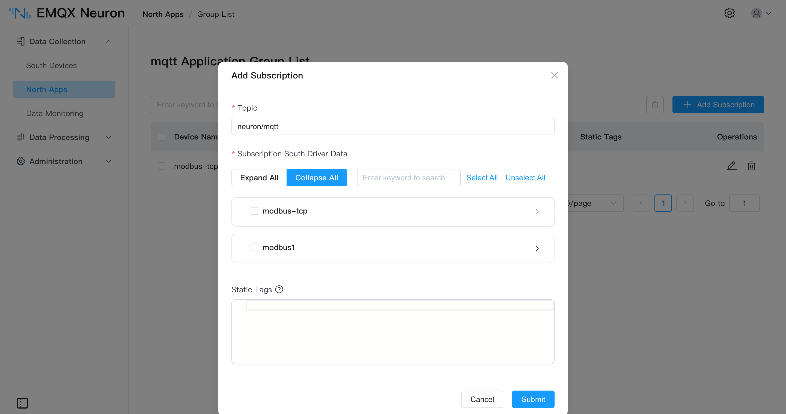

# Subscribe to Southbound Data

A northbound application receives nothing until it explicitly subscribes to a southbound collection group. Once subscribed, that group's data is published to the application at the group's polling interval.

**Subscriptions work per group** — you cannot subscribe to only some tags within a group. To publish tags separately, split them into different groups on the southbound side; see [Grouping strategy](./groups-tags/groups-tags.md#grouping-strategy).

## Add a subscription

Click the northbound application card to open the **Group List** page, then click **Add Subscription**:

| 
Field
 | Description |
| --- | --- |
| **Topic** | The upload topic. Needed only for MQTT-based applications and Kafka; a default is used when left blank |
| **Subscription South Driver Data** | Tick the collection groups to subscribe to. Expand a driver node to pick its groups; groups from different drivers can be ticked together and submitted as several subscriptions at once |
| **Static Tags** | Optional. Fixed attributes published alongside the group's data, given as JSON key-value pairs — see [Static tags](./north-apps/mqtt/api.md#static-tags) |

For MQTT and AWS IoT the default upload topic is `/neuron/{application}/{driver}/{group}`. Kafka falls back to the **default topic** in the application configuration. Azure IoT, Sparkplug B, OPC UA Server, and WebSocket derive their topic or node path from the protocol specification, so there is nothing to specify per subscription.

## How subscriptions relate

A subscription is identified by the combination of southbound driver, group, and northbound application. As a result:

- **One application can subscribe to many groups**, including groups from different drivers.
- **One group can be subscribed by many applications**, so the same collected data can go to the cloud, be read by an upper-level system, and land in a data platform at the same time, independently of each other.
- The same application can subscribe to a given group only once.

Removing a subscription stops publishing that group to that application; collection on the southbound side is unaffected.

## Verify

After subscribing, click **Data Statistics** on the northbound application card — `send_msgs_total` should keep increasing. If it does not, check in order that the southbound driver is **Running** and **Connected**, the northbound application is **Running**, and the subscription exists. For the statistics fields, see [Create a Northbound Application](./north-apps/north-apps.md#data-statistics).
