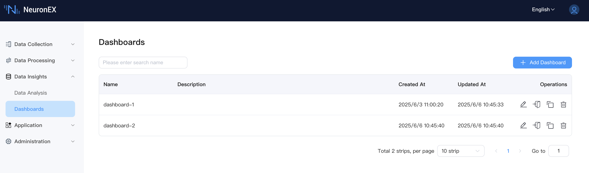
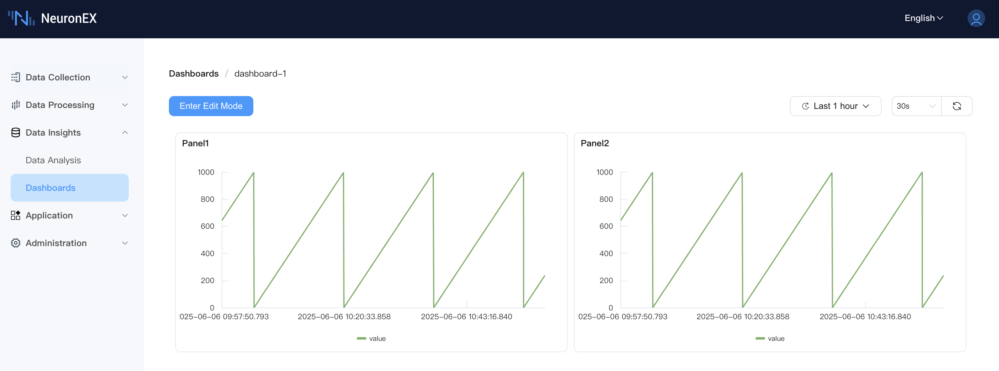
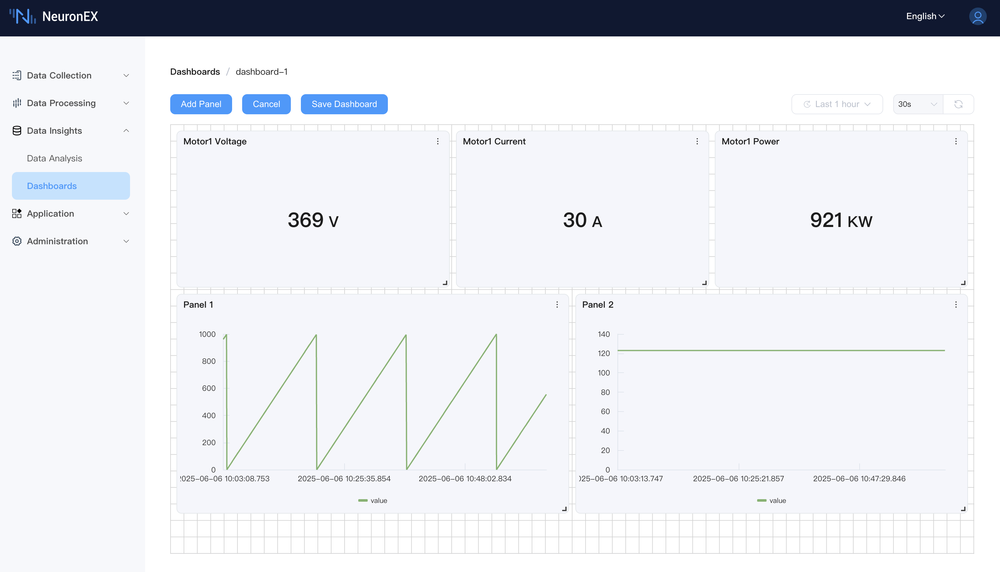
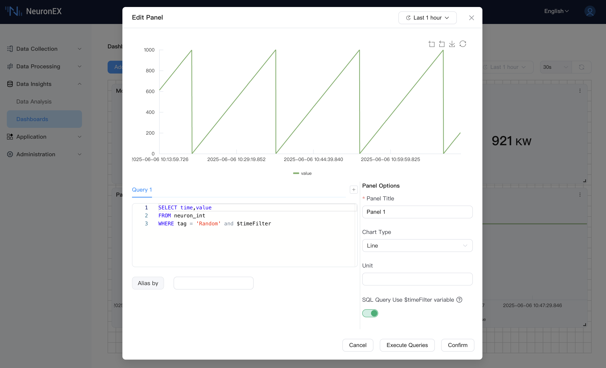

# Dashboards

Dashboards are the visualization tool within NeuronEX's Data Insights module, used for centrally displaying and monitoring key data. They allow you to create highly customizable views, presenting data stored in the time-series database in intuitive charts, statistical values, or tables. This helps you grasp real-time production and operational status, track core KPIs, and respond quickly to anomalies.

## Key Features

### 1. Dashboard Main Page Management

When you navigate to the "Dashboards" page, you will see a main page for centrally managing all your created dashboards.

*   **List Display:** Dashboards are clearly displayed in a list format, including the following columns:
    *   **Name:** The custom name of the dashboard.
    *   **Description:** A brief description of the dashboard's purpose or content.
    *   **Created At:** The date and time the dashboard was created.
    *   **Updated At:** The date and time the dashboard was last modified.
    *   **Operations:** Actions that can be performed on each dashboard.
        *   **Edit:** Click the icon to modify the name, description, and other basic information of an existing dashboard.
        *   **Enter:** Click its name to enter the detailed view of the dashboard.
        *   **Copy:** Click the icon to quickly duplicate an existing dashboard as a template for a new one.
        *   **Delete:** Click the icon to remove dashboards that are no longer needed.

### 2. Dashboard Internal View and Interaction

After entering a dashboard, you will see an interactive interface for displaying and configuring data.

#### 2.1 Top Action Bar

*   **Enter Edit Mode:** Click to enter edit mode.
*   **Add Panel:** Click the `Add Panel` button in the upper left corner to add a new data display unit (Panel) to the current dashboard.
*   **Cancel:** If you have made changes to the dashboard layout or Panels but do not want to save them, click the `Cancel` button to discard the changes.
*   **Save Dashboard:** Any modifications to the dashboard (such as adding/deleting Panels, adjusting layout, changing Panel configurations) need to be saved by clicking the `Save Dashboard` button to take effect.

#### 2.2 Global Time and Refresh Control

Located in the upper right corner of the dashboard, used to control the data display range and refresh frequency for the entire dashboard.

*   **Time Range Selector:**
    *   **Global Control:** Defines the query time span for data in all Panels.
    *   **Preset Ranges:** Offers various commonly used preset time ranges (e.g., "Last 1 hour" as shown in the screenshots).
    *   **Custom Time Period:** Allows users to select precise start and end dates and times.
*   **Refresh Mechanism:**
    *   **Auto-refresh Interval:** Select a preset auto-refresh time interval (e.g., "30s" as shown in the screenshots); the dashboard will automatically update data at this frequency.
    *   **Manual Refresh:** Click the refresh icon to immediately fetch the latest data and update all Panels.

#### 2.3 Panel Management and Layout

A Panel is the basic unit on a dashboard for displaying a single chart, statistical value, or table.

*   **Drag and Adjust:** Panels can be resized by dragging their bottom-right corner control point, or their position can be adjusted by dragging the Panel header, allowing for flexible layout customization.
*   **Grid Alignment:** Dashboards use a grid system (as indicated by the dashed grid in the background of screenshots) to help Panels align automatically, making the layout neater and more aesthetically pleasing.
*   **Panel Options Menu:** Each Panel typically has a three-dot menu icon in its upper right corner. Clicking this menu provides options to edit, duplicate, or delete the Panel.

#### 2.4 Adding and Configuring Panels

After clicking the `Add Panel` button in the dashboard view, an "Add Panel" dialog will appear for detailed Panel configuration.

*   **Dialog Layout:**
    *   **Left Side - Query Configuration:**
        *   **Query Tabs (e.g., "Query 1"):** Allows configuring multiple data queries for a single Panel (except for the Table type). Each query typically corresponds to a series in the chart. You can add new queries by clicking the `+` button (if available for multiple queries).
        *   **SQL Input Area:** Enter the SQL query statement for the currently selected Query Tab.
        *   **Alias by:** Specify a display alias for the result series of the current query. This is very useful for distinguishing multiple series within a Panel. This usually requires the SQL query result to contain a timestamp column and a single value column.
    *   **Right Side - Panel Options:**
        *   **Panel Title:** (Required) Specify a meaningful name for this Panel.
        *   **Chart Type:** Select the data display method. The current version supports:
            *   **Line:** Suitable for displaying trends in time-series data.
            *   **Bar:** Suitable for comparing data volumes across different categories or time points.
            *   **Stat:** Displays a single key numerical value prominently.
            *   **Table:** Presents detailed data in a tabular format (Table type supports only one query).
        *   **Unit:** For example, `°C`, `RPM`, `MPa`, etc. This information will be displayed on the chart or as a suffix to the numerical value.
    *   **Bottom Options:**
        *   **SQL Query Use $timeFilter variable:**
            *   **Enable/Disable Switch:** Controls whether to enable the `$timeFilter` variable in the SQL query.
            *   **When enabled:** The user's SQL statement **must include** `$timeFilter` (e.g., `WHERE $timeFilter` or `AND $timeFilter`). NeuronEX will replace it with time range conditions based on the dashboard's global time selection or the Panel's preview time selector.
            *   **When disabled:** NeuronEX will automatically append time range conditions to the user's SQL.
    *   **Dialog Top Control :**
        *   This dialog may also contain an independent time range selector, used to preview and test data for the current configuration before confirming the addition of a Panel.
    *   **Dialog Action Buttons:**
        *   **Cancel:** Close the "Add Panel" dialog without saving any configuration.
        *   **Execute Queries:** (at the bottom of the screenshot, also at the top of the dialog) Execute the current SQL query configuration and preview the results in the dialog, helping users verify the correctness of the query.
        *   **Confirm:** Save the Panel configuration and add it to the dashboard.

## Example Use Cases

- **Production Monitoring Dashboard**: Centrally display key equipment operating parameters (temperature, pressure, rotational speed), output, energy consumption, and other metrics to understand production line status in real-time.
- **KPI Tracking**: Create dedicated dashboards to visualize Key Performance Indicators such as OEE (Overall Equipment Effectiveness), equipment failure rates, and energy consumption metrics.
- **Quality Analysis**: Present trend charts and statistical data for critical product quality parameters to help monitor quality fluctuations.
- **Alarms and Events Overview**: Combine with data analysis results to display the quantity, types, and trends of recent important alarms.

## Prerequisites

- NeuronEX is enabled and configured with Integrated [Time-Series Data Storage](../admin/sys-configuration.md#data-storage-configuration).
- At least one southbound driver's data tags has been subscribed to the northbound DataStorage plugin, and the data has been successfully written to TSDB.
- For the best experience, it is recommended to analyze the data tags you intend to display beforehand to clarify their data types and common query requirements.

NeuronEX's dashboard functionality allows you to transform complex data into intuitive insights, empowering your daily operations and decision-making.