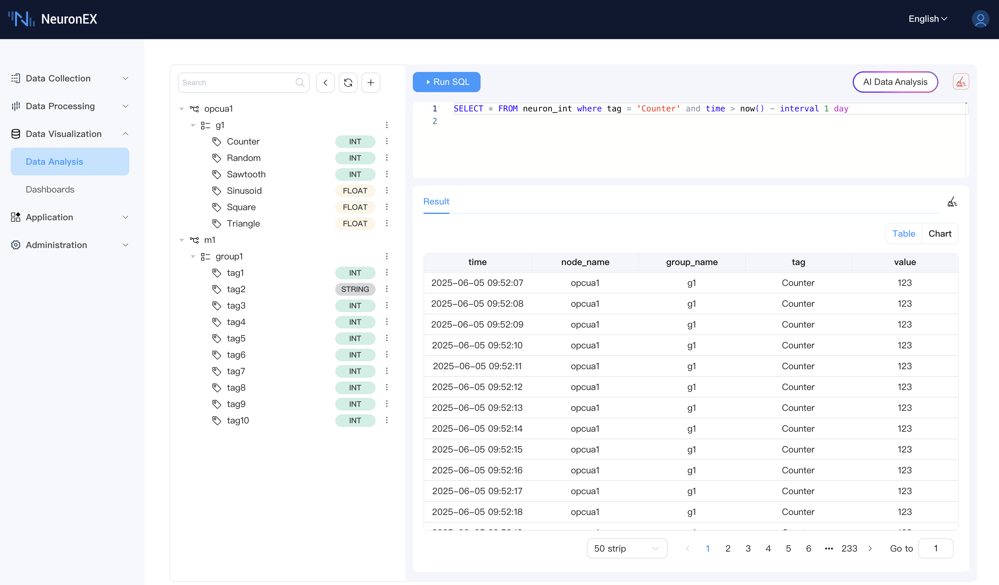

# Data Analysis

Data Analysis is the core interactive interface of NeuronEX's data insights module, providing you with a complete workflow from browsing data sources, building queries to analyzing results.

## Key Features

 

### 1. Unified Entry and Interface Layout

*   **Unified Entry:** All data browsing, SQL querying, and result display functions are integrated within the unified "Data Analysis" page.
*   **Clear Layout:** The page is typically divided into:
    *   **Left Data Source Navigation Area:** Displays data in a tree structure.
    *   **SQL Input and Configuration Area:** Used for writing and executing SQL queries.
    *   **Bottom Result Display Area:** Shows query results (tables or charts).

### 2. Data Source Tree Directory

*   **Structured Display:** The left side clearly lists southbound drivers with Datalayers storage enabled, their collection groups, and specific data tags in a tree structure.
*   **Type Display:** Each data tag is clearly labeled with its data type stored in Datalayers (e.g., `Int`, `Float`, `Bool`, `String`), helping users build correct queries.
*   **Convenient Operations:**
    *   **Refresh:** Supports manual refresh of the tree directory to get the latest driver/group/tag information.
    *   **Tag Search:** Provides data tag name search functionality to quickly locate target tag.
    *   **SQL Query Examples:** After selecting a data tag, the system automatically provides common SQL query examples, such as:
        *   `Query Column`: Query the latest 100 records of this data tag.
        *   `Query Period`: Query data from this data tag for the past day.
        *   `Query Max`: Query the maximum value of this data tag.
        Users can directly use these examples or modify them as needed.
    *   **AI Query (LLM Integration):**
        *   After selecting a data tag, you can choose the "AI Query" function.
        *   The system will automatically pre-fill the data tag name and corresponding data table information (e.g., `neuron_float`, `tag='your_tag_name'`) into the AI interaction box or pass it as context to the AI.
        *   Users can describe query requirements in **natural language** (e.g., "query the hourly average of this data tag for the past day"), and the integrated LLM will generate complex SQL query statements.

### 3. Intelligent SQL Input Area

*   **Writing Assistance:**
    *   **Keyword Suggestions:** Provides auto-completion suggestions for common SQL keywords when typing SQL.
    *   **Syntax Highlighting:** Applies syntax highlighting to SQL statements to improve readability.
    *   **Line Numbers:** Facilitates positioning and debugging.
*   **Query Restrictions:**
    *   **Single Query:** Currently supports executing single SQL query statements.
    *   **Query Type Limitation:** **Only accepts query-type SQL statements (SELECT)**. To ensure data security and system stability, **does not support** `CREATE TABLE`, `INSERT`, `DELETE`, `UPDATE`, and other data definition or modification operations.

### 4. Result Display Area

*   **Multi-view Display:** Each successfully executed SQL query result is displayed in this area in table (Table) or chart (Chart) format.
*   **Table Display:**
    *   Default display method, clearly presenting query-returned data in row-column structure.
    *   Supports basic table operations such as pagination and sorting (specific functions depend on the frontend table component).
*   **Chart Display:**
    *   **Support Conditions:** If the SQL query results contain timestamp fields and numeric fields, the system will automatically support switching results to chart view.
    *   **Chart Types:**
        *   **Line Chart:** Suitable for displaying trend changes in time-series data.
        *   **Bar Chart:** Suitable for comparing data volumes across different categories or time points.
    *   **Interactive Features:**
        *   **Chart Zoom:** Supports local magnification of charts to view details.
        *   **Save and Download:** Supports saving the current chart as an image file (such as PNG) for local download.
        *   **Legend Interaction:** (Usually supported by chart libraries) Clicking on legends can show/hide corresponding series, facilitating focused analysis.

### 5. AI Data Analysis Assistant Integration

The "Data Analysis" page deeply integrates an AI data analysis assistant, designed to help users more easily build and optimize SQL queries.

*   **UI Entry:**
    *   Through the `AI Data Analysis` button in the upper right corner of the page, clicking opens the AI interaction dialog.
    *   As mentioned earlier, the data tag operation items also provide a quick entry for `AI Query`.
*   **AI Interaction Box:**
    *   **Default Page Guidance:** When opening the AI dialog from the main entry, it provides guiding prompts, informing users that NeuronEX stores data by type in separate tables (`neuron_float`, `neuron_int`, `neuron_bool`, `neuron_string`), and suggests users provide data tag names and data types when asking questions. It also provides clickable query examples to help users get started quickly.
    *   **Data Tag Context Pre-filling:** When entering from the data tag "AI Query" entry, the data tag name and corresponding data table (e.g., `neuron_float`, `tag='tag1'`) are automatically pre-filled into the dialog or passed as context.
*   **AI Core Capabilities:**
    *   **Natural Language to SQL:** Converts users' natural language query requirements into correct SQL statements.
    *   **SQL Iterative Correction:** When generated SQL execution fails, AI can intelligently analyze error causes and use system-provided tools (such as querying table structure) for multi-round iterative corrections until generating successfully executable SQL.
*   **Context Limitations:** The current version mainly uses AI to assist SQL generation and correction. Due to LLM token limits, only partial query results are sent to AI for analysis and confirmation.
*   **Configuration and Dependencies:** Using this feature requires first enabling AI Agent service in system configuration, configuring AI models, and ensuring the runtime environment (especially when using non-AI specific Docker images) has correctly installed required Python dependency libraries. For details, please refer to [AI Feature Environment Configuration Guide](../admin/sys-configuration.md#ai-feature-environment-configuration-guide).

## Prerequisites

*   NeuronEX has enabled and configured [Integrated Time Series Data Storage (Datalayers)](../admin/sys-configuration.md#data-storage-configuration).
*   At least one southbound driver's data tags have been subscribed to the northbound DataStorage plugin.
*   If you need to use the AI Query function, please ensure AI-related services and models are correctly configured.

Through the "Data Analysis" page, you can fully utilize the powerful capabilities of SQL and the intelligent assistance of AI to deeply explore your industrial data.