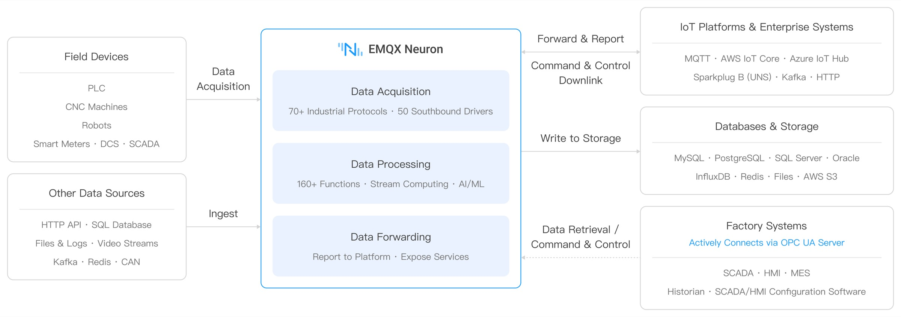

# Product Overview

EMQX Neuron (formerly NeuronEX) is an industrial edge gateway that runs on the plant floor — in manufacturing, energy, and building automation. Device-side protocols are fragmented and data formats are inconsistent, while MES, SCADA, and cloud platforms need standardized real-time data. EMQX Neuron collects from PLCs, CNC machines, robots, and meters, cleans and computes on that data at the edge, and delivers it in the shape the systems above expect.

## Core capabilities

| 
Capability
 | Description | 
Learn more
 |
| --- | --- | --- |
| **Data collection** | Southbound drivers connect 70+ industrial protocols, covering Modbus, OPC UA, EtherNet/IP, IEC 60870, BACnet, Siemens and Mitsubishi PLCs, and a range of CNC controllers | [Southbound Drivers](./introduction/driver-list/driver-list.md) |
| **Data processing** | A built-in stream processing engine with 160+ functions for filtering, transformation, aggregation, and windowing; extensible with Python/C++ functions and AI/ML models | [Data Processing](./streaming-processing/overview.md) |
| **Data forwarding** | Publish to IoT platforms and enterprise systems, write into databases, or serve data on the plant floor through an OPC UA Server | [Northbound Applications](./configuration/north-apps/catalog.md) |
| **Operations** | A web console for configuration, users and permissions, log download, runtime monitoring and alerts, with master-backup deployment | [Operations](./admin/introduction.md) |

## Getting started

- **Get one pipeline working first** — [Quick Start](./quick-start/quick-start.md): run an instance in Docker, collect from a simulated device, and forward to MQTT.
- **Deploy to production** — [Installation and Deployment](./installation/introduction.md): tar.gz, rpm, deb, and Docker, plus master-backup deployment.
- **Check whether your device protocol is supported** — [Southbound Drivers](./introduction/driver-list/driver-list.md): look up your protocol or CNC model in the compatibility tables.
- **Understand how it is put together** — [Architecture](./introduction/architecture.md).

## Data destinations

As the diagram shows, collected and processed data leaves in four directions:

| 
Destination
 | How | Notes |
| --- | --- | --- |
| IoT platforms | [MQTT](./configuration/north-apps/mqtt/overview.md), [AWS IoT Core](./configuration/north-apps/aws-iot/overview.md), [Azure IoT Hub](./configuration/north-apps/azure-iot/overview.md), [Sparkplug B](./configuration/north-apps/sparkplugb/overview.md) | **Bidirectional**: publish tag values, and accept write commands from the platform to control devices. Sparkplug B builds a unified namespace (UNS); the docs include verified walkthroughs for [Ignition](./configuration/north-apps/sparkplugb/ignition.md) and [Cogent DataHub](./configuration/north-apps/sparkplugb/cogent.md) |
| Enterprise systems | [Kafka](./configuration/north-apps/kafka/overview.md), HTTP, [WebSocket](./configuration/north-apps/websocket/websocket.md) | Feed the enterprise message bus for MES and data platforms |
| Databases and storage | MySQL, PostgreSQL, SQL Server, Oracle, InfluxDB, Redis, AWS S3 | Written by a data processing [sink](./streaming-processing/sink/sink.md), optionally aggregated or downsampled first |
| Served on the plant floor | [OPC UA Server](./configuration/north-apps/opcua-server/overview.md) | On-site SCADA, HMI, MES, and historians connect in as clients to read tags and write control commands |

### Serving OPC UA on the plant floor

The first three push data outward. The [OPC UA Server](./configuration/north-apps/opcua-server/overview.md) reverses that: EMQX Neuron exposes an OPC UA service, and the SCADA, HMI, MES, and historian systems already installed in the plant connect to it as clients — subscribing to tag changes, reading live values, and writing control commands back down.

On an existing production line, the value is that **nothing upstream has to change**. SCADA already speaks OPC UA, so once it connects, the seventy-plus device protocols collected below become a single OPC UA data source — Modbus, Siemens S7, Mitsubishi, and CNC devices no longer have to be integrated one by one. Security covers policies such as Basic256Sha256, username and password authentication, and mutual validation with a server certificate and trusted client certificates.

## Deployment and performance

- **Low latency**: collection intervals down to 100 ms, with processing at the edge instead of round-tripping to the cloud.
- **Lightweight**: low memory footprint, x86 and ARM support, runs on industrial PCs and gateway hardware, and deploys via Docker and Kubernetes.
