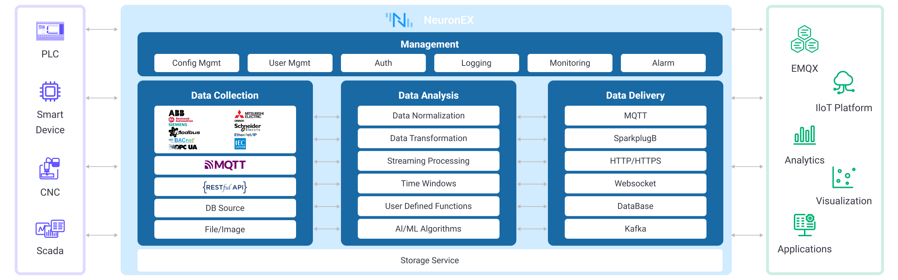

# Product Overview

EMQX Neuron (formerly NeuronEX) is a powerful Industrial Connectivity Gateway designed for digital transformation in industrial sectors. Deployed in manufacturing, energy, building, and other industrial sites, its core mission is to bridge the gap between the physical and digital worlds, enabling:

- **Massive Device Connectivity and Data Ingestion**: It unifies data collection from OT devices like PLCs, CNCs, robots, instrumentation, and various industrial systems through extensive protocol support.
- **Edge Intelligent Processing and Analysis**: At the edge, close to the data source, it performs real-time data filtering, cleansing, aggregation, computation, and AI-driven analysis, transforming raw data into valuable information.
- **Seamless Multi-system Integration and Linkage**: It efficiently and securely connects processed data to industrial internet platforms, cloud services, and enterprise applications (such as MES, SCADA), facilitating data flow and business collaboration.

EMQX Neuron breaks down the technical barriers between OT and IT, providing an end-to-end solution for industrial scenarios—from data collection, processing, and analysis to integration. It is a core component for enterprises building stable, efficient, and intelligent edge data infrastructure.

## Product Advantages

- **Rich Protocol Integration**

    Diverse industrial protocols cater to various industrial scenarios, enabling real-time data collection and unified access for equipment data such as PLCs, CNC machines, robots, Scada systems, and smart sensors.

- **Low-Latency Data Processing**

    Designed specifically for industrial fields, EMQX Neuron offers low-latency data access and processing, facilitating rapid data transmission between multiple systems for real-time monitoring and decision-making.

- **Lightweight and Flexible Deployment**

    EMQX Neuron is lightweight, low-memory, and supports multiple CPU architectures. It can be deployed in Docker or Kubernetes containers.

- **Comprehensive Data Analysis Capabilities**

    A powerful built-in stream computing engine offers over 160 functions to support extraction, transformation, filtering, and aggregation of real-time data streams.

- **AI/ML Analysis**

    EMQX Neuron supports user-defined function extensions and AI/ML algorithm integration. You can generate Python portable plugins from natural language and run complex computation and inference at the edge.

- **Platform Integration**

    EMQX Neuron integrates with MQTT, SparkplugB, HTTP, and other protocols to integrate data into local data centers, IIoT platforms, or cloud services.

## Product Architecture

As shown in the diagram, EMQX Neuron is primarily divided into modules such as Data Collection, Data Processing and Analysis, Data Forwarding and Storage, and System Management.

### Data Collection Module

In the realm of data collection, EMQX Neuron not only supports industrial equipment data collection but also facilitates the integration of multi-source data from the industrial site.

#### Industrial Equipment Data Collection

EMQX Neuron supports various industrial protocols through drivers, including Modbus, OPC UA, EtherNet/IP, IEC104, BACnet, Siemens PLC, and Mitsubishi PLC. This meets the data collection needs of diverse industries such as smart manufacturing, oil and gas, steel and metallurgy, energy, and building automation.

#### Integration of Multi-Source Data
EMQX Neuron also possesses the capability to flexibly acquire various types of data. In industrial settings, it can support:

- **Integration with MES, WMS, and ERP Systems**

  Integration with MES, WMS, and ERP systems is achieved through [HTTP Pull](./streaming-processing/http_pull.md) and [HTTP Push](./streaming-processing/http_push.md), facilitating bidirectional data exchange.

- **Database Integration**

  EMQX Neuron supports data retrieval from databases like SQLite, MySQL, SQL Server, and others.

- **Enterprise Service Bus (ESB) Integration**

  Bidirectional integration with the Enterprise Service Bus (ESB) is achieved [HTTP Pull](./streaming-processing/http_pull.md) and [HTTP Push](./streaming-processing/http_push.md), enabling data push and pull operations with the ESB.

- **[File](./streaming-processing/file.md) Data Collection**

  EMQX Neuron supports data collection from files in CSV, JSON, and other formats.

- **Video Stream Access and Analysis**

### Data Processing and Analysis Module

The core value of EMQX Neuron lies in its powerful edge data processing and analysis capabilities, which transform raw, chaotic data into standardized, valuable insights.

- **Data Standardization and Cleansing**: With over 160 built-in [functions](./streaming-processing/sqls/functions/overview.md), it supports operations like data type conversion, unit standardization, format restructuring, filtering, sorting, and aggregation to meet various data preprocessing needs.
- **Real-time Stream Processing**: A powerful stream processing engine enables millisecond-level real-time handling of data streams, satisfying low-latency scenarios such as real-time data collaboration between multiple systems and closed-loop control.
- **AI/ML Algorithm Integration**: Supports user integration of [custom functions](./streaming-processing/extension.md) and [AI/ML algorithm models](./streaming-processing/portable_python.md) written in Python, C/C++, etc., for low-latency intelligent inference at the edge. You can also [generate Python portable plugins from natural language](./best-practise/llm-portable-plugin.md) to lower the barrier to writing extensions.

### Data Forwarding and Storage Module

EMQX Neuron acts as a powerful bridge connecting the edge to the cloud and on-premises systems, offering flexible options for data forwarding and storage.

- **Data Forwarding**: Supports seamless data handoff to public cloud IoT platforms, private clouds, or on-premises data centers via standard protocols like MQTT, SparkplugB, HTTP, and WebSocket.
- **Data Storage**: EMQX Neuron supports writing data to various external databases and message queues, such as MySQL, InfluxDB, Kafka, and Datalayers, to meet diverse data persistence requirements.

### System Management Module

EMQX Neuron provides a complete and user-friendly set of system management functions to ensure its stable, secure, and reliable operation in industrial environments.

- **System Configuration**: Offers a clean Web UI for convenient configuration management of all modules, including drivers, data processing rules, and northbound applications.
- **Security and Authentication**: Supports username/password-based access control and TLS/SSL encrypted transmission to guarantee system and data security.
- **Logging and Monitoring**: Provides detailed operational logs, performance metrics, and status monitoring to facilitate user operations and troubleshooting.

For guidance on using EMQX Neuron's System Management Module, refer to the [Operations Guide](./admin/introduction.md).
