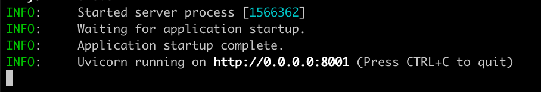

# NeuronEX AI Function Installation Package Installation Guide

1. Download the corresponding installation package according to the current environment. For example: neuronex-3.6.0-beta.3-linux-amd64.deb.
2. Install NeuronEX with reference to the documentation: [install NeuronEX](./introduction.md)
3. Enter the AI function module directory. The default directory for the AI function of NeuronEX managed by systemd is: /opt/neuronex/software/neuronex-ai.
4. The AI function of NeuronEX uses uv as the project management tool. If uv is not installed, it needs to be installed first. For details, refer to: [Installing uv](https://docs.astral.sh/uv/getting-started/installation/)
5. After successfully installing uv, use the following command to test whether the AI function can be started normally: uv sync && cd src/apps_entry && uv run main.py.
6. If the above command shows the following prompt, it means that the AI - related dependent libraries have been installed successfully:

7. If the environment cannot install uv and the dependent libraries normally, you can find available domestic mirror repositories, or use the NeuronEX container images with the -ai or -ai - arm64 suffix to deploy the NeuronEX service. The images already have a complete AI function. 