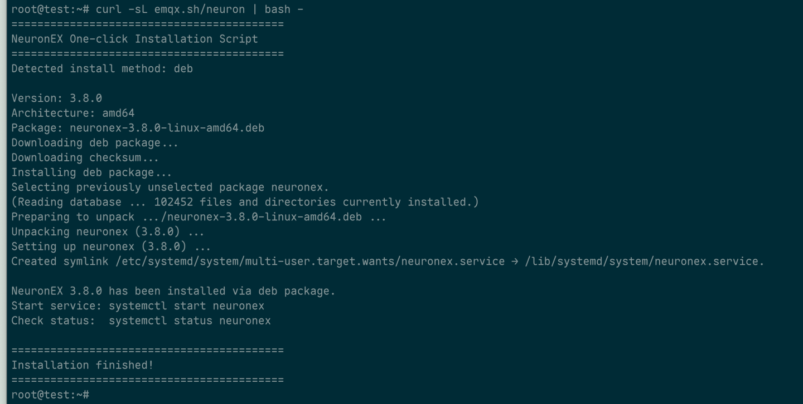

# Installation and Deployment

EMQX Neuron runs on Linux, supporting 32/64-bit ARM and 64-bit x86 architectures, and deploys in containers through Docker, Kubernetes, and KubeEdge.

## Quick install

```bash
curl -fsSL emqx.sh/neuron | bash
```



The script chooses between `.deb`, `.rpm`, `tar.gz`, and Docker, and verifies the SHA256 checksum when one is published. With `tar.gz`, it installs to `/opt/neuronex` and symlinks `neuronex` into `/usr/local/bin`, so you can start it straight from the command line.

### Controlling what the script does

Environment variables steer the script, so there is no need to download a package by hand:

| Variable | Default | Description |
| --- | --- | --- |
| `INSTALL_METHOD` | `auto` | Force an install method: `deb`, `rpm`, `targz`, or `docker` |
| `NEURONEX_VERSION` | latest | Install a specific version |
| `ROOT` | `/opt` | Install root; the product goes to `$ROOT/neuronex` |
| `BIN_LINK_DIR` | `/usr/local/bin` | Where the executable is symlinked |
| `DOCKER_IMAGE` | `emqx/neuronex:latest` | Used only with `INSTALL_METHOD=docker` |
| `DOCKER_PORT` | `8085` | Docker only — host port to publish |
| `DOCKER_NAME` | `neuronex` | Docker only — container name |

For example, to force a Docker install of a specific version:

```bash
curl -fsSL emqx.sh/neuron -o install_neuronex.sh
INSTALL_METHOD=docker NEURONEX_VERSION=3.9.2 bash install_neuronex.sh
```

## Choosing an install method

If you need a specific method, or the script does not fit your environment:

| <div style="width:80pt">Method</div> | When to use it | Details |
| --- | --- | --- |
| **.deb** | Debian-based distributions such as Debian, Ubuntu, and Kylin — preferred | [Installing from a Package](./package.md) |
| **.rpm** | RPM-based distributions such as RedHat, CentOS, and openEuler | [Installing from a Package](./package.md) |
| **.tar.gz** | Any Linux distribution, no package manager required | [Installing from a Package](./package.md) |
| **Docker** | Quick evaluation, container deployments, CI environments | [Docker](./docker.md) |

Packages are available from the [download page](https://www.emqx.com/en/try?tab=self-managed). File names look like `neuronex-x.y.z-linux-amd64.rpm`, where `x.y.z` is the version and `amd64` / `arm` / `arm64` is the architecture.

## Operating system requirements

| Category | Supported systems | Install method |
| --- | --- | --- |
| Mainstream distributions | CentOS 8.0+, Ubuntu 20.04+, Debian 11+ | The matching rpm / deb / tar.gz package |
| Chinese domestic systems | openEuler (ARM64) | RPM package |
| | Kylin (ARM64) | DEB package |
| | UOS | Either package |

::: tip Windows
There is no native Windows build. On Windows, run EMQX Neuron with Docker Desktop, or install a Linux environment through WSL or VirtualBox.
:::

## Hardware requirements

EMQX Neuron runs on industrial PCs, gateway hardware, and servers. It sustains a **100 ms** polling interval even on constrained devices, and uses multiple CPU cores to poll large tag counts when resources allow.

Minimum memory for data collection (enabling data processing consumes more):

| Tags | Minimum memory | Architecture | Reference hardware |
| --- | --- | --- | --- |
| 100 | 128 MB | 64-bit ARM / x86 | Raspberry Pi 3 |
| 1,000 | 256 MB | 64-bit ARM / x86 | Raspberry Pi 4 |
| 10,000 | 512 MB | 64-bit ARM / x86 | Industrial PC |
| More than 10,000 | 1 GB and up | 64-bit x86 | High-end industrial PC, server |

There is no hard limit on tag count — it depends on the CPU and memory you allocate. For measured figures per driver, see [Performance Testing](../performance/performance.md).

::: tip Recommended size per instance
With adequate hardware, keep a single instance under **100,000 tags** and **100 southbound drivers**. Beyond that, split the workload across multiple EMQX Neuron instances.
:::

## Version numbers

Versions are written as `x.y.z`:

- **x** — major version: introduces architectural changes and is not guaranteed to be backward compatible.
- **y** — minor version: introduces features while staying compatible within the same major version.
- **z** — patch version: bug fixes only.

## Next steps

- **Try it end to end** — [Quick Start](../quick-start/quick-start.md) walks collection through forwarding in five steps.
- **Set up a license** — 30 tags are included free by default; beyond that you need a license. See [Licensing](./license.md).
- **Production high availability** — see [Master-Backup Mode](../best-practise/master-backup.md).
