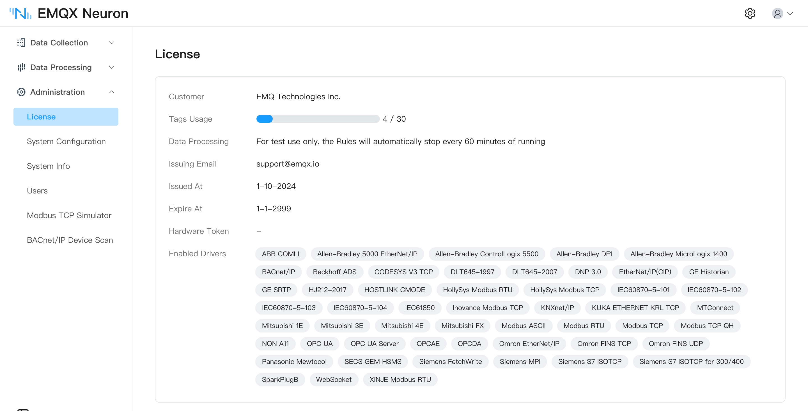
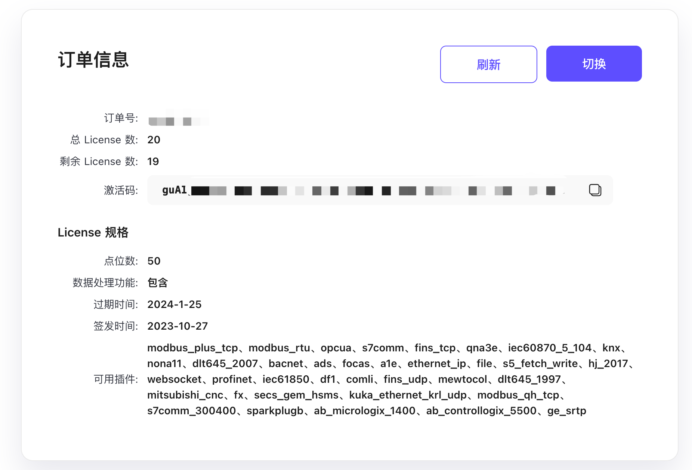
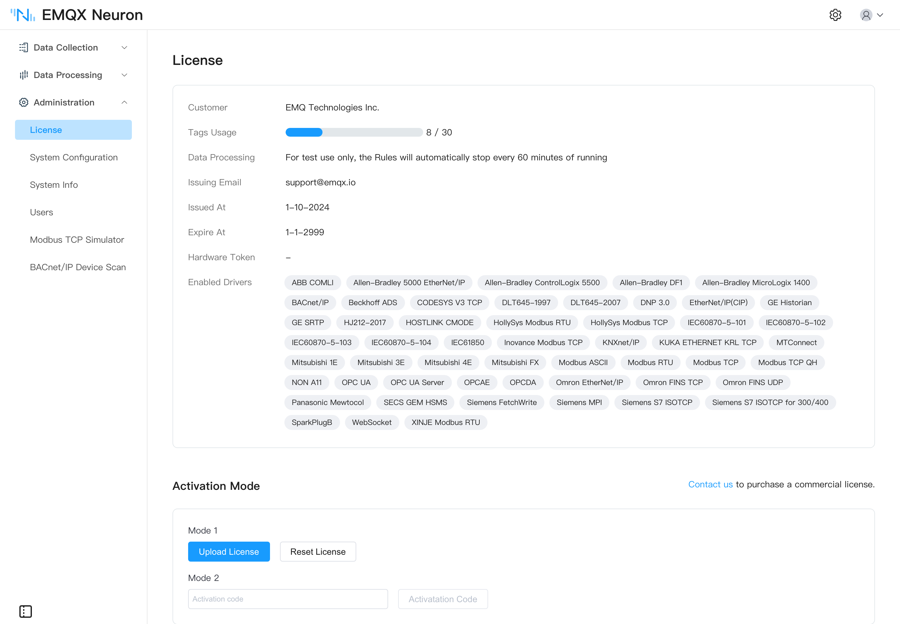

# Licensing

EMQX Neuron (formerly NeuronEX) works as soon as it is installed: it ships with a **permanent free license** covering 30 data tags. You only need a trial or commercial license once you exceed that quota or want the full data processing capability.

## Quota comparison

| 
Item
 | Free (built in) | Trial | Commercial |
| --- | --- | --- | --- |
| Data tags | 30 | 1,000 | Per purchase |
| Validity | Permanent | 15 days | Per subscription term |
| Data processing | Testing only — **each rule stops automatically after 60 minutes** | Full | Full |
| CNC drivers | Not included | Included | Included |
| Hardware binding | Not applicable | Bound to a hardware ID by default | Bound or unbound |
| How to get it | Nothing to do | [Apply on the website](https://www.emqx.com/en/contact?product=neuronex); at most two per email address | [Contact EMQ sales](https://www.emqx.com/en/contact?product=neuronex) |

The software itself can be downloaded from the [EMQ website](https://www.emqx.com/en/try?product=neuronex) without a license.

## What the free quota covers

The built-in license covers most standard southbound drivers and northbound applications — Modbus, OPC UA, Siemens and Mitsubishi PLCs, EtherNet/IP, IEC 60870, IEC 61850, BACnet, DL/T645, MQTT, Sparkplug B, and more — all usable within the 30-tag limit at no cost.

::: tip Note
**CNC drivers such as Fanuc Focas Ethernet and Mitsubishi CNC are not part of the permanent free quota.** [Contact us](https://www.emqx.com/en/contact?product=neuronex) if you need them.
:::

Drivers and applications are licensed **individually**. To see exactly what your instance is entitled to, check the *Enabled Drivers and Applications* field on **Administration → License**. For the full set of supported protocols, see [Southbound Drivers](../introduction/driver-list/driver-list.md).

## Applying for a trial license

Apply on the [EMQ website](https://www.emqx.com/en/contact?product=neuronex). A trial unlocks every driver, application, and the full data processing engine for 15 days, within a limit of 1,000 data tags. You can reapply after it expires, up to two trial licenses per email address.

::: tip
A trial license obtained from the website **must be bound to a hardware ID**. EMQX Neuron installed in Docker or another container has an empty hardware ID and cannot be bound — in that case, [contact us](https://www.emqx.com/en/contact?product=neuronex) for a license without hardware binding.
:::

## Installing a license

A license can be installed more than once; a new one replaces the old.

| 
Method
 | When to use it |
| --- | --- |
| [Upload a license file](#upload-a-license-file) | Single deployment — the common case |
| [ECP floating license](#ecp-floating-license) | Several instances, with ECP allocating tags centrally |

### Upload a license file

[Contact us](https://www.emqx.com/en/contact?product=neuronex) to request a license. Then go to **Administration → License** and click `Upload License`. Once the upload succeeds, the license details appear on the same page.

<!-- ### Activation code

Suited to deploying EMQX Neuron across a fleet of gateways, distributing licenses and binding them to hardware through activation codes.

1. Talk to EMQ sales to buy licenses in bulk. After the order is placed, EMQ sends the order number to your email. One order number can hold several licenses of the same specification, each activating one EMQX Neuron instance.

2. Open the [EMQX Neuron license lookup](https://www.emqx.com/en/neuronex-license-info) page, enter the order number, the email bound to it, and the verification code. Save the activation code from the results.

   

3. In EMQX Neuron, go to **Administration → License**, enter the activation code, and click `Activate`. EMQX Neuron fetches the license from the website and imports it automatically.

   

After a successful activation, the order's remaining count drops by one.

::: tip
- Activation requires network access from EMQX Neuron to the EMQ website.
- If a device loses its license, the same activation code can reissue it. Licenses map one-to-one to hardware IDs, so activating the same device repeatedly consumes only one seat.
::: -->

### ECP floating license

Suited to EMQX Neuron instances managed by ECP. When several instances are deployed, ECP manages the total tag count and allocates it flexibly, and also provides fast deployment, remote operation, and central management. See [ECP](https://www.emqx.com/en/products/emqx-ecp).

## Viewing license information

However the license was installed, the details are on **Administration → License**:

| 
Field
 | Description |
| --- | --- |
| Issued At | When the license takes effect |
| Expire At | The last day the license is valid |
| Tags Usage | The maximum number of tags allowed, and how many are in use |
| Enabled Drivers and Applications | The drivers and applications this license authorizes. Each commercial module is licensed independently |
| Hardware Token | The hardware ID of the running instance — see below |

## Hardware token

Licenses come in hardware-bound and unbound forms. A bound license only takes effect on an instance whose hardware token matches; you can read the token on the license page.

::: tip
EMQX Neuron installed in Docker or another container has an empty hardware token and cannot use a hardware-bound license.
:::

## Expiry and renewal

When a license expires, core EMQX Neuron functions stop: data collection and forwarding halt, and the instance does not fall back to the default free license.

The console stays accessible. Upload a new license file to restore service — the procedure is the same as the first install, the new license replaces the old one, and there is no need to remove the old license first. If a new license is not available yet, [reset to the free license](#resetting-to-the-free-license) to keep running within the 30-tag quota.

## Resetting to the free license

On **Administration → License**, click `Reset License` to restore the built-in permanent 30-tag free license.
