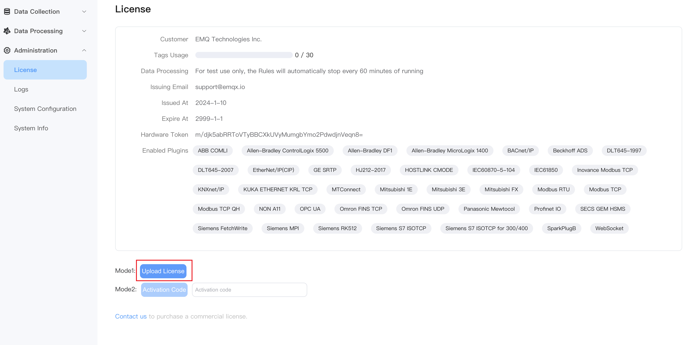
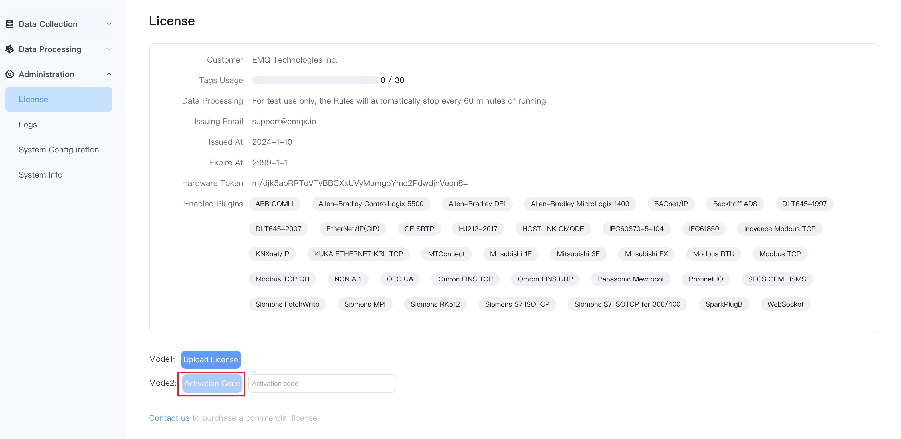

# License Policy

NeuronEX comes with a trial license that provides 30 points (30 connections and 30 data tags) of free usage. This allows you to run commercial modules without installing an EMQ license. After exceeding the free usage limit, you must install a valid official EMQ license to use all of NeuronEX's features.

## Install  License

Licenses can be installed multiple times. When you reinstall a license, the old license will be deleted. There are three ways to install a license:

- **Apply for a license on the website**

  You can directly [contact us](https://www.emqx.com/en/contact?product=neuronex) to apply for a license that does not require hardware binding. After applying for a license, you can enter NeuronEX, click **Administration** > **License**, click **Re-upload**, and then you can see the detailed information of the license on this page after the upload is successful.

  

- **Activate a license**

  This method is suitable for users who want to install NeuronEX in gateway hardware and quickly register licenses for a large number of boxes. You need to manually activate NeuronEX through a registration activation code to achieve license distribution and hardware binding.

  - Users first place an order on the EMQ website to purchase a batch of NeuronEX licenses and obtain an order number. You can also contact us.

  - Users go to the [NeuronEX License Information Query](https://site.mqttce.com/en/neuronex-license-info) page, enter the order number, the email address associated with the order number, and the verification code to query the information of the current purchased license order. Save the activation code.

    

  - Enter NeuronEX, click **Administration** > **License**, enter the activation code you just saved, click **Re-activate**, NeuronEX will obtain the license from the official website and automatically import it. After the activation is successful, re-enter the [NeuronEX License Information Query](https://site.mqttce.com/en/neuronex-license-info) page, you will find that the remaining licenses have been reduced. If the hardware device loses the license, you can re-activate the license to the hardware device through the registration activation code. The license is one-to-one corresponding to the hardware identifier of NeuronEX. The same device will only reduce 1 license for multiple activations.

    

- **Floating license**

  This method is suitable for NeuronEX that is managed or hosted by ECP. After NeuronEX is managed by ECP, NeuronEX can be assigned tags in the ECP page while it is online. ECP will automatically issue the corresponding floating license to NeuronEX. The function of NeuronEX will be limited by the points assigned. Please allocate points reasonably.

## View License

You can view the detailed information of a license, regardless of how it was installed, on the license page.

| 内容               | 描述                                                         |
| :----------------- | :----------------------------------------------------------- |
| Issued At          | The date when the NeuronEX license becomes effective.        |
| Expire At          | The deadline by which NeuronEX can be used. If the license expires, the system will not function properly. You must obtain a new valid license and re-upload the license. |
| Tags Usage         | The maximum value of the sum of all tags that can be created in NeuronEX, as well as the number of tags that are in use. |
| Enables    Plugins | The plugins that are authorized for NeuronEX. Each commercial plugin module can be independently authorized in the EMQ license. |

