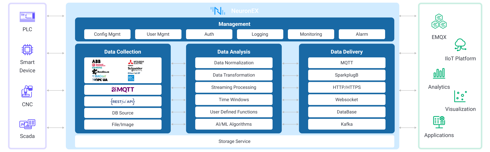

# NeuronEX Architecture

NeuronEX is a software designed for device data collection and edge intelligent analysis in the industrial sector. It is primarily deployed in industrial settings to achieve industrial equipment communication, industrial bus protocol collection, integration of industrial system data, edge data filtering analysis, and AI algorithm integration. Additionally, it facilitates integration with industrial IoT platforms. NeuronEX delivers low-latency data access management and intelligent analytical services tailored for industrial scenarios.

As shown in the diagram, NeuronEX is primarily divided into modules such as Data Collection, Data Processing and Analysis, Data Forwarding and Storage, and System Management.

## Data Collection Module

In the realm of data collection, NeuronEX not only supports industrial equipment data collection but also facilitates the integration of multi-source data from the industrial site.

### Industrial Equipment Data Collection

NeuronEX supports various industrial protocols through plugins, including Modbus, OPC UA, EtherNet/IP, IEC104, BACnet, Siemens PLC, and Mitsubishi PLC. This meets the data collection needs of diverse industries such as smart manufacturing, oil and gas, steel and metallurgy, energy, and building automation.

### Integration of Multi-Source Data
NeuronEX also possesses the capability to flexibly acquire various types of data. In industrial settings, it can support:

- **Integration with MES, WMS, and ERP Systems**
  
  Integration with MES, WMS, and ERP systems is achieved through [HTTP Pull](../streaming-processing/http_pull.md) and [HTTP Push](../streaming-processing/http_push.md), facilitating bidirectional data exchange.

- **Database Integration**
  
  NeuronEX supports data retrieval from databases like SQLite, MySQL, SQL Server, and others.

- **Enterprise Service Bus (ESB) Integration**
  
  Bidirectional integration with the Enterprise Service Bus (ESB) is achieved [HTTP Pull](../streaming-processing/http_pull.md) and [HTTP Push](../streaming-processing/http_push.md), enabling data push and pull operations with the ESB.
    
- **[File](../streaming-processing/file.md) Data Collection**
  
  NeuronEX supports data collection from files in CSV, JSON, and other formats.

- **Video Stream Access and Analysis**

## Data Processing and Analysis Module

NeuronEX provides low-latency data processing and analysis, facilitating rapid data transfer across multiple systems. Leveraging AI/ML algorithms enables intelligent decision-making and control. Edge-side analysis involves preprocessing and edge computing, reducing the load on cloud-edge communication and backend storage pressure.

Capabilities of NeuronEX's Data Processing and Analysis Module include:

- Data Standardization

  NeuronEX supports standardization of data from various types of industrial devices, including data type conversion, unit conversion, and format conversion, meeting the standardization needs in industrial scenarios.

- Data Filtering and Cleaning

  NeuronEX has built-in functions for data extraction, transformation, filtering, sorting, grouping, aggregation, and connection. With over 160 built-in functions, it covers mathematical operations, string processing, aggregation, and hash operations, meeting diverse data filtering and cleaning requirements.

- Real-time Data Stream Processing

  NeuronEX offers the capability for real-time, low-latency processing of data streams. It supports real-time interaction and collaborative processing of data across multiple systems in industrial scenarios, achieving seamless interconnectivity and intelligent decision-making.

- AI/ML Algorithm Integration

  NeuronEX supports user-defined function extensions and AI algorithm integration, providing intelligent data analysis capabilities.

## Data Forwarding and Storage Module

NeuronEX supports data forwarding to cloud platforms or external systems, enabling data transmission through MQTT, SparkplugB, HTTP, Websocket, and supports data storage in databases.

## System Management Module

NeuronEX's System Management Module includes functionalities such as system configuration, authentication, logs, monitoring, and alerts. For guidance on using NeuronEX's System Management Module, refer to the [Operations Guide](../admin/introduction.md).
