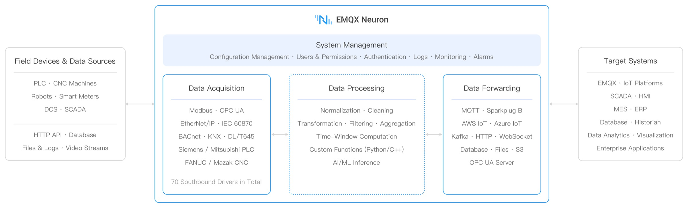

# Architecture

EMQX Neuron runs on the plant floor: southbound drivers read and write devices over their native protocols, northbound applications send data outward, a separate stream processing engine handles the data in between, and a system management module configures and monitors the whole thing.

## Core data model

Three concepts underpin every configuration in EMQX Neuron:

| Concept | What it is |
| --- | --- |
| **Node** | A running instance of one southbound driver or northbound application. The same driver can back several nodes, each talking to a different device |
| **Group** | A collection unit under a node, with its own polling interval. **The group is the unit of collection, reporting, and subscription** |
| **Tag** | One address inside a device, with read/write attributes, a data type, and precision |

A single EMQX Neuron process runs many southbound and northbound nodes side by side, isolated from one another, with the core framework routing messages between them.

For configuration steps, see [Data Collection, Processing and Delivery](../configuration/introduction.md); for limits such as name lengths, groups per node, and the fastest polling interval, see [Configuration specification](../configuration/introduction.md#configuration-specification) on that page.

## Routing from southbound to northbound

Collected data does not go straight from a driver to an application — the core framework's message bus forwards it:

1. On startup, each node opens two UNIX domain sockets (`AF_UNIX` / `SOCK_DGRAM`): one carries control commands, the other carries data, keeping the control plane and data plane separate.
2. A northbound application subscribes by **(driver, group)**. The core framework records the subscription along with that application's socket address.
3. When a group finishes a polling cycle, the core framework looks up every application subscribed to that group and delivers the data to each one's data-plane socket.

Because subscription is per group rather than per node, different groups on the same device can go to different applications — a high-frequency group to the local SCADA, a low-frequency group to the cloud. See [Subscribe to Southbound Data](../configuration/subscription.md).

## Stream processing engine

The stream processing engine is a **separate process**, not part of the EMQX Neuron main process. The two communicate over an NNG channel:

- On the EMQX Neuron side, the **rule engine application** (a northbound application) listens on `0.0.0.0:7081` — the port is configurable in the range 1024–65535 — using the NNG `pair0` protocol.
- The engine process dials in as the client and receives the subscribed southbound data.

The consequence is that **collection and processing do not block each other**: restarting the engine, a faulty rule, or a load spike will not disturb southbound collection, and the engine can be scaled independently. The cost is one cross-process hop for the data.

The engine can also ingest non-device sources — [HTTP Pull](../streaming-processing/http_pull.md), [HTTP Push](../streaming-processing/http_push.md), [SQL databases](../streaming-processing/sql.md), [files](../streaming-processing/file.md), and [video streams](../streaming-processing/video.md) — and merge them with device data in the same engine. Results are written out through a [sink](../streaming-processing/sink/sink.md).

## Offline caching

Plant networks are unreliable, so data is not lost when a northbound connection drops. Taking the MQTT application as an example, with **offline caching** enabled:

| Setting | Description | Range |
| --- | --- | --- |
| Cache memory size | Messages are buffered in memory first after a disconnect | 1–1024 MB |
| Cache disk size | Spills to disk once memory fills; should be larger than the memory cache | 1–10240 MB |
| Sync interval | Interval for replaying cached messages after reconnecting, in milliseconds | 10–120000, default 100 |

The memory and disk tiers are configured together — set both or neither. Once the connection recovers, cached messages are replayed in batches at the sync interval.

## System management

- **Configuration**: one web console for southbound drivers, northbound applications, and processing rules; configuration is persisted in the data directory and survives upgrades.
- **Security**: username and password access control, JWT-based API authentication, and TLS/SSL for transport.
- **Observability**: runtime logs, per-node performance metrics, connection status monitoring, and alerts.
- **High availability**: deployable in [master-backup mode](../best-practise/master-backup.md).

See [Operations](../admin/introduction.md).
