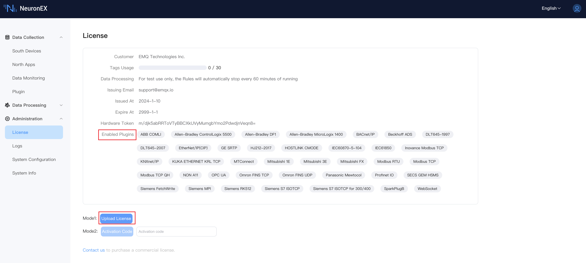

# License Policy

EMQX Neuron (formerly NeuronEX) provides a free quota of 30 data tags upon default installation. You can utilize these commercial modules without installing an EMQ license. For details, refer to the **Enabled Plugins** section below. Additionally, the data processing module in EMQX Neuron, which is also available after default installation, is only for testing purposes. Any rules created will automatically stop running after 60 minutes.

To exceed the free quota of data tags or fully utilize the data processing functionality, it is necessary to install a valid trial or commercial license of EMQX Neuron. EMQX Neuron software can be downloaded directly from the [download](https://www.emqx.com/en/try?product=neuronex) page of EMQ official website.

:::tip Note

CNC plugins are not included in the 30 free permanent tags. If you need to use them, you can [contact us](https://www.emqx.com/en/contact?product=neuronex) directly.

:::

## Apply for a license

Trial EMQ licenses can be downloaded from the [official EMQ website](https://www.emqx.com/en/contact?product=neuronex). All available plugin modules and data stream processing functions are available for a 15-day trial period with a limit of 1000 data tags. If the trial EMQ license expires, you can reapply for a trial EMQ license through our website. However, a mailbox can only apply for two trial licenses at most.

:::tip
When you apply for a trial license on our website, you must use the hardware identification to bind the device. You can directly [contact us](https://www.emqx.com/en/contact?product=neuronex) to apply for a license without hardware identification for device binding, or apply for a full license.
:::

## Manage License

After applying for a license, In the `Administration` -> `License` page, you can click `Upload License` to upload the license.  More detailed license management operations, please refer to [License Management](../../installation/license_setting.md).

## Reset License

In the `Administration` -> `License` page, click the `Reset License` button to reset to the EMQX Neuron default license containing 30 tags.
