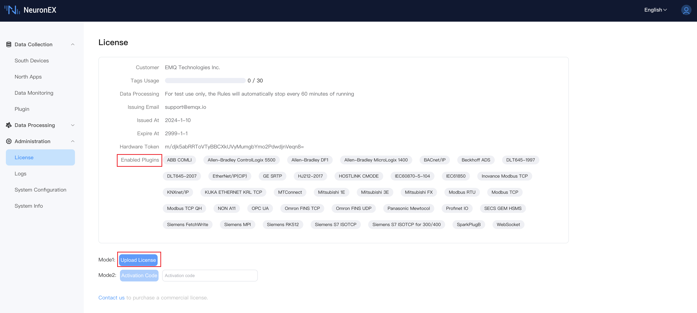

# License Policy

EMQX Neuron (formerly NeuronEX) works as soon as it is installed: it ships with a **permanent free license** covering 30 data tags. You only need a trial or commercial license once you exceed that quota or want the full data processing capability.

## Quota comparison

| 
Item
 | Free (built in) | Trial | Commercial |
| --- | --- | --- | --- |
| Data tags | 30 | 1,000 | Per purchase |
| Validity | Permanent | 15 days | Per subscription term |
| Data processing | Testing only — **each rule stops automatically after 60 minutes** | Full | Full |
| CNC drivers | Not included | Included | Included |
| Hardware binding | Not applicable | Bound to a hardware ID by default | Bound or unbound |
| How to get it | Nothing to do | [Apply on the website](https://www.emqx.com/en/contact?product=neuronex); at most two per email address | [Contact EMQ sales](https://www.emqx.com/en/contact?product=neuronex) |

The software itself can be downloaded from the [EMQ website](https://www.emqx.com/en/try?product=neuronex) without a license.

## What the free quota covers

The built-in license covers most standard southbound drivers and northbound applications — Modbus, OPC UA, Siemens and Mitsubishi PLCs, EtherNet/IP, IEC 60870, IEC 61850, BACnet, DL/T645, MQTT, Sparkplug B, and more — all usable within the 30-tag limit at no cost.

::: tip Note
**CNC drivers such as Fanuc Focas Ethernet and Mitsubishi CNC are not part of the permanent free quota.** [Contact us](https://www.emqx.com/en/contact?product=neuronex) if you need them.
:::

Drivers and applications are licensed **individually**. To see exactly what your instance is entitled to, check **Administration → License** and read the *Enabled Drivers and Applications* field:

For the full set of supported protocols, see [Southbound Drivers](../driver-list/driver-list.md).

## Applying for a trial license

Apply on the [EMQ website](https://www.emqx.com/en/contact?product=neuronex). A trial unlocks every driver, application, and the full data processing engine for 15 days, within a limit of 1,000 data tags. You can reapply after it expires, up to two trial licenses per email address.

::: tip
A trial license obtained from the website **must be bound to a hardware ID**. EMQX Neuron installed in Docker or another container has an empty hardware ID and cannot be bound — in that case, [contact us](https://www.emqx.com/en/contact?product=neuronex) for a license without hardware binding.
:::

## Installing and resetting

Once you have a license there are three ways to install it: upload the license file, enter an activation code (suited to fleets of gateways), or let ECP hand out a floating license. For the steps, license details, and hardware ID notes, see [Applying for and Installing a License](../../installation/license_setting.md).

To return to the default state, go to **Administration → License** and click `Reset License`, which restores the built-in 30-tag free license.
