# Modbus TCP Driver Performance Testing

## Test Purpose

In the scenario where Modbus TCP driver connects to devices for large-scale data collection and device control, verify the resource usage of NeuronEX, and continuously monitor: CPU, memory, network IO, and device control delay.

## Test Architecture

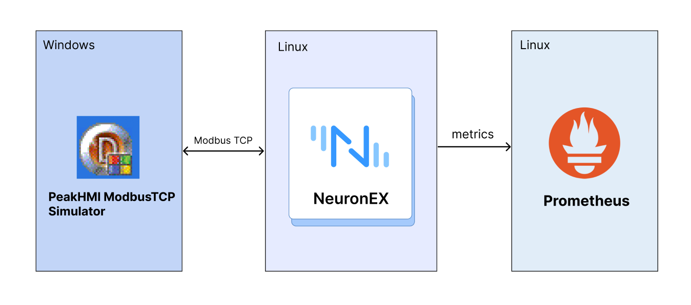

## Test Environment and Testing Tools

- PeakHMI Modbus TCP Simulator is a tool for simulating Modbus TCP communication. It allows users to test and develop applications based on the Modbus TCP protocol without actual hardware. Modbus TCP is a commonly used industrial communication protocol, widely applied in automation and control systems for data transmission between devices.

- Hardware resources of the Linux machine deployed with NeuronEX:

| NeuronEX Version     | Operating System | CPU       | Memory     |  CPU Model   |
| ---------------- | ------- | ---------| ------ |------ |
| NeuronEX 3.2.1      | Debian GNU/Linux 12      | 4 cores   | 30Gi | Intel(R) Xeon(R) Platinum 8269CY CPU T 3.10GHz                    |

- Monitoring the usage of CPU, memory, network IO, and other resources of NeuronEX software on the Linux machine through Prometheus.

## Test Scenarios
### Data Collection Scenarios

- Scenario 1

NeuronEX is configured with 1 Modbus TCP driver, which contains 10 collection groups. Each group collects 1000 Float type data points per second, totaling 10,000 data points.

- Scenario 2

NeuronEX is configured with 5 Modbus TCP drivers, each containing 10 collection groups. Each group collects 1000 Float type data points per second, totaling 50,000 data points.

- Scenario 3

NeuronEX is configured with 10 Modbus TCP drivers, each containing 10 collection groups. Each group collects 1000 Float type data points per second, totaling 100,000 data points.

- Scenario 4

NeuronEX is configured with 1 Modbus TCP driver, containing 1 collection group. Each group collects 1000 Float type data points every 100 milliseconds, totaling 1,000 data points.

- Scenario 5

NeuronEX is configured with 5 Modbus TCP drivers, each containing 1 collection group. Each group collects 1000 Float type data points every 100 milliseconds, totaling 5,000 data points.

- Scenario 6

NeuronEX is configured with 10 Modbus TCP drivers, each containing 1 collection group. Each group collects 1000 Float type data points every 100 milliseconds, totaling 10,000 data points.

### Device Control Scenarios
- Scenario 7

NeuronEX is configured with 10 Modbus TCP drivers, each containing 10 collection groups. Each group collects 1000 Float type data points per second, totaling 100,000 data points, while distributing 100 data points.

## Overview of Results

### Data Collection Performance Test

Scenario | Number of Drivers | Number of Groups per Driver | Number of Points per Group | Collection Interval | Total Points | Point Type | Memory Usage | CPU Usage | Network IO
| ---------------- | ------- | ---------| ------ |------ |------ |------ |------ |------ |------ |
Scenario 1 | 1 | 10 | 1000 | 1 second | 10,000 | Float | 199MB | 3% | receive: 13kb/s transmit: 3kb/s
Scenario 2 | 5 | 10 | 1000 | 1 second | 50,000 | Float | 327MB | 13% | receive: 69kb/s transmit: 16kb/s
Scenario 3 | 10 | 10 | 1000 | 1 second | 100,000 | Float | 497MB | 30% | receive: 139kb/s transmit: 32kb/s
Scenario 4 | 1 | 1 | 1000 | 100 ms | 1,000 | Float | 128MB | 2% | receive: 9kb/s transmit: 2kb/s
Scenario 5 | 5 | 1 | 1000 | 100 ms | 5,000 | Float | 165MB | 12% | receive: 47kb/s transmit: 12kb/s
Scenario 6 | 10 | 1 | 1000 | 100 ms | 10,000 | Float | 189MB | 21% | receive: 94kb/s transmit: 24kb/s

###  Device Control Latency Test
|Scenario	|Dispatch Method|	Number of Points Dispatched	|Test Count|	Minimum Response Time	|Maximum Response Time|	Average Response Time
| ---------------- | ------- | --------- | ------ |------ |------ |------ |
|Configured 10 Modbus TCP drivers in NeuronEX, each driver containing 10 collection groups, each group collecting 1,000 Float type data points per second, totaling 100,000 data points under normal collection conditions.	|API Dispatch	|100|	100 times|	85ms	|778ms	|523ms|

::: tip 

This test used simulator devices, and the data point addresses were all continuous segments, so the system resource usage when NeuronEX collects data from real devices will be higher than the results of this test.

If using NeuronEX data processing functions for data cleaning and filtering, edge computing, and algorithm integration, additional CPU and memory will be consumed.

:::

## Detailed Test Results
### Scenario 1
NeuronEX configured with 1 Modbus TCP driver, this driver contains 10 collection groups, each group collecting 1,000 Float type data points per second, totaling 10,000 data points

- Memory Usage ：199MB

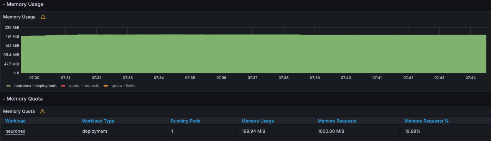

- CPU Usage ：3%

- Network IO ： receive:13KB/s; transmit:3KB/s

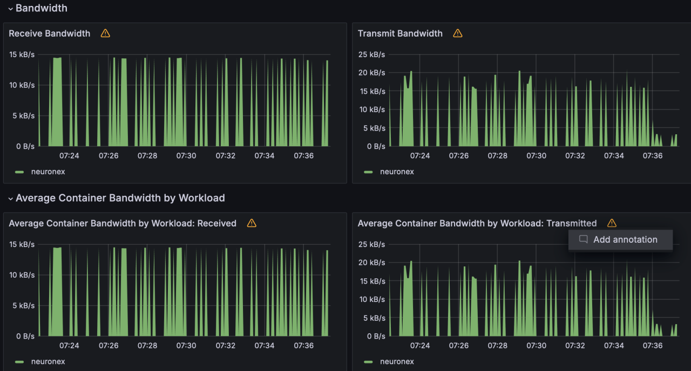

### Scenario 2

NeuronEX is configured with 5 Modbus TCP drivers, each containing 10 collection groups. Each group collects 1000 Float type data points per second, totaling 50,000 data points.

- Memory Usage ：327MB

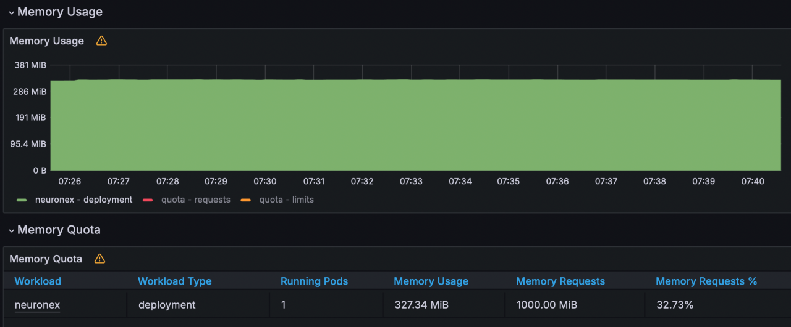

- CPU Usage ：13%

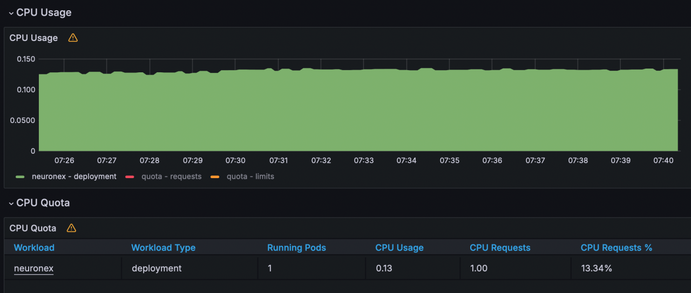

- Network IO ： receive:69KB/s; transmit:16KB/s

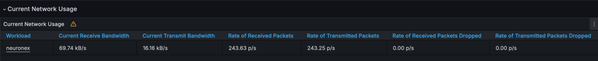
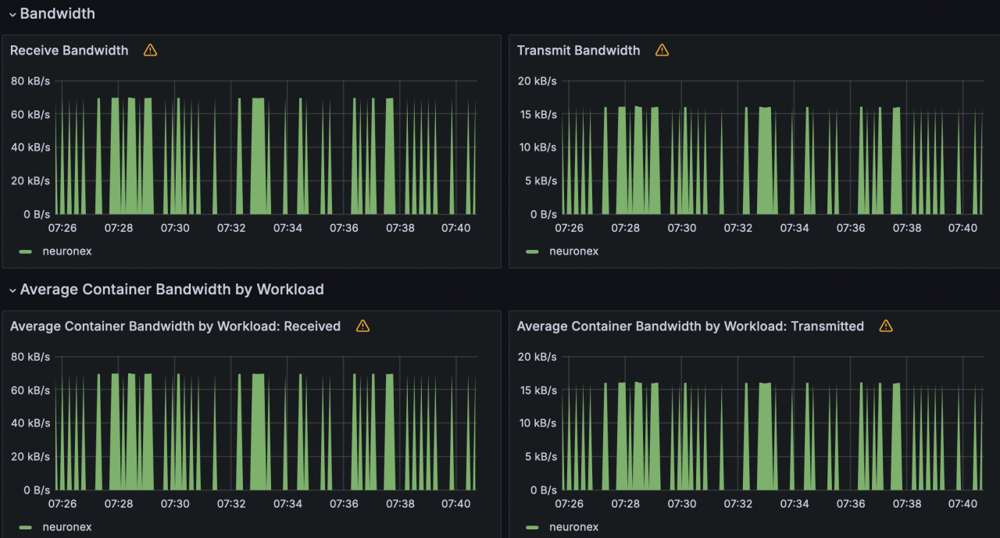

### Scenario 3

NeuronEX is configured with 10 Modbus TCP drivers, each containing 10 collection groups. Each group collects 1000 Float type data points per second, totaling 100,000 data points.

- Memory Usage ：497MB

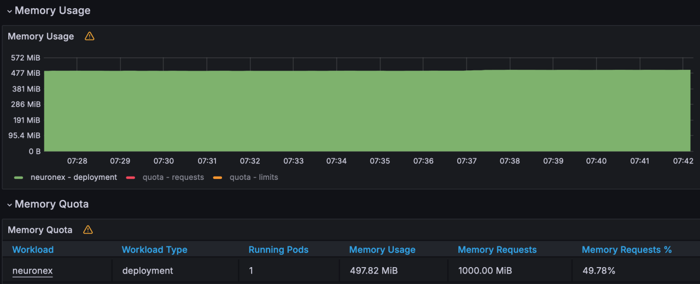

- CPU Usage ：30%

- Network IO ： receive:139KB/s; transmit:32KB/s

### Scenario 4

NeuronEX is configured with 1 Modbus TCP driver, containing 1 collection group. Each group collects 1000 Float type data points every 100 milliseconds, totaling 1,000 data points.

- Memory Usage ：128MB

- CPU Usage ：2%

- Network IO ： receive:9KB/s; transmit:2KB/s

### Scenario 5

NeuronEX is configured with 5 Modbus TCP drivers, each containing 1 collection group. Each group collects 1000 Float type data points every 100 milliseconds, totaling 5,000 data points.

- Memory Usage ：165MB

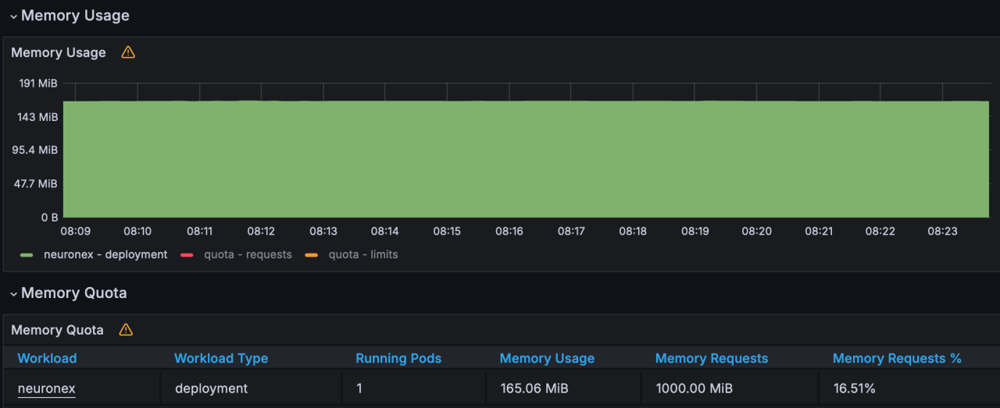

- CPU Usage ：12%

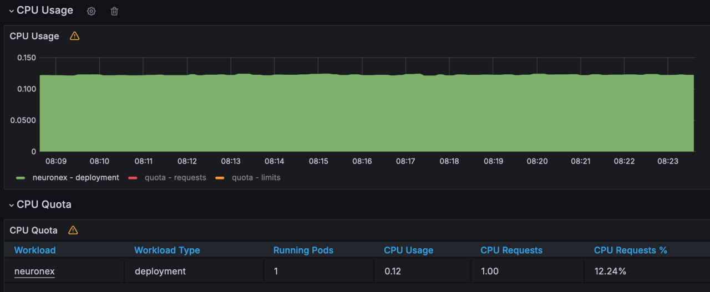

- Network IO ： receive:47KB/s; transmit:12KB/s

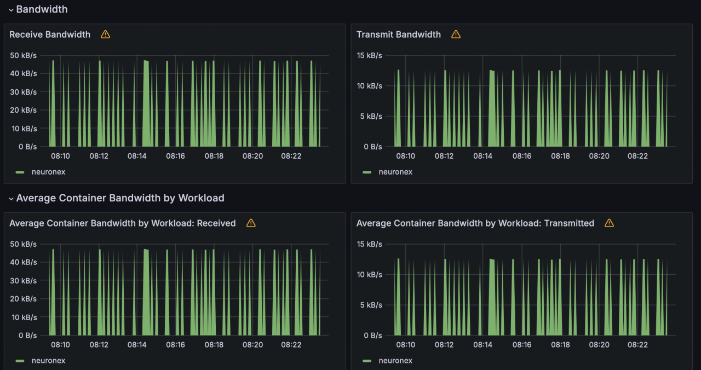

### Scenario 6

NeuronEX is configured with 10 Modbus TCP drivers, each containing 1 collection group. Each group collects 1000 Float type data points every 100 milliseconds, totaling 10,000 data points.

- Memory Usage ：189MB

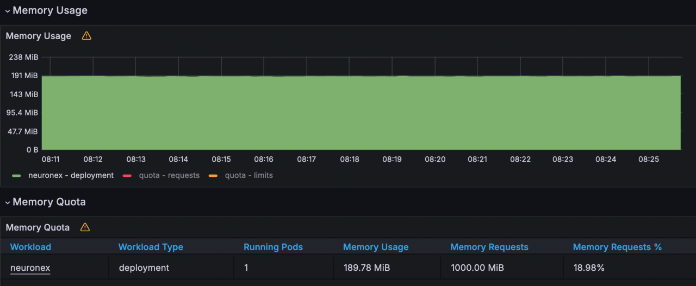

- CPU Usage ：21%

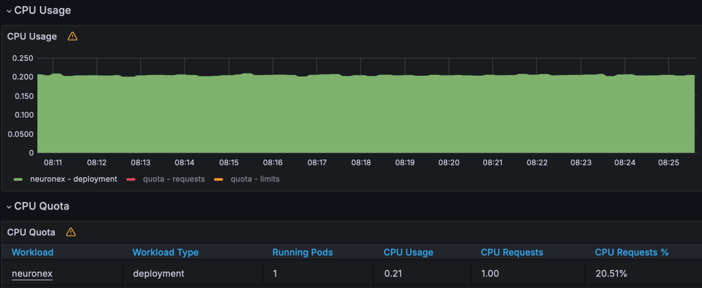

- Network IO ： receive:94KB/s; transmit:24KB/s

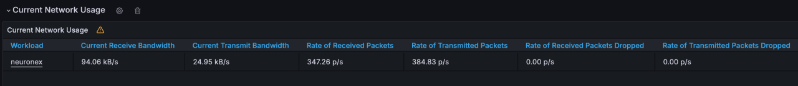
