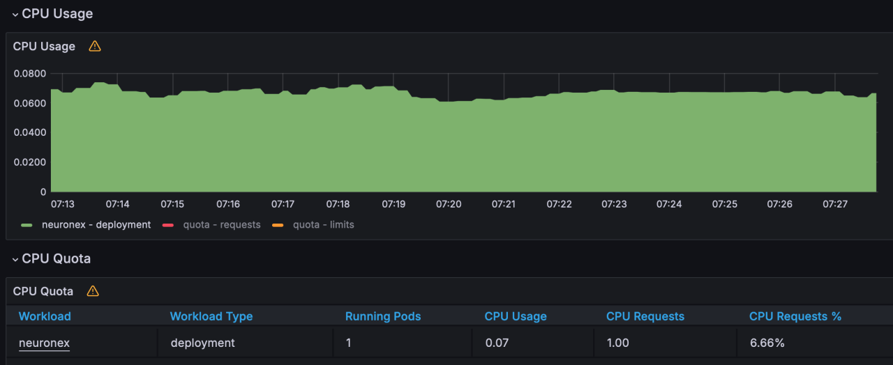
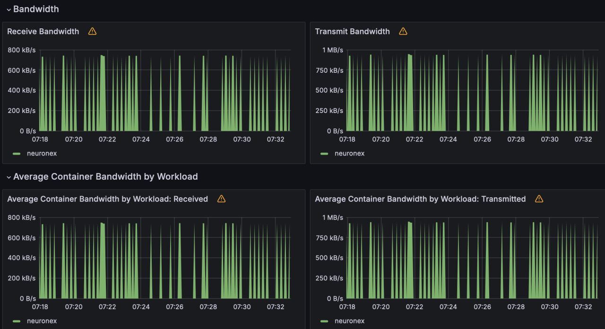
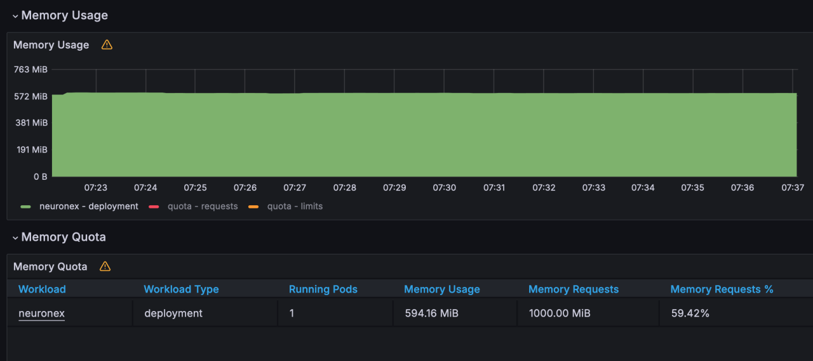
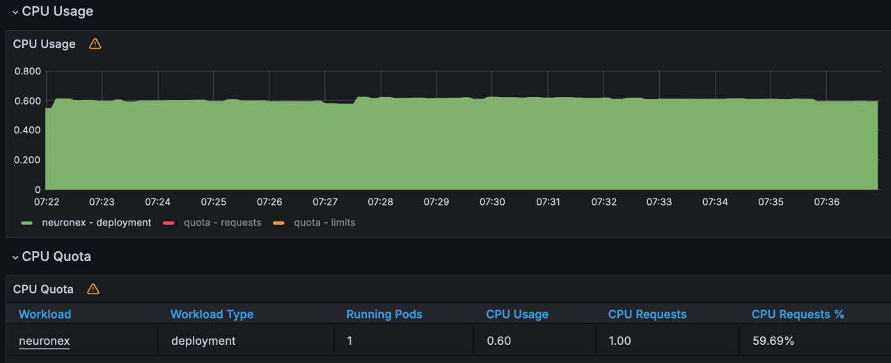
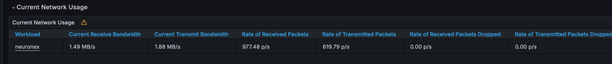
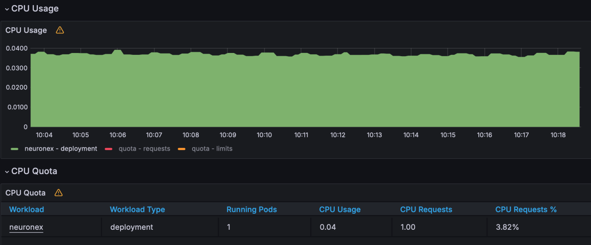
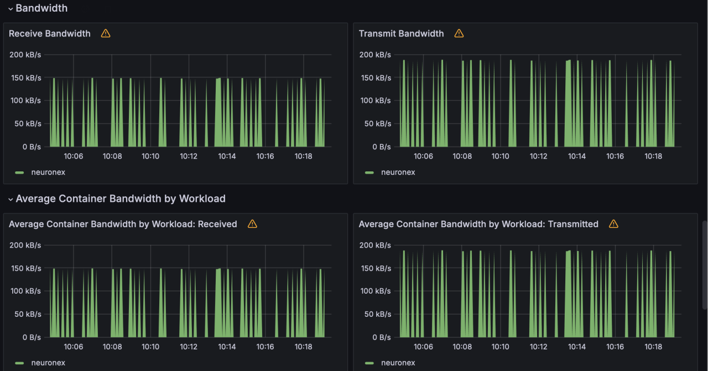
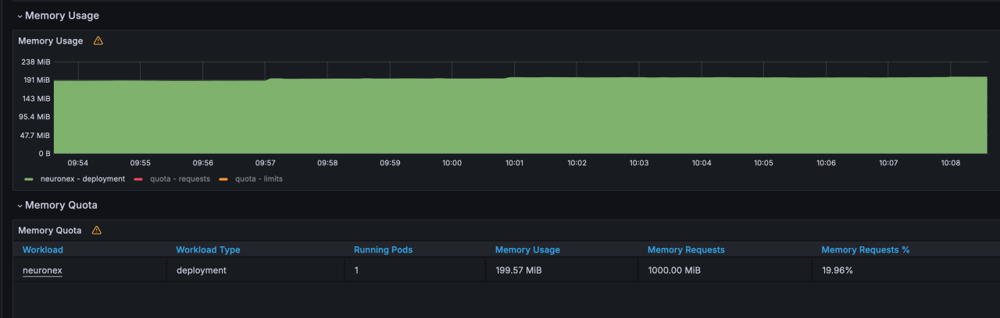
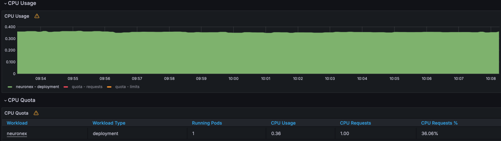
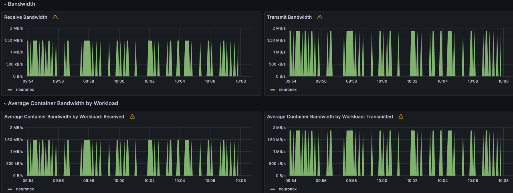

# OPCUA Driver Performance Testing
## Test Purpose

In the scenario where OPCUA driver connects to devices for large-scale data collection and device control, verify the resource usage of NeuronEX, and continuously monitor: CPU, memory, network IO, and device control delay.

## Test Architecture

## Test Environment and Testing Tools

- **Prosys OPC UA Simulation Server** ：This software is an advanced simulation tool developed by Prosys OPC, specifically designed for the development, testing, and educational training of OPC UA (OPC Unified Architecture) technology. OPC UA is an open, standardized communication protocol widely used in the fields of industrial automation and smart manufacturing. It supports cross-platform, cross-language data exchange and provides high levels of security and reliability.

- Hardware resources of the Linux machine deployed with NeuronEX:

| NeuronEX Version     | Operating System | CPU       | Memory     |  CPU Model   |
| ---------------- | ------- | ---------| ------ |------ |
| NeuronEX 3.2.1      | Debian GNU/Linux 12      | 4 cores   | 30Gi | Intel(R) Xeon(R) Platinum 8269CY CPU T 3.10GHz                    |

- Monitoring the usage of CPU, memory, network IO, and other resources of NeuronEX software on the Linux machine through Prometheus.

## Test Scenarios
### Data Collection Scenarios

- Scenario 1

NeuronEX is configured with 1 OPCUA driver, which includes 10 collection groups, each group collecting 1,000 Float type data points per second, totaling 10,000 data points.

- Scenario 2

NeuronEX is configured with 5 OPCUA drivers, each driver including 10 collection groups, each group collecting 1,000 Float type data points per second, totaling 50,000 data points.

- Scenario 3

NeuronEX is configured with 10 OPCUA drivers, each driver including 10 collection groups, each group collecting 1,000 Float type data points per second, totaling 100,000 data points.

- Scenario 4

NeuronEX is configured with 1 OPCUA driver, each driver including 1 collection group, each group collecting 1,000 Float type data points every 100 milliseconds, totaling 1,000 data points.

- Scenario 5

NeuronEX is configured with 5 OPCUA drivers, each driver including 1 collection group, each group collecting 1,000 Float type data points every 100 milliseconds, totaling 5,000 data points.

- Scenario 6

NeuronEX is configured with 10 OPCUA drivers, each driver including 1 collection group, each group collecting 1,000 Float type data points every 100 milliseconds, totaling 10,000 data points.

### Device Control Scenarios
- Scenario 7

In NeuronEX configured with 10 OPCUA drivers, each driver including 10 collection groups, each group collecting 1,000 Float type data points per second, totaling 100,000 data points, dispatch 100 data points.

## Overview of Results

### Data Collection Performance Test

Scenario | Number of Drivers | Number of Groups per Driver | Number of Points per Group | Collection Interval | Total Points | Point Type | Memory Usage | CPU Usage | Network IO
| ---------------- | ------- | ---------| ------ |------ |------ |------ |------ |------ |------ |
| Scenario 1 | 1 | 10 | 1000 | 1 second | 10,000 | Float | 172MB | 7% | receive: 147kb/s transmit: 186kb/s |
| Scenario 2 | 5 | 10 | 1000 | 1 second | 50,000 | Float | 323MB | 31% | receive: 738kb/s transmit: 934kb/s |
| Scenario 3 | 10 | 10 | 1000 | 1 second | 100,000 | Float | 594MB | 60% | receive: 1.49mb/s transmit: 1.88mb/s |
| Scenario 4 | 1 | 1 | 1000 | 100 ms | 1,000 | Float | 140MB | 4% | receive: 148kb/s transmit: 188kb/s |
| Scenario 5 | 5 | 1 | 1000 | 100 ms | 5,000 | Float | 162MB | 20% | receive: 741kb/s transmit: 939kb/s |
| Scenario 6 | 10 | 1 | 1000 | 100 ms | 10,000 | Float | 199MB | 36% | receive: 1.49mb/s transmit: 1.88mb/s |

### Device Control Latency Test

|Scenario	|Dispatch Method|	Number of Points Dispatched	|Test Count|	Minimum Response Time	|Maximum Response Time|	Average Response Time
| ---------------- | ------- | --------- | ------ |------ |------ |------ |
|Configured 10 OPCUA drivers in NeuronEX, each driver containing 10 collection groups, each group collecting 1,000 Float type data points per second, totaling 100,000 data points under normal collection conditions.	|API Dispatch	|100|	100 times|	6ms	|19ms	|12ms|

::: tip 

This test used simulator devices, and the data point addresses were all continuous segments, so the system resource usage when NeuronEX collects data from real devices will be higher than the results of this test.

If using NeuronEX data processing functions for data cleaning and filtering, edge computing, and algorithm integration, additional CPU and memory will be consumed.

:::

## Detailed Test Results
### Scenario 1

NeuronEX is configured with 1 OPCUA driver, which includes 10 collection groups, each group collecting 1,000 Float type data points per second, totaling 10,000 data points.

- Memory Usage ：172MB

- CPU Usage ：7%

- Network IO ：receive:147KB/s;  transmit:186KB/s

### Scenario 2

NeuronEX is configured with 5 OPCUA drivers, each driver including 10 collection groups, each group collecting 1,000 Float type data points per second, totaling 50,000 data points.

- Memory Usage ：323MB

- CPU Usage ：31%

- Network IO ：receive: 738KB/s;  transmit: 934KB/s

### Scenario 3

NeuronEX is configured with 10 OPCUA drivers, each driver including 10 collection groups, each group collecting 1,000 Float type data points per second, totaling 100,000 data points.

- Memory Usage ：594MB

- CPU Usage ：60%

- Network IO ：receive: 1.49MB/s; transmit: 1.88MB/s

### Scenario 4

NeuronEX is configured with 1 OPCUA driver, each driver including 1 collection group, each group collecting 1,000 Float type data points every 100 milliseconds, totaling 1,000 data points.

- Memory Usage ：140MB

- CPU Usage ：4%

- Network IO ：receive: 148KB/s; transmit: 188KB/s

### Scenario 5

NeuronEX is configured with 5 OPCUA drivers, each driver including 1 collection group, each group collecting 1,000 Float type data points every 100 milliseconds, totaling 5,000 data points.

- Memory Usage ：162MB

- CPU Usage ：20%

- Network IO ：receive: 741KB/s; transmit: 939KB/s

### Scenario 6

NeuronEX is configured with 10 OPCUA drivers, each driver including 1 collection group, each group collecting 1,000 Float type data points every 100 milliseconds, totaling 10,000 data points.

- Memory Usage ：199MB

- CPU Usage ：36%

- Network IO ： receive: 1.49MB/s; transmit: 1.88MB/s

