# Quick Start

This tutorial starts with the download and installation, taking the Modbus TCP driver protocol as an example, and quickly starts using NeuronEX to collect analog device data, directly uploading the data to the EMQX MQTT public cloud service, and simply using the data stream processing function.

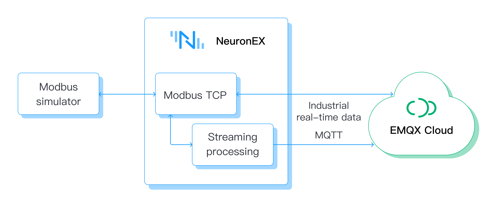

## NeuronEX Installation

NeuronEX provides a variety of installation methods. Users can view detailed installation methods in [Installation](../installation/introduction.md). This example uses docker to start experiencing NeuronEX as quickly as possible.

- Get Docker image

```
$ docker pull emqx/neuronex:latest
```

- Start Docker container

```
$ docker run -d --name neuronex -p 8085:8085 --log-opt max-size=100m emqx/neuronex:latest
```

## Install Modbus simulator

Install the PeakHMI Slave Simulators software. The installation package can be downloaded from [PeakHMI official website](https://hmisys.com).

After installation, run Modbus TCP slave EX. Set the simulator point value and site number, as shown in the figure below.


:::tip
It is necessary to ensure that NeuronEX and the simulator are running in the same local area network.

Try to turn off the firewall in Windows, otherwise NeuronEX may not be able to connect to the emulator.

:::

## Login to NeuronEX

Open a web browser and enter the gateway address and port number running NeuronEX to enter the login interface. The default port number is 8085. For example, http://127.0.0.1:8085

Use the initial username and password to log in to the management console page (initial username: `admin`, initial password: `0000`). The login interface is as shown in the figure below.

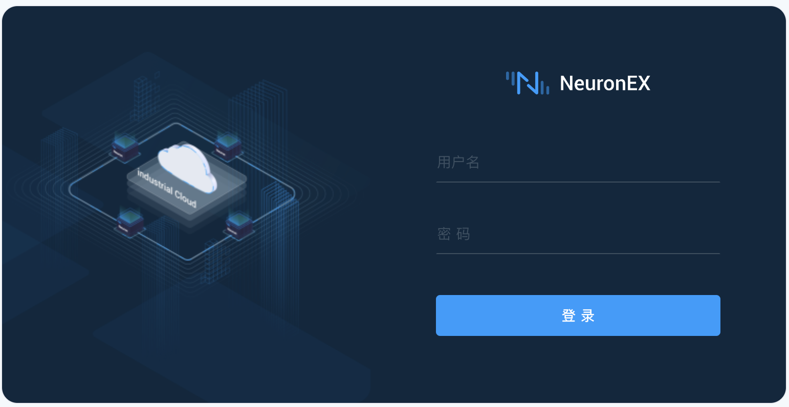

## Southbound device configuration

### Create southbound device node

The southbound device node is used to establish a connection between NeuronEX and the device, and to create and configure device data collection points. In this example, NeuronEX's Modbus TCP plug-in is used to obtain data in the Modbus simulator.

Select `South Device` in the `Data Collection` menu to enter the southbound device management interface, click `Add Device` to add a new device, as shown in the figure below.

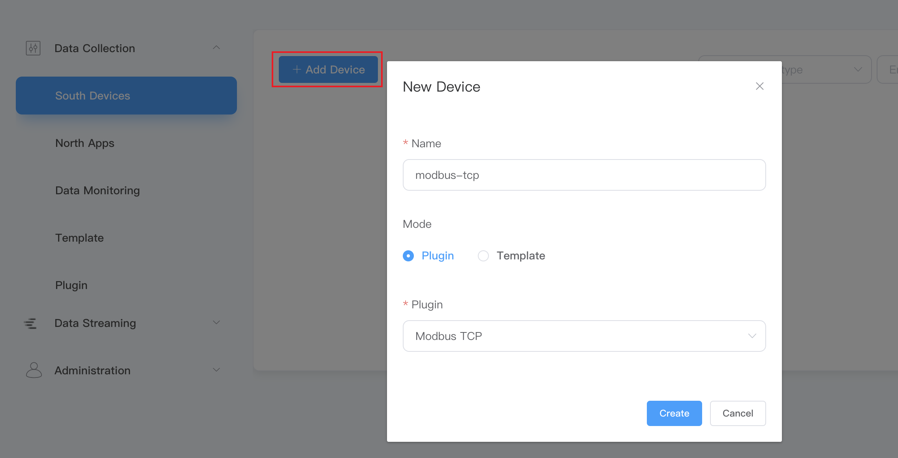

- Name: fill in the device name, such as Modbus TCP;
- Mode: Plugin is selected by default;
- Plugin: Select the Modbus TCP plug-in from the drop-down box;
- Click `Create` to add a new device.

### Configure southbound device node

Configure the parameters NeuronEX needs to establish a connection with the device.

After the southbound node is successfully created, it will automatically jump to the `Device Configuration` page, as shown in the figure below.

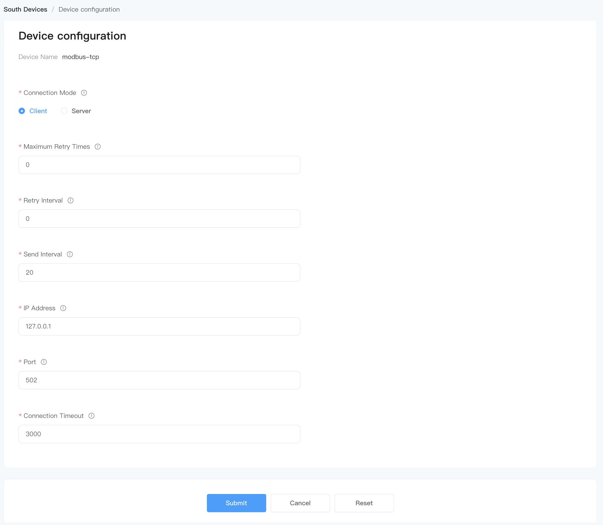

- IP address: Fill in the IP address of the access device. Example: fill in the IP address of the PC side of the Modbus simulator installed;
- Port: default port 502;
- Click `Submit` to complete the device configuration, and the device card automatically enters the **Running** working state;

:::tip
The configuration parameters required for each device are different. For detailed southbound device parameter description, please refer to [Create Southbound Driver](../configuration/south-devices/south-devices.md).
:::

### Create data point

Create groups for classification and unified management of device points. Click any blank space of the newly created **modbus-tcp** southbound device node to enter the group list management interface.

Click `Create` and fill in the relevant parameters in the `Create Group` pop-up box, as shown in the figure below.

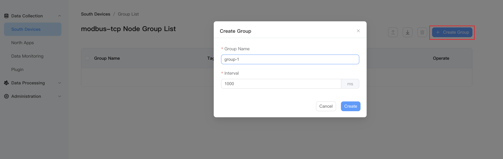

- Group name: fill in the group name, such as group-1;
- Interval: fill in the collection interval;
- Click `Create` to complete the group creation.

Manually create points for the group, click any blank space in the newly created **group-1** group list to enter the point list interface.

Click `Create`, create a new device point to be collected on the `Add Tags` page, and configure the data point attributes, type, address, etc., as shown in the figure below.

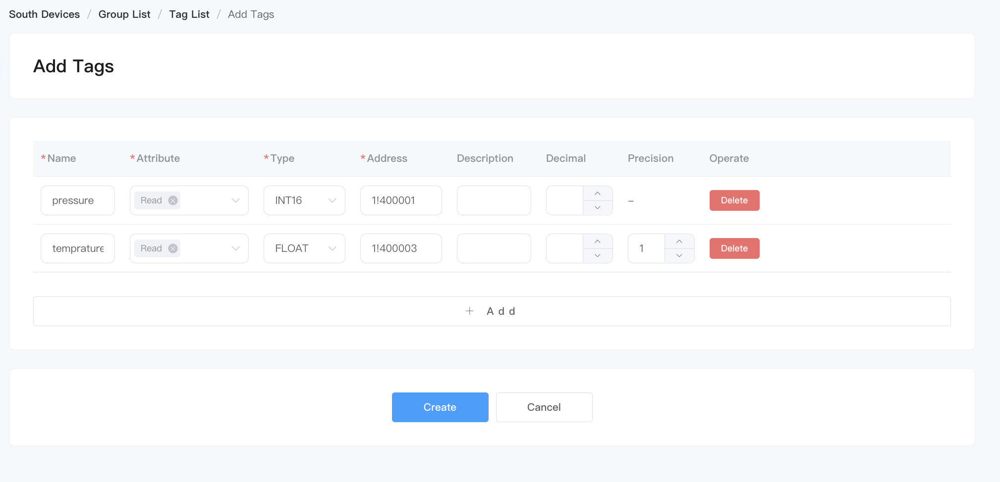

- Name: fill in the name of the equipment point, for example, pressure;
- Attributes: drop down to select point attributes, for example, Read;
- Type: drop down to select the data type, for example, int16;
- Address: fill in the driving point address, for example, 1!40001;
- Click the `Create` button to complete the creation of Tag;

:::tip
Point address resolution: 1 represents the point site number set in the Modbus simulator, 40001 represents the register address of the point.

For detailed instructions on how to use the driver address, please refer to [Creating a southbound driver](../configuration/south-devices/south-devices.md).
:::

After creating the collected equipment points, NeuronEX automatically establishes communication with the equipment. The southbound device node enters the **Running** working state and the **Connected** connection state.

If after waiting for a few seconds, the connection status is still **Disconnected**, please do the following to find out the reason:

- Please confirm that the IP address and port number are set correctly during device configuration, and the firewall is turned off.
- Execute the following command in the NeuronEX operating environment terminal to confirm whether the NeuronEX operating environment can access the corresponding IP and port:

```
$ telnet <IP of the PC running the Modbus simulator> 502
```

## View collected data

Select `Data Monitoring` under the `Data Collection` menu to enter the data monitoring page and view the values read from the created points, as shown in the figure below.

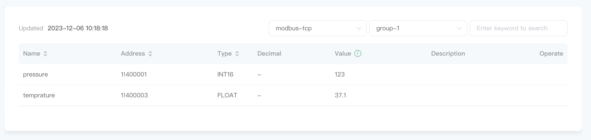

Data monitoring displays values in groups:

- Southbound device: drop-down box to select the southbound device you want to view, for example, select modbus-tcp created in the above step;
- Group name: Use the drop-down box to select the group you want to view under the selected southbound device. For example, select group-1 that has been created in the above step;
- Once the selection is completed, the page will display the value of each point under the group;

## Northbound application configuration

### Create northbound application node

Northbound application nodes are used for data interaction between NeuronEX and various northbound applications. Taking the MQTT plug-in as an example, a new MQTT node is added.

Select `North Apps` in the `Data Collection` menu and click `Add Application` to add a new application, as shown in the figure below.

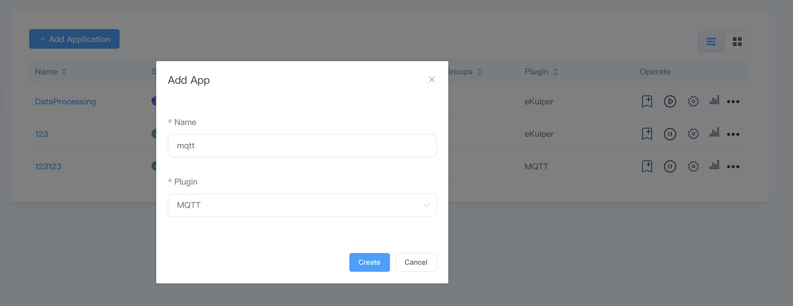

- Name: fill in the application name, for example, mqtt;
- Plug-in: Select the MQTT plug-in from the drop-down box;
- Click `Create` to add a new application.

### Configure northbound application nodes

Configure the parameters required for NeuronEX to establish a connection with the northbound application.

After the northbound node is successfully created, it will automatically jump to the `Application Configuration` page, as shown in the figure below.

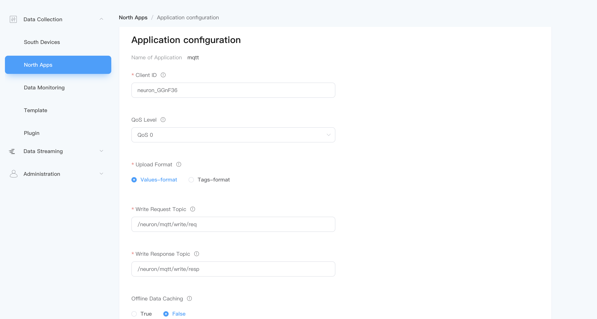

- Server address: Fill in the server address of the application. By default, the public EMQX Broker (broker.emqx.io) is used;
- Server port: fill in the server port, the default is 1883;
- Click `Submit` to complete the northbound application configuration, and the application card automatically enters the **Running** working state.
​

### Subscribe to southbound group

The collected data send to the North Apps in groups, and users need to choose which groups of data to send.

Click `Add Subscription` button to add a new subscription, as shown in the figure below.

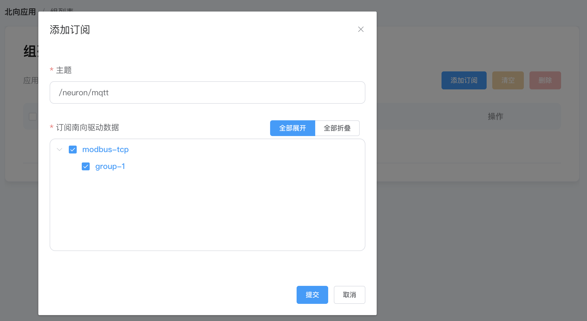

- Topic: The topic can be customized, and the example uses the default topic;
- Subscription south driver data: independently select the data group to be subscribed;
- Click `Submit` to complete the subscription.

## View data on MQTT client

Use the MQTT client to view the uploaded data. For example, use the MQTT client tool [MQTTX](https://www.emqx.com/zh/products/mqttx) to connect to the public EMQX broker to view the data uploaded by NeuronEX to the MQTT Broker, as follows As shown in the figure.

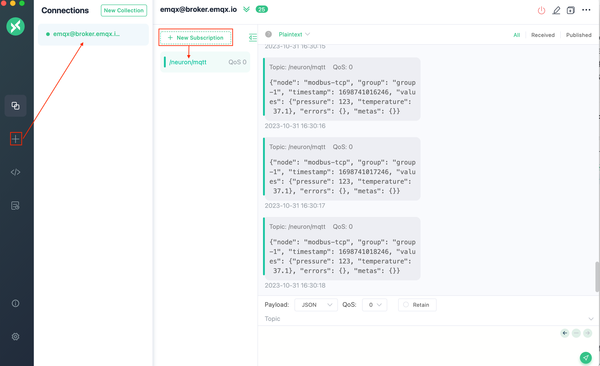

After the subscription is successful, you can see that MQTTX can always receive the data collected and reported by NeuronEX.

- Open MQTTX to add a new connection, correctly fill in the name, Host (broker.emqx.io) and Port (default 1883) to complete the connection;
- Add a new subscription, and the Topic must be consistent with the subscription topic of the NeuronEX northbound application.

## Data processing

NeuronEX provides data processing functions, which can perform data extraction, transformation, filtering, sorting, grouping, aggregation, connection and other functions on data points. Through powerful streaming computing and analysis capabilities, it can realize data filtering and cleaning, data standardization, analysis and monitoring, and Real-time alarm.

This example will introduce how to +1 the value collected by NeuronEX and then send the result to the dynamic topic of MQTT in the cloud.

### Data flow northbound application node

On the **Data Collection** -> **Northbound Application** page, NeuronEX has been configured with a DataProcessing northbound application by default. Users only need to subscribe to the **data group** of **Southbound Driver** through this application. , and then the data points collected by Southbound driver will be sent to the `neuronStream` stream on the **Data Processing** -> **Sources** page.

Click `Add Subscription` button to add a new subscription on **DataProcessing** App, as shown in the figure below.
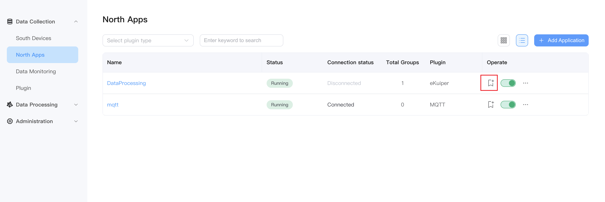
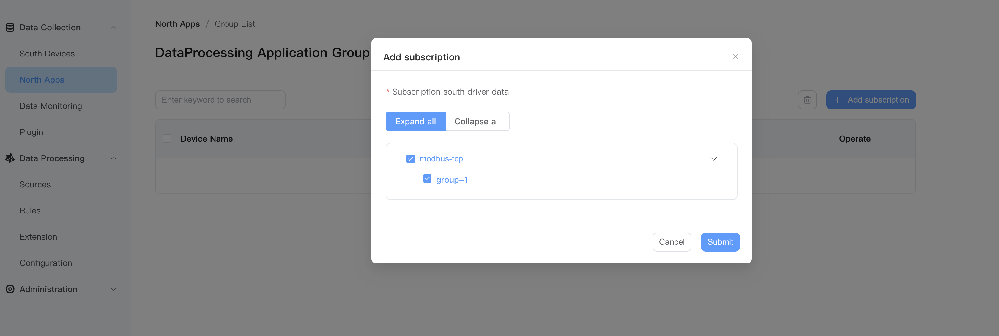

### Create new rule

On the **Data Processing** -> **Rules** page, click `Create Rule`, as shown in the figure below.

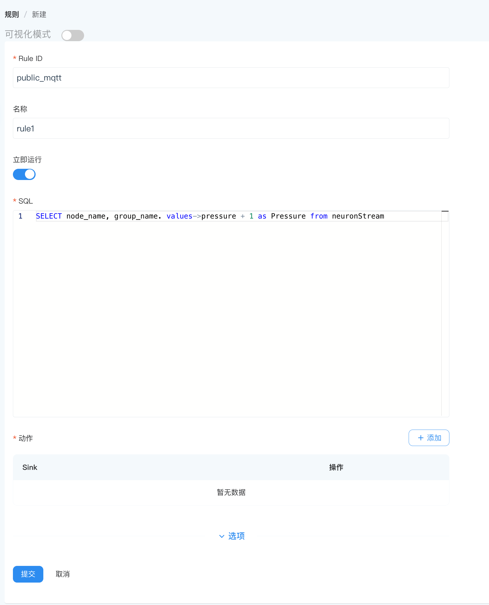

Click `Add Action`, as shown in the figure below.

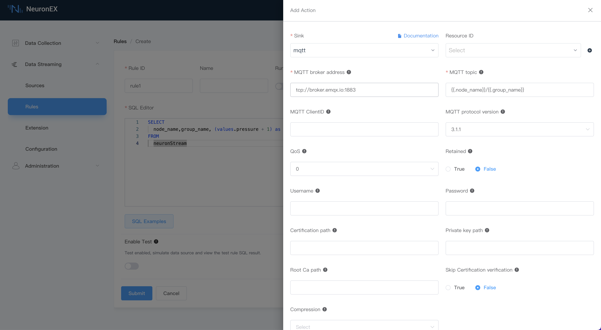

- Sink: Select **mqtt** from the drop-down box;
- MQTT server address: Correctly fill in the MQTT server address and port number;
- MQTT topic: data reporting topic, the example uses the default topic;

## View stream processing results

In the example, the node_name subscribed by the data flow node is `modbus-tcp`, and the group_name is `group-1`, that is, the subscription topic is `modbus-tcp/group-1`.

