# Quick Start

This tutorial walks one complete pipeline in five steps: start EMQX Neuron, generate data with the built-in simulator, collect it through a southbound driver, and forward it to an MQTT broker through a northbound application.

<style>
.nxq            { width: 100%; height: auto; display: block; margin: 24px 0; }
.nxq .t         { font-family: -apple-system, "Segoe UI", "Helvetica Neue", Arial, sans-serif; fill: #1f2d3d; }
.nxq .h         { font-size: 15px; font-weight: 600; }
.nxq .m         { font-size: 14px; font-weight: 600; }
.nxq .sub       { font-size: 12px; fill: #4a5b6e; }
.nxq .step      { font-size: 11.5px; font-weight: 600; fill: #2a6ebb; }
.nxq .lbl       { font-size: 12.5px; font-weight: 600; fill: #2a6ebb; }
.nxq .ptitle    { fill: #1b4f89; }
.nxq .bg        { fill: #f7fafd; }
.nxq .box       { fill: #ffffff; stroke: #ccd8e4; stroke-width: 1.5; }
.nxq .mod       { fill: #ffffff; stroke: #2a6ebb; stroke-width: 1.5; }
.nxq .prod      { fill: #eaf2fb; stroke: #2a6ebb; stroke-width: 2; }
.nxq .flow      { stroke: #2a6ebb; stroke-width: 2; }
.nxq .ah        { fill: #2a6ebb; }

html.dark .nxq .t      { fill: #d7dee6; }
html.dark .nxq .sub    { fill: #9db0c4; }
html.dark .nxq .step   { fill: #7fb4ea; }
html.dark .nxq .lbl    { fill: #7fb4ea; }
html.dark .nxq .ptitle { fill: #8ec1f0; }
html.dark .nxq .bg     { fill: #161c24; }
html.dark .nxq .box    { fill: #1d2631; stroke: #3b4857; }
html.dark .nxq .mod    { fill: #1d2631; stroke: #5a9fe0; }
html.dark .nxq .prod   { fill: #1a2938; stroke: #5a9fe0; }
html.dark .nxq .flow   { stroke: #7fb4ea; }
html.dark .nxq .ah     { fill: #7fb4ea; }
</style>

<svg class="nxq" xmlns="http://www.w3.org/2000/svg" viewBox="0 0 1200 320" role="img" aria-label="Quick start pipeline: the built-in Modbus simulator produces data, EMQX Neuron collects it through a southbound driver and shows it in data monitoring, a northbound MQTT application forwards it to broker.emqx.io, and an MQTTX client subscribes to verify">
  <defs>
    <marker id="nxqA" viewBox="0 0 10 10" refX="9" refY="5" markerWidth="7" markerHeight="7" orient="auto-start-reverse"><path class="ah" d="M0 0 L10 5 L0 10 z"/></marker>
  </defs>
  <rect class="bg" x="0" y="0" width="1200" height="320" rx="10"/>

  <rect class="box" x="24" y="98" width="188" height="118" rx="8"/>
  <text class="t h" x="118" y="132" text-anchor="middle">Built-in Modbus simulator</text>
  <text class="t step" x="118" y="154" text-anchor="middle">Step 2</text>
  <text class="t sub" x="118" y="186" text-anchor="middle">sine · square · random</text>

  <line class="flow" x1="220" y1="158" x2="268" y2="158" marker-end="url(#nxqA)"/>
  <text class="t lbl" x="244" y="146" text-anchor="middle">Collect</text>

  <rect class="prod" x="276" y="40" width="330" height="240" rx="10"/>
  <text class="t h ptitle" x="441" y="68" text-anchor="middle">EMQX Neuron</text>

  <rect class="mod" x="300" y="86" width="282" height="56" rx="6"/>
  <text class="t m" x="441" y="110" text-anchor="middle">Southbound driver · Modbus TCP</text>
  <text class="t step" x="441" y="130" text-anchor="middle">Step 3</text>

  <rect class="mod" x="300" y="154" width="282" height="52" rx="6"/>
  <text class="t m" x="441" y="176" text-anchor="middle">Data monitoring</text>
  <text class="t step" x="441" y="196" text-anchor="middle">Step 4</text>

  <rect class="mod" x="300" y="218" width="282" height="52" rx="6"/>
  <text class="t m" x="441" y="240" text-anchor="middle">Northbound app · MQTT</text>
  <text class="t step" x="441" y="260" text-anchor="middle">Step 5</text>

  <line class="flow" x1="614" y1="158" x2="662" y2="158" marker-end="url(#nxqA)"/>
  <text class="t lbl" x="638" y="146" text-anchor="middle">Forward</text>

  <rect class="box" x="670" y="98" width="200" height="118" rx="8"/>
  <text class="t h" x="770" y="140" text-anchor="middle">MQTT broker</text>
  <text class="t sub" x="770" y="168" text-anchor="middle">broker.emqx.io</text>

  <line class="flow" x1="878" y1="158" x2="926" y2="158" marker-end="url(#nxqA)"/>
  <text class="t lbl" x="902" y="146" text-anchor="middle">Subscribe</text>

  <rect class="box" x="934" y="98" width="200" height="118" rx="8"/>
  <text class="t h" x="1034" y="132" text-anchor="middle">MQTTX client</text>
  <text class="t step" x="1034" y="154" text-anchor="middle">Step 5</text>
  <text class="t sub" x="1034" y="186" text-anchor="middle">subscribe and verify</text>
</svg>

## Before you start

| What you need | Notes |
| --- | --- |
| Docker | To run EMQX Neuron. For other install methods, see [Installation](../installation/introduction.md) |
| A browser | To reach the EMQX Neuron console |
| An MQTT client | To verify data in the last step — [MQTTX](https://www.emqx.com/en/products/mqttx) is a good choice |

## Step 1 · Start EMQX Neuron

Pull the image and start the container:

```bash
docker pull emqx/neuronex:latest
docker run -d --name neuronex -p 8085:8085 --log-opt max-size=100m emqx/neuronex:latest
```

Open `http://127.0.0.1:8085` in a browser and sign in with the default account **admin** / **0000**.

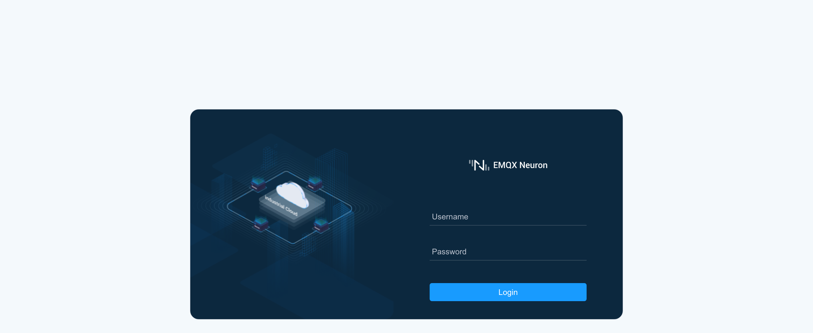

## Step 2 · Start the built-in simulator

EMQX Neuron ships with a Modbus TCP simulator that produces live data, so you do not need a real PLC to get started.

1. Go to **Data Collection → Modbus TCP Slave Simulator**.
2. Click `Start Simulator`. The simulator is off by default and consumes no resources until you start it.
3. Add tags — up to 10, with simulation types `sine`, `ramp`, `square`, or `random`. Addresses are assigned automatically.
4. Click `Save Tag Configuration`. The simulator starts producing data.

The simulator listens on port `502` inside the same container as EMQX Neuron, so there is no cross-machine networking involved. For full details, see [Modbus TCP Slave Simulator](../configuration/modbus-simulator.md).

::: tip Shortcut
On the simulator page, click `Download Southbound Driver Configuration`. The file already contains every tag. Import it on the **Data Collection → South Devices** page and you can skip straight to [Step 4](#step-4-view-the-collected-data). Work through Step 3 manually to see how drivers, groups, and tags fit together.
:::

## Step 3 · Add a southbound driver and configure tags

A southbound driver talks to the device. Here the Modbus TCP driver reads from the simulator.

### Create the driver node

On **Data Collection → South Devices**, click `Add Device`:

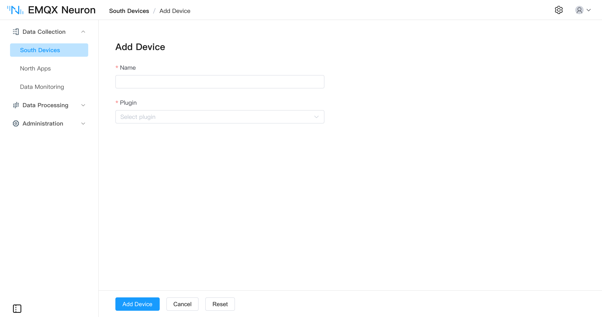

| Field | Value |
| --- | --- |
| Name | `modbus-tcp` |
| Driver | Select **Modbus TCP** |
| Connection mode | `Client` |
| IP address | `127.0.0.1` (the simulator runs in the same container) |
| Port | `502` |
| Connection timeout | `3000` |

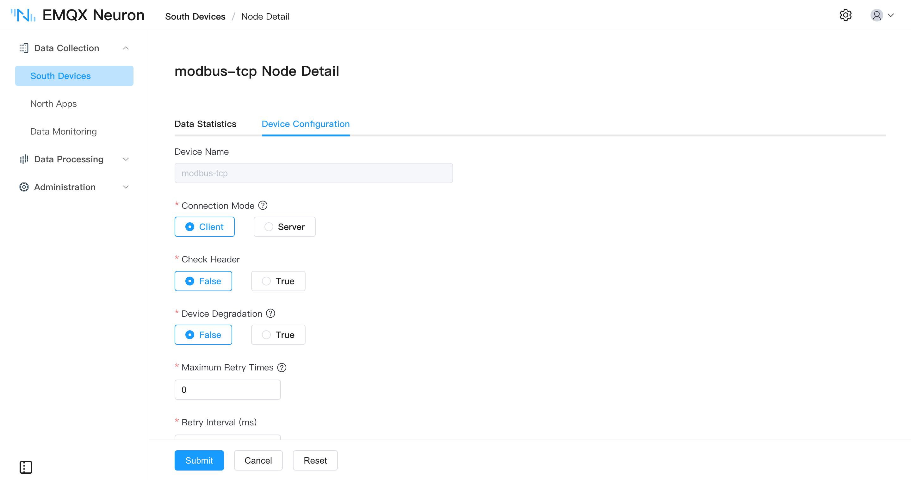

A new driver shows as **Disconnected** at first. That is expected — EMQX Neuron only starts issuing read requests once tags are configured.

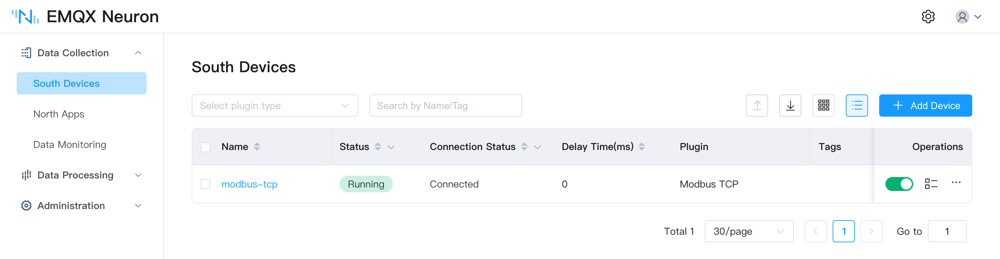

::: tip
Every protocol takes a different set of parameters. For the full parameter reference per driver, see [Southbound Drivers](../introduction/driver-list/driver-list.md).
:::

### Create a group

Click the **modbus-tcp** node to open its group list, then click `Create Group`:

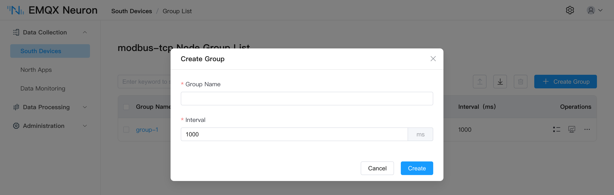

| Field | Value |
| --- | --- |
| Group name | `group-1` |
| Interval | `1000` (milliseconds — one poll per second) |

The group is the unit of collection and reporting; every tag in a group is polled at the same interval.

### Add a tag

Open `Tag List` on **group-1**, then click `Add Tag`:

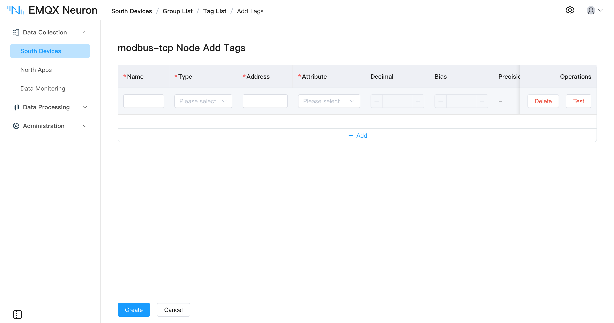

| Field | Value |
| --- | --- |
| Name | `pressure` |
| Attribute | `Read` |
| Type | `int16` |
| Address | The tag's address in the simulator, written as `slave!register` — for example `1!40001` |

::: tip
In `1!40001`, `1` is the slave address and `40001` is the holding-register address. Address formats differ per driver; see the relevant driver page.
:::

Once the tag is created the node should move to **Running** / **Connected**. If it still shows **Disconnected** after a few seconds, check that the port is reachable from inside the container:

```bash
docker exec -it neuronex telnet 127.0.0.1 502
```

## Step 4 · View the collected data

Go to **Data Collection → Data Monitoring** and select the `modbus-tcp` device and the `group-1` group. Tag values update live as the simulator runs.

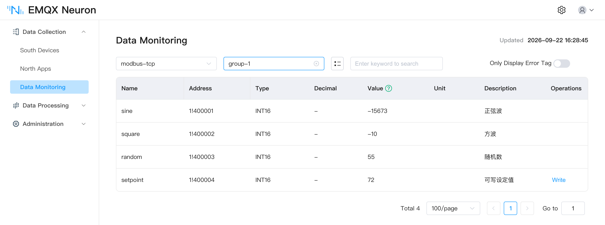

If values refresh here, the collection path works.

## Step 5 · Forward to MQTT

### Create a northbound application

On **Data Collection → North Apps**, click `Add Application`:

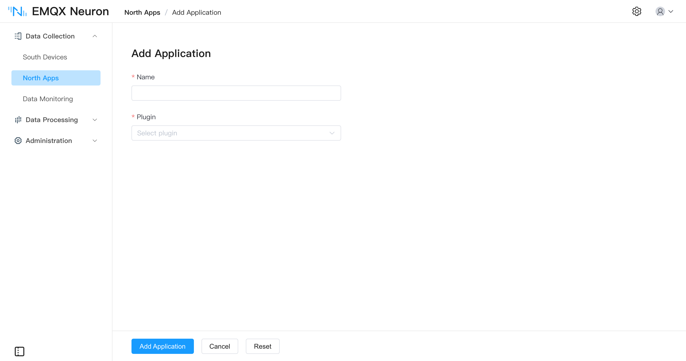

| Field | Value |
| --- | --- |
| Name | `mqtt` |
| Application | Select **MQTT** |

The application configuration page opens automatically:

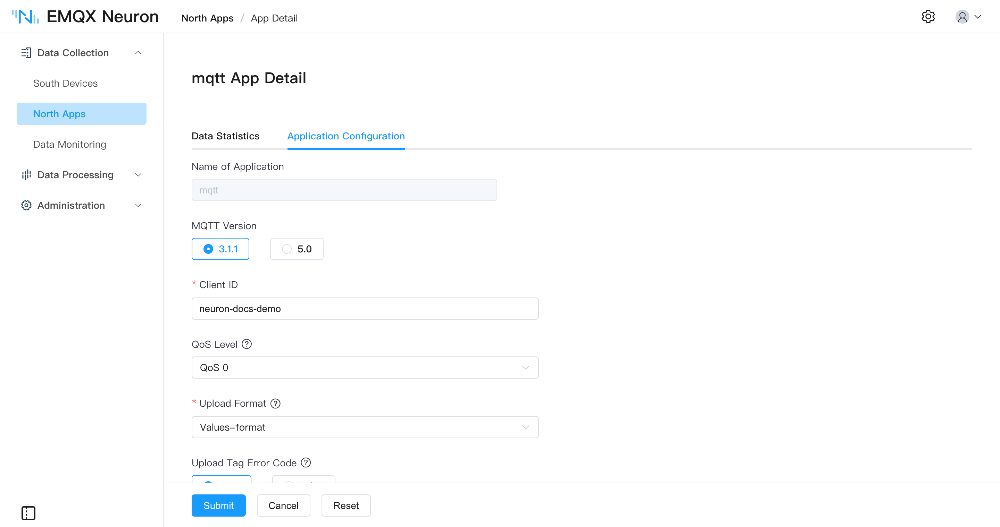

| Field | Value |
| --- | --- |
| Broker address | `broker.emqx.io` (the public EMQX broker) |
| Broker port | `1883` |

After you submit, the application card moves to **Running**.

### Subscribe to southbound data

Data is reported per **group**, so you choose which groups to publish. On the MQTT application, click `View Subscriptions` → `Add Subscription`:

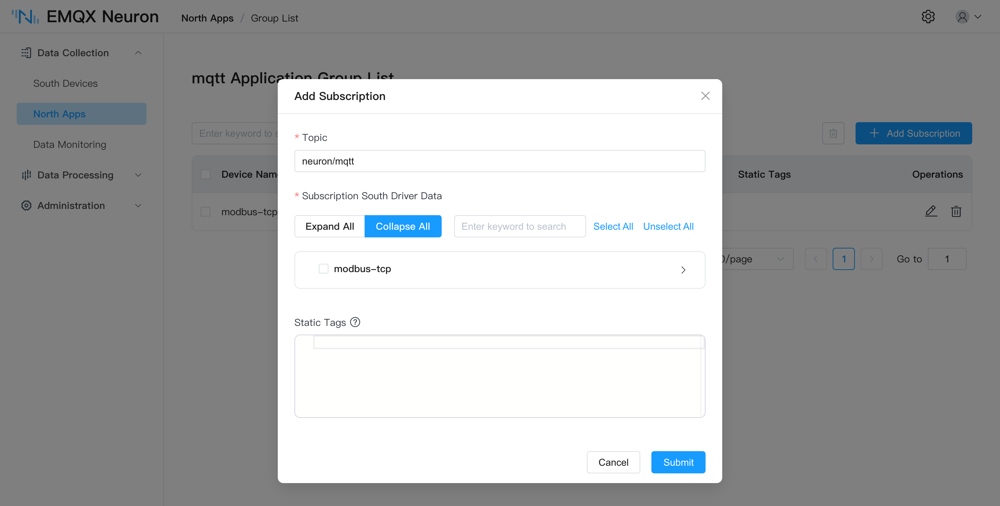

| Field | Value |
| --- | --- |
| Topic | The default is fine — note it down |
| Southbound data | Select `group-1` under `modbus-tcp` |

### Verify with an MQTT client

Open MQTTX, create a connection (Host `broker.emqx.io`, Port `1883`), and subscribe to the topic you noted:

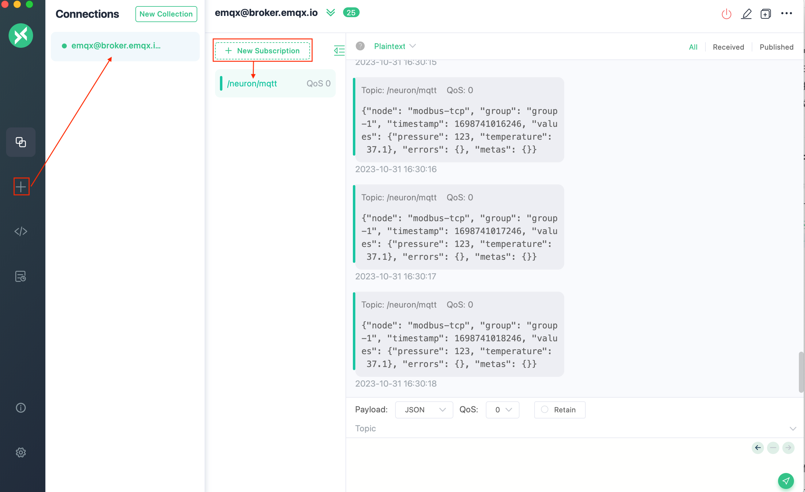

A steady stream of messages from EMQX Neuron means the whole pipeline is working.

## Next steps

- **Connect a real device** — find your protocol or CNC model in [Southbound Drivers](../introduction/driver-list/driver-list.md); parameters and address formats are documented per driver.
- **Send data elsewhere** — beyond MQTT there is AWS IoT, Azure IoT, Sparkplug B, and Kafka, plus an OPC UA Server for on-site systems. See [Northbound Applications](../configuration/north-apps/catalog.md).
- **Process data at the edge** — filter, convert, and aggregate before publishing. See [Your First Rule](../streaming-processing/first-rule.md).
- **Deploy to production** — see [Installation](../installation/introduction.md).
